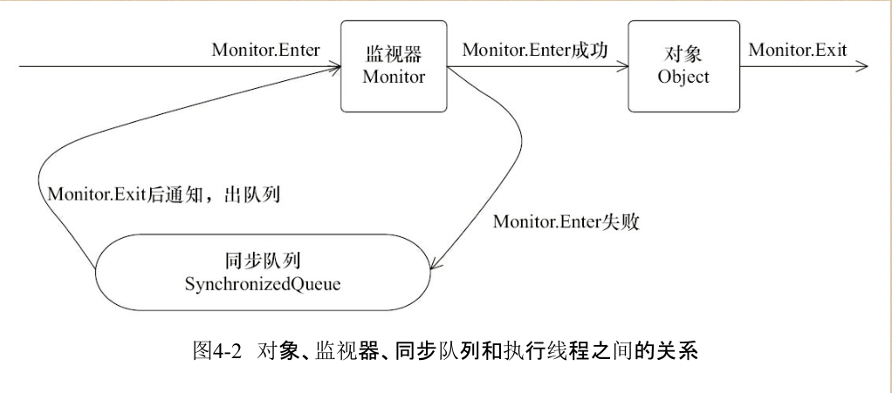
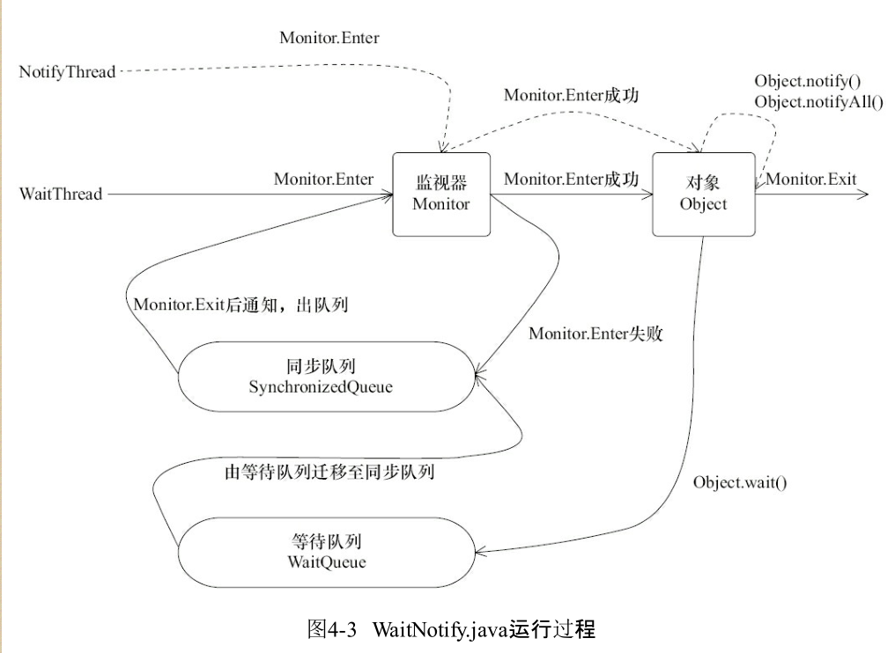

## java并发编程
- java并发编程的艺术
  - 1:并发真的快吗？
  > 不一定：并发会有线程的创建和上下文切换的开销
  > 从保存上下文到再加载的过程称为一次上下文切换
  - 2:如何减少上下文切换
  > 1:无锁并发编程 2：cas算法 3：使用最少线程 4：使用协程
    ```
    1:无锁并发编程。多线程竞争锁时，会引起上下文切换，所以多线程处理数据时，可以用一
    些办法来避免使用锁，如将数据的ID按照Hash算法取模分段，不同的线程处理不同段的数据。 
    2:CAS算法。Java的Atomic包使用CAS算法来更新数据，而不需要加锁
    3:使用最少线程。避免创建不需要的线程，比如任务很少，但是创建了很多线程来处理，这
      样会造成大量线程都处于等待状态
    4:协程：在单线程里实现多任务的调度，并在单线程里维持多个任务间的切换
    ```  
  - 3:死锁
  > 相乘双发互相等待对方释放锁
    ```
    避免死锁的常见的几个方法
    1：避免一个线程同时获取多个锁
    2：避免一个线程在锁内同时占用多个资源，尽量保证每个锁只占用一个资源
    3：尝试使用定时锁，使用lock.tryLock（timeout）来替代使用内部锁机制
    4：对于数据库锁，加锁和解锁必须在一个数据库连接里，否则会出现解锁失败的情况
    ```
  - 4:synchronized
  > java中的每个对象都可以作为锁，具体表现为一下三个形式
    ```
    1:对于普通同步方法，锁是当前实例对象
    2:对于静态同步方法，锁是当前的class对象
    3:对于同步方法块，锁是synchronized括号内配置的对象 
    ```
    > 当一个线程试图访问同步代码块时，他必须先获得锁，推出或抛出异常时必须释放锁
  - 5:锁的优缺点
    ```
    1:偏向锁：加锁和解锁不需要额外的消耗，和执行非同步方法相比仅存在纳秒级别的差距
            如果线程间存在锁竞争，会带来额外的锁撤销的消耗
            适用于只有一个线程访问同步块的场景
    2:轻量级锁:竞争的线程不会阻塞，提高了程序的响应速度
            如果始终得不到锁竞争的线程，使用自旋会消耗cpu
            追求响应时间，同步块执行速度非常快
    3:重量级锁:线程竞争不使用自旋，不消耗cpu
            线程阻塞，响应时间缓慢
            追求吞吐量，同步块执行时间较长
    ```
  - 6:cas实现原子操作的三大问题
    ```
    1:ABA问题：解决思路：加上版本号：1A-2B-3A:AtomicStampedReference
    2:循环时间长，开销大,自旋CAS如果长时间不成功，会给CPU带来非常大的执行开销
    3:只能保证一个共享变量的原子操作;使用锁 或者 把多个共享变量合并成一个共享变量来
      操作。比如，有两个共享变量i＝2，j=a，合并一下ij=2a，然后用CAS来操作ij。从Java 1.5开始，
      JDK提供了AtomicReference类来保证引用对象之间的原子性，就可以把多个变量放在一个对
      象里来进行CAS操作。
          锁机制实现原子操作：偏向锁，轻量级锁，互斥锁，jvm中除了偏向锁，其他锁都是用了循环cas
          即当一个线程想进入同步块时使用循环cas的方式来获取锁，推出同步块时使用循环cas释放锁
    ```
  - 7:并发编程模型的两个关键问题
  > 线程之间如何通信以及线程之间如何同步
    - 在命令式编程中，线程通信机制分为：共享内存与消息传递
    - 同步：在共享内存并发模型中为显式，消息传递并发模型中为隐式

  - 8:java内存模型的抽象结构
  > 在Java中，所有实例域，静态域和数组元素都存储在堆内存中，堆内存在线程间共享，局部变量
  > 方法定义参数和异常处理参数不会在线程间共享，不会存在内存可见性问题
  
  - 9：JMM:JAVA内存模型
  > 线程之间的共享变量存储在主内存中，每个线程都有一个私有的本地内存，本地内存中存储了
  > 该线程以读写共享变量的副本，本地内存时JMM的一个抽象概念，并不真实存在，他涵盖了缓存，
  > 写缓冲区、寄存器以及其他硬件和编译器的优化
  
  - 10：线程之间的通信
  > JMM通过控制主内存与每个线程的本地内存之间的交互，来为java程序员提供内存可见性保证
  
  - 11：从源代码到指令序列的重排序
  > 在执行程序时，为了提高新能，编译器和处理器常常会对指令做重排序，分为以下3类
  ```
  1:编译器优化的重排序
    编译器在不改变单线程程序语义的前提下，可以重新安排语句
    的执行顺序
  2:指令级并行的重排序
    现代处理器采用了指令级并行技术来将多条指令重叠执行。如果不存在数据依赖性，处理器可以改变语句对应
    机器指令的执行顺序
  3:内存系统的重排序
    由于处理器使用缓存和读/写缓冲区，这使得加载和存储操作看上
    去可能是在乱序执行
  从源代码到最终执行的指令序列，会经历下面的重排序
    源代码--》编译器优化重排序--》指令集并行重排序--》内存系统重排序--》最终执行的指令序列
            编译器重排序       处理器重排序
  ```
  
  - 12:happens-before
  > JDK5开始，java使用JSR-133内存模型，其使用happens-before来阐述操作之间的可见性
  > 在JMM中，如果一个操作执行的结果需要对另一个操作可见，那么这两个操作必须存在happens-before关系
  ```
    1:程序顺序规则：一个线程中的每个操作，happens-before于该线程中的任意后续操作
    2:监视器锁规则：对一个锁的解锁，happens-before于随后对这个锁的加锁
    3:volatile变量规则：对一个volatile域的写，happens-before于任意后续对这个volatile域的读
    4:传递性；A->happens-before->B  B->happens-before->C 则A->happens-before->C
    注意：两个操作之间具有happens-before关系，并不意味着前一个操作必须要在后一个操作之前执行，它
    仅仅要求前一个操作的结果对后一个操作可见，并且前一个操作按顺序在后一个操作之前
  ```
  
  - 13:数据依赖性
  > 如果两个操作访问同一个变量，且这两个操作中有一个为写操作，此时这两个操作之间就存在数据依赖性
  > 例如：写后读，读后写，写后写
  
  - 14: as-if-serial
  > 不管怎么重排序（编译器和处理器为了提高效率），（单线程）程序的执行结果不能被改变，编译器，runtime,处理器
  > 必须遵循该语义，所以编译器处理器不会对粗壮乃数据依赖的操作做重排序，反之，这些操作就有可能被重排序

  - 15:顺序一致性
  > 顺序一致性内存模型是一个理论参考模型，在设计的时候，处理器和编程语言的内存模型都会以此作为参考
  
  - 16:数据竞争与顺序一致性
  > 程序未正确同步时，就可能会存在数据竞争，JMM对数据竞争的定义如下：
  ```
    1:在一个线程中写一个变量
    2:在另一个线程中读同一个变量
    3:读和写没有通过同步来排序
    如果一个多线程程序能正确同步，僵尸一个没有竞争的程序
  ```
  > JMM对正确同步的多线程程序的内存一致性做了如下保证：如果程序是正确同步的，程序的执行将具有顺序一致性，
  > 即程序的执行结果与该程序的顺序一致性内存模型中的执行结果相同
  
  - 17:顺序一致性内存模型
  > 是一个理想化的计算机模型，未程序提供了极强的内存可见性保证：1：一个线程中的所有操作必须按照程序的顺序来执行
  > 2：（不管程序是否同步）所有的线程都只能看到单一的操作执行顺序，在顺序一致性内存模型中，每个操作都必须原子执行且立即对所有线程可见
  
  - 18：JMM不保证顺序一致性内存模型
  > 在JMM中，未同步的程序不但整体的执行顺序是无序的，而且所有线程看到的操作执行顺序也可能不一致，比如，在当前线程把写过的数据缓存在本地
  内存中，在没有刷新到主内存之前，这个写操作仅对当前线程可见；从其他线程的角度来观
  察，会认为这个写操作根本没有被当前线程执行。只有当前线程把本地内存中写过的数据刷
  新到主内存之后，这个写操作才能对其他线程可见。在这种情况下，当前线程和其他线程看到
  的操作执行顺序将不一致。
  
  - 19:同步程序的顺序一致性结果
  > 对程序使用锁来同步，在锁之内的代码可以视情况重排序（无依赖性数据），程序的执行结果将与程序在顺序一致性模型中的
  执行结果相同，JMM在具体实现上的基本方针为：在不改变（正确同步的）程序执
  行结果的前提下，尽可能地为编译器和处理器的优化打开方便之门
  
  - 20:未同步程序的执行特性
  > 对于未同步或未正确同步的多线程程序，JMM只提供最小安全性：线程执行时读取到的
  值，要么是之前某个线程写入的值，要么是默认值（0，Null，False），JMM保证线程读操作读取
  到的值不会无中生有（Out Of Thin Air）的冒出来。为了实现最小安全性，JVM在堆上分配对象
  时，首先会对内存空间进行清零，然后才会在上面分配对象（JVM内部会同步这两个操作）。因
  此，在已清零的内存空间（Pre-zeroed Memory）分配对象时，域的默认初始化已经完成了
  
  - 21:未同步程序在顺序一致性模型和JMM中的差异
  ```
    1:顺序一致性模型保证单线程内的操作会按照程序的顺序执行，但是JMM不会（可能存在重排现象）
    2:顺序一致性模型保证所有线程只能看到一致的操作执行顺序，而JMM不保证
    3:JMM不保证对64位的long型和double型变量的写操作具有原子性，而顺序一致性模型保证对所有的内存读写具有原子性
        --数据通过总线在处理器和内存之间传递，这一系列步骤称为总线事务，总线仲裁处理机制可以把所有处理器对内存的访问以串行化的方式来执行。在任意时
        间点，最多只能有一个处理器可以访问内存。这个特性确保了单个总线事务之中的内存读/写
        操作具有原子性
  ```
  
  - 22: volatile
  > volatile变量自身具有可见性以及原子性，但是类似于volatile++这种复合操作不具备原子性
  > volatile的写-读内存语义；在写的收会将该线程中本地内存的共享变量刷新到主内存
  > 读：会将本地内存的共享变量置为无效，线程接下来将从主内存读取共享变量
  ```
    结合volatile写-读步骤一起来看的话，可以得出：在读一个volatile变量之后以及在写一个volatile变量之前的所有可见的共享变量的值都将内存可见
    1：当第一个操作是volatile读时，不管第二个操作是什么，都不能重排
    2：当第二个操作是volatile写时，不管第一个操作是什么，都不能重排
    3：当第一个操作是volatile写，第二个操作是volatile读，也不能重排
  ```
  
  - 23:JMM volatile内存屏障策略
  ```
  1:Load屏障：执行读取数据的时候，强制每次都从主内存读取最新的值
  2:Store屏障：每次执行修改数据的时候，强制刷新回主内存
  为了实现volatile内存语义，JMM采取保守策略：
    1：在每个volatile写操作的前面插入一个StoreStore屏障（禁止上面的普通写与下面的volatile写重排序）
    2：在每个volatile写操作的后面插入一个StoreLoad屏障（禁止上面的volatile写与下面的volatile读、写重排序）
         或者在每个volatile读的前面插入StoreLoad屏障
            从整体执行效率的角度考虑，JMM最终选择了在每个
            volatile写的后面插入一个StoreLoad屏障。因为volatile写-读内存语义的常见使用模式是：一个
            写线程写volatile变量，多个读线程读同一个volatile变量。当读线程的数量大大超过写线程时，
            选择在volatile写之后插入StoreLoad屏障将带来可观的执行效率的提升
    3：在每个volatile读操作的后面插入一个LoadLoad屏障（禁止上面的volatile读与下面的普通读重排序）
    4：在每个volatile读操作的后面插入一个LoadStore屏障（禁止上面的volatile读与下面的普通读、写重排序）
  所以：volatile的写-读和锁的释放-获取具有相同的内存语义

  ```
  > 由于volatile仅仅保证对单个volatile变量的读/写具有原子性，而锁的互斥执行的特性可以
  确保对整个临界区代码的执行具有原子性。在功能上，锁比volatile更强大；在可伸缩性和执行
  性能上，volatile更有优势。如果读者想在程序中用volatile代替锁，请一定谨慎，具体详情请参
  阅Brian Goetz的文章《Java理论与实践：正确使用Volatile变量》。

  - 24:锁的释放-获取建立的happens-before关系
  > 锁是java并发编程中最重要的同步机制，锁除了让临界区互斥之外，还可以让释放锁的线程向获取同一个锁的线程发送消息
  > 线程A在释放锁之前所有可见的共享变量，在线程B获取同一个锁之后，将立刻变得
  对B线程可见
  
  - 25:锁的释放和获取的内存语义
  > 当线程释放锁时，JMM会把该线程对应的本地内存中的共享变量刷新到主内存中
  > 当线程获取锁时，JMM会把该线程对应的本地内存置为无效，
  > 从而使得被监视器保护的临界区代码必须从主内存中读取共享变量
  
  ```
    对比锁释放-获取的内存语义与volatile写-读的内存语义可以看出：
      锁释放与volatile写有相同的内存语义
      锁获取与volatile读有相同的内存语义
  总结：
    1:线程A释放一个锁，实质上是线程A向接下来将要获取这个锁的某个线程发出了（线程A
    对共享变量所做修改的）消息
    2:线程B获取一个锁，实质上是线程B接收了之前某个线程发出的（在释放这个锁之前对共
    享变量所做修改的）消息
    3:线程A释放锁，随后线程B获取这个锁，这个过程实质上是线程A通过主内存向线程B发
    送消息
  ```
    
  - 26:锁内存语义的实现
  > 借助ReentrantLock源码，分析锁内存语义的实现机制
  ```
    ReentrantLock的实现依赖于java同步器框架AbstractQueuedSynchronizer(AQS),
    AQS使用一个整型的volatile变量，名为state来维护同步状态
  ```
  - 27:公平锁
  > 公平锁在释放锁的最后写volatile变量state，在获取锁时首先读这个volatile变量。根据
  volatile的happens-before规则，释放锁的线程在写volatile变量之前可见的共享变量，在获取锁
  的线程读取同一个volatile变量后将立即变得对获取锁的线程可见
  - 28:非公平锁
  > 获取锁时调用的是：AbstractQueuedSynchronizer:compareAndSetState(int expect,int update)。
  > 该方法以原子操作的方式更新state变量：如果当前状态值等于预期值，则以原子方式将同步状态
  设置为给定的更新值。此操作具有volatile读和写的内存语义
  - why?(此操作(CAS)具有volatile读和写的内存语义)
  > 编译器不会对volatile读与volatile读后面的任意内存操作重排序；编译
  器不会对volatile写与volatile写前面的任意内存操作重排序。组合这两个条件，意味着为了同
  时实现volatile读和volatile写的内存语义，编译器不能对CAS与CAS前面和后面的任意内存操
  作重排序
  
  - 29:总结公平锁与非公平锁的内存语义
  ```
    1:公平锁和非公平锁释放时，最后都要写一个volatile变量state。
    2:公平锁获取时，首先会去读volatile变量。
    3:非公平锁获取时，首先会用CAS更新volatile变量，这个操作同时具有volatile读和volatile
      写的内存语义
    锁释放-获取的内存语义的实现至少有下面两种:
      1:利用volatile变量的写-读所具有的内存语义。(公平锁实现)
      2:利用CAS所附带的volatile读和volatile写的内存语义（非公平锁实现）
  ```
  - 30:concurrent包的实现
  ```
    由于java的cas同事具有volatile读，volatile写的内存语义，因此java线程间的通信有了以下四种方式
    1：A线程写volatile变量，随后B线程读这个volatile变量
    2：A线程写volatile变量，随后B线程用CAS更新这个volatile变量
    3：A线程用CAS更新一个volatile变量，随后B线程用CAS更新这个volatile变量
    4：A线程用CAS更新一个volatile变量，随后B线程读这个volatile变量
    分析concurrent包的实现可以发下以下通用化实现模式：
    1：声明共享变量为volatile;
    2：使用cas的原子条件更新来实现线程之间同步
    3：配合以volatile的读、写和cas所具有的volatile读、写的内存语义实现线程间的通信
    AQS、非阻塞数据结构、原子变量类，这些concurrent包中的基础类都是使用这种模式实现的
    有低级到高级排列如下：
    volatile变量的读、写              CAS
    AQS     非阻塞数据结构        原子变量类
    Lock 同步器  阻塞队列  Executor 并发容器   
  ```
  - 31:final域的内存语义
  ```
  final域的重排序规则：
  1:在构造函数内对一个final域的写入，与随后把这个被构造对象的引用赋值给一个引用
    变量，这两个操作之间不能重排序
  2:初次读一个包含final域的对象的引用，与随后初次读这个final域，这两个操作之间不能
    重排序
  写final域的重排序规则：
  写final域的重排序规则禁止把final域的写重排序到构造函数之外
  1：JMM禁止编译器把final域的写重排序到构造函数之外
  2：编译器会在final域写之后，构造函数return之前，插入一个storestore屏障，这个屏障禁止处理器把final域的写重排序到构造函数之外
  ```
  > 写final域的重排序规则可以确保：在对象引用为任意线程可见之前，对象final域已经被正确初始化过了，
  > 而普通域则不具备这个保障
  ```
  读final域的重排序规则：
  在一个线程中，初次读对象引用与初次读该对象包含的final
  域，JMM禁止处理器重排序这两个操作（注意，这个规则仅仅针对处理器）。编译器会在读final
  域操作的前面插入一个LoadLoad屏障
  读final域的重排序规则可以确保：
  在读一个对象的final域之前，一定会先读包含这个final
  域的对象的引用。在这个示例程序中，如果该引用不为null，那么引用对象的final域一定已经
  被A线程初始化过了
  ```
  - 32:final域为引用类型
  > 在构造函数内对一个final引用的对象的成员域
  的写入，与随后在构造函数外把这个被构造对象的引用赋值给一个引用变量，这两个操作之
  间不能重排序

  ```
  在构造函数返回前，被构造对象的引用不能为其他线程所见，因为此
  时的final域可能还没有被初始化。在构造函数返回后，任意线程都将保证能看到final域正确初
  始化之后的值
  ```
  - 33:JSR-133为什么要增强final语义
  >在旧的Java内存模型中，一个最严重的缺陷就是线程可能看到final域的值会改变。比如，
  一个线程当前看到一个整型final域的值为0（还未初始化之前的默认值），过一段时间之后这个
  线程再去读这个final域的值时，却发现值变为1（被某个线程初始化之后的值）。最常见的例子
  就是在旧的Java内存模型中，String的值可能会改变。
  为了修补这个漏洞，JSR-133专家组增强了final的语义。通过为final域增加写和读重排序
  规则，可以为Java程序员提供初始化安全保证：只要对象是正确构造的（被构造对象的引用在
  构造函数中没有“逸出”），那么不需要使用同步（指lock和volatile的使用）就可以保证任意线程
  都能看到这个final域在构造函数中被初始化之后的值
  
  - 34:happens-before
  > 《JSR-133:Java Memory Model and Thread Specification》对happens-before关系的定义如下。
  1）如果一个操作happens-before另一个操作，那么第一个操作的执行结果将对第二个操作
  可见，而且第一个操作的执行顺序排在第二个操作之前。
  2）两个操作之间存在happens-before关系，并不意味着Java平台的具体实现必须要按照
  happens-before关系指定的顺序来执行。如果重排序之后的执行结果，与按happens-before关系
  来执行的结果一致，那么这种重排序并不非法（也就是说，JMM允许这种重排序）。
  上面的1）是JMM对程序员的承诺。从程序员的角度来说，可以这样理解happens-before关
  系：如果A happens-before B，那么Java内存模型将向程序员保证——A操作的结果将对B可见，
  且A的执行顺序排在B之前。注意，这只是Java内存模型向程序员做出的保证！
  上面的2）是JMM对编译器和处理器重排序的约束原则。正如前面所言，JMM其实是在遵
  循一个基本原则：只要不改变程序的执行结果（指的是单线程程序和正确同步的多线程程序），
  编译器和处理器怎么优化都行。JMM这么做的原因是：程序员对于这两个操作是否真的被重
  排序并不关心，程序员关心的是程序执行时的语义不能被改变（即执行结果不能被改变）。因
  此，happens-before关系本质上和as-if-serial语义是一回事。
  ·as-if-serial语义保证单线程内程序的执行结果不被改变，happens-before关系保证正确同
  步的多线程程序的执行结果不被改变。
  ·as-if-serial语义给编写单线程程序的程序员创造了一个幻境：单线程程序是按程序的顺
  序来执行的。happens-before关系给编写正确同步的多线程程序的程序员创造了一个幻境：正
  确同步的多线程程序是按happens-before指定的顺序来执行的。
  as-if-serial语义和happens-before这么做的目的，都是为了在不改变程序执行结果的前提
  下，尽可能地提高程序执行的并行度。
  
  - 35:happens-before
  ```
  《JSR-133:Java Memory Model and Thread Specification》定义了如下happens-before规则。
   1）程序顺序规则：一个线程中的每个操作，happens-before于该线程中的任意后续操作。
   2）监视器锁规则：对一个锁的解锁，happens-before于随后对这个锁的加锁。
   3）volatile变量规则：对一个volatile域的写，happens-before于任意后续对这个volatile域的
     读。
   4）传递性：如果A happens-before B，且B happens-before C，那么A happens-before C。
   5）start()规则：如果线程A执行操作ThreadB.start()（启动线程B），那么A线程的
     ThreadB.start()操作happens-before于线程B中的任意操作。
     --线程A在执行ThreadB.start()之前对共享
     变量所做的修改，接下来在线程B开始执行后都将确保对线程B可见
   6）join()规则：如果线程A执行操作ThreadB.join()并成功返回，那么线程B中的任意操作
     happens-before于线程A从ThreadB.join()操作成功返回
     --假设线程A在执行的过程中，通过执行ThreadB.join()来等待线
     程B终止；同时，假设线程B在终止之前修改了一些共享变量，线程A从ThreadB.join()返回后会
     读这些共享变量
  ```
  - 36:双重检查锁定与延迟初始化
  > 在Java多线程程序中，有时候需要采用延迟初始化来降低初始化类和创建对象的开销。双
  重检查锁定是常见的延迟初始化技术，但它是一个错误的用法。我们将分析双重检查锁定的
  错误根源，以及两种线程安全的延迟初始化方案
  
  - 37: java程序的内存可见性保证
  ```
  单线程程序。单线程程序不会出现内存可见性问题。编译器、runtime和处理器会共同确
    保单线程程序的执行结果与该程序在顺序一致性模型中的执行结果相同。
  正确同步的多线程程序。正确同步的多线程程序的执行将具有顺序一致性（程序的执行
    结果与该程序在顺序一致性内存模型中的执行结果相同）。这是JMM关注的重点，JMM通过限
    制编译器和处理器的重排序来为程序员提供内存可见性保证。
  未同步/未正确同步的多线程程序。JMM为它们提供了最小安全性保障：线程执行时读取
    到的值，要么是之前某个线程写入的值，要么是默认值（0、null、false）
  ```
  - 38 JSR-133对旧内存模型的修补
  ```
  ·增强volatile的内存语义。旧内存模型允许volatile变量与普通变量重排序。JSR-133严格
   限制volatile变量与普通变量的重排序，使volatile的写-读和锁的释放-获取具有相同的内存语
   义。
  ·增强final的内存语义。在旧内存模型中，多次读取同一个final变量的值可能会不相同。为
   此，JSR-133为final增加了两个重排序规则。在保证final引用不会从构造函数内逸出的情况下，
   final具有了初始化安全性 
  ```
  - java并发编程基础
  - 39:是什么时线程
  > 现代操作系统运行一个程序时，会为其创建一个进程，例如启动一个java程序，操作系统就会创建一个java进程，现代操作系统调度的最小单元就是线程
  > 也叫做轻量级进程，在一个进程里可以创建多个线程，这些线程都拥有各自的计数器、堆栈和局部变量等属性，并且能够访问共享的内存变量，处理器在这
  > 些线程上高速切换，让使用者感觉到这些线程在同时执行
  
  - 40:为什么要使用多线程
    - 更多的处理核心
    > 随着处理器的核心数越来越多,以超线程技术的广泛应用，线程是大多数操作系统调度的基本单元，一个程序作为一个进程来运行，程序运行过程中能创建多个
    > 线程，而一个线程在一个时刻只能运行在一个处理器核心上，试想一下，一个单线程程序在运行时只能使用一个处理器核心，那么再多的处理器核心加入也无法
    > 显著提升该程序的执行效率，如果该程序使用多线程技术，将计算逻辑分配到多个处理器核心上，就会显著减少程序的执行时间，并且随着更多的处理器核心的加入
    > 而变得更有效率 
    - 更快的响应时间
    > 有时候我们会编写一些复杂的代码，不是指是算法的复杂，而是指业务为逻辑的复杂，例如创建一笔订单，插入订单数据，生成订单快照，发送邮件通知卖家，
    > 记录货品销售量，这么多的业务操作如何使其能够更快速的完成呢？在此场景中可以使用多线程技术，即将数据一致性不强的操作派发给其他线程处理（也可以使用消息队列）
    > 例如生成订单快照和发送邮件，这样做的好处是响应用户请求的线程能够快速的完成，缩短响应时间，提升体验
    - 更好的编程模型
    > java为多线程编程提供了良好、考究并一致的编程模型，使开发人员能够更专注的解决问题，即为所遇到的问题建立合适的模型，而不是绞劲脑汁考虑如何多线程化
    > 一旦开发人员建立好了模型，稍作修改就能方便的映射到java提供的多线程编程模型上
  
  - 41:线程优先级
  > 现代操作系统基本采用分时的形式调度运行的线程，操作系统会分出一个一个时间片，线程会分配到若干时间片，当线程的时间片用完了就会发生线程调度，并等待着下次的分配。
  > 线程分配到的时间片多少也决定着线程使用处理器资源的多少，而线程优先级就是决定线程需要多少分配一些处理器资源的线程属性
  > 在java线程中，通过一个整形成员变量priority来控制优先级，优先级的范围从1-10，在线程构建的时候可以通过setPriority(int x)方法来修改线程的优先级，默认的优先级为5
  > 优先级高的线程分配时间片的数量要多于优先级低的线程，设置线程优先级时，针对频繁阻塞（I/O或者休眠操作）的线程需要设置较高的优先级，而偏重计算的（需要较多cpu时间或者偏运算）
  > 的线程则设置较低的优先级，确保处理器不会被独占，在不同的jvm及操作系统上，线程规划会存在差异，有些操作系统甚至会忽略会线程优先级的设定，见：Priority类
  
  - 42:线程的状态
  > java线程在运行的生命周期中可以处于一下6种不同的状态，在给定的一个时刻，线程只能处于其中的一个状态
    - NEW:初始状态,线程被创建，但是还没有调用start()方法
    - RUNNABLE:运行状态，java线程将操作系统中的就绪和运行两种状态统称为运行状态
    - BLOCKED:阻塞状态，表示线程阻塞于锁
    - WAITING:等待状态，表示线程进入等待状态，进入该状态表示当前线程需要等待其他线程做出一些特定动作（通知或中断）
    - TIME_WAITING:超时等待状态，该状态不同于waiting,他是可以在指定时间自行返回的
    - TERMINATED:终止状态，表示当前线程已经执行完毕
  > 线程在自身的生命周期中并不是固定的处于某个状态，而是随着代码的执行在不同的状态之间切换，状态变迁如下所示：
  > 实例初始化NEW状态--》Thread.start()-->运行Runnable状态，包括操作系统的运行中Running状态和就绪Ready状态
  > 运行状态Runnable之间是如何切换的呢（Running<--->Ready）,yield()方法转换为Ready状态，操作系统在从ready状态调度到Running状态
  > 运行状态等待进入synchronized方法/块--》进入到阻塞Blocked状态，如果获取到了锁，就又进入了运行状态Runnable
  > 运行状态通过Object.wait(),Object.join(),LockSupport.park()就进入了等待状态Waiting,通过Object.notify(),Object.notifyAll(),LockSupport.unpark(Thread)就转到了运行状态
  > 运行状态通过Thread.sleep(long),Object.wait(long),Thread.join(long),LockSupport.parkNanos(),LockSupport.parkUntil()就进入超时等待时间（timed-waiting）
  > 超时等待状态通过Object.notify().Object.notifyAll(),LockSupport.unpark(Thread)超时时间到，进入到运行状态
  ```
    线程创建之后，调用start()方法开始运行，当线程执行wait()方法之后，线程进入等待状态，进入等待状态的线程需要依靠其他线程的通知才能返回到运行状态
    而超时等待状态相当于在等待状态的基础上增加了超时限制，也就是超时时间达到将会返回运行状态，当线程调用同步方法或者代码块之时，在没有获得到锁的情况下
    线程将会进入到阻塞状态，线程在执行完Runnable的run()方法之后将会进入到终止状态。
    注意：java将操作系统中的运行和就绪两个状态合并为了一个运行状态，阻塞状态是线程阻塞在进入synchronized关键字修饰的方法或者代码块（获取锁）时候的状态
         但是阻塞在java.concurrent包中的Lock接口的线程状态却是等待状态，这是因为java.concurrent包中Lock接口对于阻塞的实现均使用了LockSupport类中的相关方法
  ```

  - 43:Daemon线程
  > Daemon线程是一种支持型线程，因为他主要被用作程序中后台调度及支持性工作，这意味着，当一个java虚拟机中不存在非Daemon线程的时候，java虚拟机将会退出
  > Thread.setDaemon(true)将线程设置为Daemon线程
  > Daemon属性需要在启动后线程之前设置
  > Daemon线程被用作完成支持性的工作，但是在java虚拟机退出的时候Daemon线程中的finally块不一定执行
  
  - 44:启动和终止线程
    - 构造线程
    > 查看Thread线程类的init方法 
    ```
    private void init(ThreadGroup g, Runnable target, String name,long stackSize,
    AccessControlContext acc) {
      if (name == null) {
        throw new NullPointerException("name cannot be null");
      }
      // 当前线程就是该线程的父线程
      Thread parent = currentThread();
      this.group = g;
      // 将daemon、priority属性设置为父线程的对应属性
      this.daemon = parent.isDaemon();
      this.priority = parent.getPriority();
      this.name = name.toCharArray();
      this.target = target;
      setPriority(priority);
      // 将父线程的InheritableThreadLocal复制过来
      if (parent.inheritableThreadLocals != null)
      this.inheritableThreadLocals=ThreadLocal.createInheritedMap(parent.
      inheritableThreadLocals);
      // 分配一个线程ID
      tid = nextThreadID();
    }
    ```
    > 一个新构造的线程对象是由其parent线程来进行空间分配的，而child线程
    继承了parent是否为Daemon、优先级和加载资源的contextClassLoader以及可继承的
    ThreadLocal，同时还会分配一个唯一的ID来标识这个child线程。至此，一个能够运行的线程对
    象就初始化好了，在堆内存中等待着运行
    - 启动线程
    > 线程对象在初始化完成之后，调用start()方法就可以启动这个线程。线程start()方法的含义
    是：当前线程（即parent线程）同步告知Java虚拟机，只要线程规划器空闲，应立即启动调用
    start()方法的线程,启动一个线程前，最好为这个线程设置线程名称，因为这样在使用jstack分析程
    序或者进行问题排查时，就会给开发人员提供一些提示，自定义的线程最好能够起个名字
    - 理解中断
    > 中断可以理解为线程的一个标志位属性，它表示一个运行中的线程是否被其他运行的线程进行了中断操作，中断好比其他线程
    > 对该线程打了个招呼，其他线程通过调用该线程的interrupt()方法对其进行中断操作，
    > 线程通过检查自身是否被中断了来进行响应，线程通过方法isInterrupted()方法来进行判断是否被中断，也可以调用静态方法
    > Thread.interrupted()对当前线程进行标志位复位，如果该线程已经处于终结状态，即使该线程被中断过，在调用该线程对象
    > 的isInterrupted()时依旧会返回false
    > 从java的api可以看出，许多声明抛出InterruptedException的方法，例如Thread.sleep(long),这些方法在抛出异常之前
    > java虚拟机会先将该线程的中断标识位清除，然后抛出InterruptedException，此时调用isInterrupted()方法会返回false
    > 观察表示位置，见Chapter4代码Interrupted类
    
    - 过期的suspend(),resume(),stop()
    > 类似于cd机得暂停，恢复 停止 见代码Deprecated.class,suspend() resume() stop()完成了线程的暂停，恢复，终止
    > 但是他们都是过期的，不建议使用，不建议使用的原因主要有，以suspend()方法为例，在调用后，线程不会释放已经占有的资源，
    > 比如锁，而是占有着资源进入睡眠状态，这样就容易发生死锁问题，同样，stop方法在终结一个线程时候，不会保证线程的资源正常释放 
    > 通常是没有给予线程完成资源释放工作的机会，因此导致程序可能工作在不确定状态下
      > 因为不建议使用，所以后面使用等待、通知机制来代替暂停、恢复机制   
    - 安全的终止线程
    > 之前提到的中断状态是线程的一个标识位，中断操作是一种简便的线程间交互方式，这种交互方式最适合用来取消或停止任务，除了中断之外
    > 还可以利用一个boolean变量来控制是否需要停止任务并终止该线程，见Shutdown.java 
  - 45:线程间通信
    > 线程开始运行，拥有自己的栈空间，就如同一个脚本一样，按照既定的代码一步一步的执行，知道终止。但是每个运行中的线程，如果仅仅是孤立的执行，
    > 那么没有一点儿价值，或者说价值很少，如果多个线程能够配合的完成工作，这将会带来巨大的价值
    - volatile和synchronized关键字
    > java支持多个线程同时访问一个对象或者对象的成员变量，由于每个线程可以拥有这个变量的拷贝（虽然对象以及成员变量分配的内存是在共享内存中的，
    > 但是每个执行的线程还是可以拥有一份拷贝，这样做的目的是加速程序的运行，这是现代多核处理器的一个显著的特性），所以程序在执行过程中，
    > 一个线程看到的变量并不一定是最新的
    > 关键字volatile，可以用来修饰字段（成员变量），就是告诉程序任何对改变量的访问，均要从共享内存中获取，而对他的改变必须同步刷新到共享同步内存
    > 他能保证所有线程对变量访问的可见性
    > 举个例子：定义一个标识程序是否运行的成员变量boolean on=true,那么另一个线程可能对他执行关闭动作（on=false）,这里设计多个线程对变量的访问
    > 因此需要将其定义成为 volatile boolean on=true;这样其他线程对它进行改变时，可以让所有线程感知到变化，因为所有对on变量的访问和修改都需要
    > 以共享内存为准，但是过多的使用volatile是不必要的，因为他会降低程序执行的效率
    > 关键字：synchronized可以修饰方法或者以同步块的形式来进行使用，它主要确保多个线程在同一个时刻，只能有一个线程处于方法或者同步块中，它保证了
    > 线程对变量访问的可见性和排他性 见代码Synchronized.java
    - 等待、通知机制
    > 一个线程修改了一个对象的值，而另一个线程感知到了变化，然后进行相应的操作，整个过程开始于一个线程，而最终执行又是另一个线程，前者是生产者，后者是消费者
    > 这种模式隔离了“做什么（what） 怎么做(how)”,在功能层面上实现了解耦，体系结构上具备良好的伸缩性，在java语言中如何实现呢？
    > 简单的办法就是让消费者线程不断的循环检查变量是否符合预期，比如在while循环中设置不满足的条件，如果条件满足则退出while循环，从而完成消费者的工作
    ```
      while(value!=desire){
        Thread.sleep(100)
      } 
      doSomething();
    ```
    > 上面这段代码表示在条件不满足时就睡眠一段时间，这样做的目的是防止过快的无效尝试,看似能够解决问题，实际上确存在问题：
    > 1：难以保证及时性，在睡眠期间基本不消耗处理器资源，但是如果睡的过久，就不能及时发现条件已经变化，也就是难以保证及时性
    > 2：难以降低开销，如果降低睡眠的时间，比如休眠1毫秒，这样消费者能够很迅速的发现条件的编话，但是却可能消耗更多的处理器资源，造成了无端的浪费
    > 以上两个矛盾看似无法调和，但是通过java内置的等待、通知机制能很好的解决整个矛盾
    > 等待、通知的相关方法是任何java对象都具备的，这些方法被定义在Object对象上
    ```
     notify():通知一个在对象上等待的线程，使其从wait()方法返回，而返回的前提是该线程获取到了对象的锁
     noiifyAll():通知所有等待在对象上的线程
     wait():调用该方法的线程进入waiting状态，只有等待另外线程的通知或者被中断才会返回，需要注意，调用wait()方法后，会释放对象的锁
     wait(long):超时等待一段时间，这里的参数时间是毫秒，即等待时间超过n毫秒，如果没有通知就超时返回
     wait(long,int):对于超时时间的更细粒度的控制，可以达到纳秒级别
    ```
    
    > 等待、通知机制，是指一个线程A调用了对象O的wait()方法进入等待状态，而另一个线程B调用对象O的notify()或者notifyAll()方法
    > 线程A收到通知后从对象O的wait()方法返回，进而执行后续操作，上述两个线程通过对象O来完成交互，而对象上的wait()和notify/notifyAll()的关系
    > 就如同开关信号一样，用来完成等待方和通知方之间的交互工作，见代码WaitNotify.java
    
    > 上图WaitThread先获取了对象的锁，然后调用对象的wait()方法，从而放弃了锁，并进入到对象的等待队列WaitQueue中，进入等待状态，由于WaitThread
    > 释放了对象的锁，NotifyThread随后获取了对象的锁，并调用对象的notifyAll()方法，将WaitThread从WaitQueue移动到SynchronizedQueue中，
    > 此时WaitThread状态变为Blocked阻塞状态,NotifyThread线程释放锁之后，WaitThread再次获得到锁并从wait()方法返回继续执行
    ```
    在synchronized代码块或方法中，对共享变量的修改会立即被写入主内存，并且其他线程在获取锁之后会从主内存中读取最新的值。
    因此，如果一个线程修改了某个变量的值，其他线程在获取锁之后就一定能看到最新的值
    ```
    - 等待、通知的经典范式
    > 该范式分为两个部分，分别是等待方（消费者）和通知方（生产者）
     - 1：等待方遵顼如下原则
    ```
      1:获取对象的锁
      2：如果条件不满足，那么调用对象的wait()方法，被通知后仍然要检查条件
      3：条件满足则执行对应的逻辑
      对应的伪代码如下：
      synchronized(对象){
        whie(条件不满足){
          对象.wait();
        }
        对应的处理逻辑
      }
    ```
     - 2:通知方遵顼如下原则
    ```
      1:获得对象的锁
      2：改变条件
      3：通知所有等待在对象上的线程
      对应的伪代码如下：
      synchronized(对象){
        改变条件
        对象.notifyAll();
      }
    ```
    - 管道输入、输出流
    > 管道输入输出流和普通的文件输入输出流或者网络输入输出流不同之处在于：它主要用于线程之间的数据传输，而传输的媒介为内存
    > 管道输入输出流包含了如下四种具体实现：PipedOutputStream,PipedInputStream,PipedReader,PipedWriter,前两者面向字节，后两者面向字符
    > 详见Piped
    - Thread.join()的使用
    > 如果一个线程A执行了thread.join()语句，其含义是：当前线程A等待thread线程终止之后才从thread.join()返回，线程Thread除了提供join()方法之外，
    > 还提供了join(long),join(long millis,int nanos)两个具备超时特性的方法，这两个超时方法表示，如果线程thread在给定的超时时间内没有终止，那么将会从该超时方法中返回
    - ThreadLocal的使用
    > ThreadLocal即线程变量，是一个以ThreadLocal对象为键，任意对象为值的存储结构，这个结构被附带在线程上，也就是说一个线程可以根据ThreadLocal对象查询到绑定在这个线程上的一个值
    > 可以通过set(T)方法来设置一个值，在当前线程下再通过get()方法获取到原先设定的值
  
  - 46:线程应用实例
    - 等待超时模式
    > 开发人员经常会遇到这样的方法调用场景：调用一个方法时等待一段时间（一般来说是给定一个时间段），如果该方法能够在给定的时间段内得到结果，那么将结果
    > 立刻返回，反之超时返回默认结果，之前的等待、通知经典范式，即加锁，条件循环和处理逻辑三个步骤，这种范式无法做到超时等待，只需要如下小改动即可：
    ```
    //对当前对象加锁
    public synchronized Object get(long mills) throws InterruptedException{
          //8:03:25
        long future=System.currentTimeMills()+mills;
          //5秒
        long remaining=mills;
        //当超时大于0且result返回值不满足要求时
        while((result==null)&& remaining>0){
           wait(remaining);
           remaining=future-System.currentTimeMills();
        }
        return result;
    }
    ```
    - 一个简单的数据库连接池示例
    > 我们使用等待超时模式来构建一个简单的数据库连接池，模拟从连接池中获取，使用和释放连接的过程，而客户端获取连接的过程被设置为等待、超时模式
    > 在1000毫秒内如果无法获取可用的连接则返回客户端null,设定连接池的大小为10个，然后调节客户端的连接数来模拟无法获取连接的场景
    ```
      1:定义一个连接池，见ConnectionPool.java;通过构造函数初始化连接池大小，使用双向队列来维护，调用方法前获取，调用后放回
      2：动态代理实现一个java.sql.Connection实例，在commit()方法调用时休眠100毫秒，见ConnectionDriver.java
      3:ConnectionPoolTest.java测试
    ```
    - 线程池技术及其示例
    > 对于服务端的程序，经常面对的是客户端传入的短小（执行时间短、工作内容较为单一）
    任务，需要服务端快速处理并返回结果。如果服务端每次接受到一个任务，创建一个线程，然
    后进行执行，这在原型阶段是个不错的选择，但是面对成千上万的任务递交进服务器时，如果
    还是采用一个任务一个线程的方式，那么将会创建数以万记的线程，这不是一个好的选择。因
    为这会使操作系统频繁的进行线程上下文切换，无故增加系统的负载，而线程的创建和消亡
    都是需要耗费系统资源的，也无疑浪费了系统资源
    > 
    > 线程池技术能够很好地解决这个问题，它预先创建了若干数量的线程，并且不能由用户
    直接对线程的创建进行控制，在这个前提下重复使用固定或较为固定数目的线程来完成任务
    的执行。这样做的好处是，一方面，消除了频繁创建和消亡线程的系统资源开销，另一方面，
    面对过量任务的提交能够平缓的劣化。
    代码见ThreadPool.java
    - 一个基于线程池技术的简单web服务器
    > 目前的浏览器都支持多线程访问，比如说在请求一个HTML页面的时候，页面中包含的图
    片资源、样式资源会被浏览器发起并发的获取，这样用户就不会遇到一直等到一个图片完全
    下载完成才能继续查看文字内容的尴尬情况
  
    > 如果Web服务器是单线程的，多线程的浏览器也没有用武之地，因为服务端还是一个请求
    一个请求的顺序处理。因此，大部分Web服务器都是支持并发访问的。常用的Java Web服务器，
    如Tomcat、Jetty，在其处理请求的过程中都使用到了线程池技术。
  
    > 见SimpleHttpServer.java
  - 47:本章小结
    ```
    本章从介绍多线程技术带来的好处开始，讲述了如何启动和终止线程以及线程的状态，纤细讲述了多线程之间的通信的基本方式
    即等待、通知方式，在线程应用示例中，使用了等待超时、数据库连接池、以及简单线程池三个不同的示例巩固本章的知识，最后
    通过一个简单的web应用服务器将上述只是串联起来
    
    ```
  
  - java中的锁
    > 本章将介绍java并发包中与锁相关的api和组件，以及这些api和组件的使用方式和实现细节，关于使用和实现
    > 使用：通过实例演示这些组件的使用方法以及详细介绍与锁相关的api,
    > 实现：分析源码 剖析实现细节 
  - 48: Lock接口
    > 锁是用来控制多个线程访问共享资源的方式，一般来说，一个锁能够防止多个线程同时访问共享资源（但有些锁可以允许多个线程并发的访问共享资源，比如读写锁）
    > 在Lock接口出现之前，java程序是靠着synchronized关键字来实现锁功能的，在jdk5之后，并发包中新增了Lock接口（以及相关实现类）用来实现锁功能
    > 它提供了与synchronized关键字类似的同步功能，只是在使用时需要显示的获取和释放锁，虽然它缺少了（通过synchronized块或方法所提供的）隐式获取和释放锁
    > 的便捷性，但是确拥有了锁获取和释放的可操作性，可中断的获取锁，以及超时获取锁等多种synchronized关键字不具备的同步特性
    > 
    > 使用synchronized关键字将会隐式的获取锁，但是他将锁的获取和释放固化了，也就是先获取再释放，当然这种方式简化了同步的管理，可是扩展性没有显示的获取和释放的好
    > 例如在一个场景手把手经行所得获取和释放，先获取锁a,再获取锁b,获得b之后释放锁a，同时获取锁c,获取锁c的同时释放锁b再获取锁d,这种场景synchronized不太好实现
    > 但是使用Lock就容易很多：LockUseCase
    > 
    > Lock接口提供了synchronized关键字不具备的主要特征
    > 1：尝试非阻塞的获取锁：当前线程尝试获取锁，如果这一时刻没有被其他线程获取到，则成功获取并持有锁
    > 2：能被中断的获取锁：与synchronized不同，获取到锁的线程能够响应中断，当获取到锁的线程被中断时，中断异常将会被抛出，同时锁会被释放
    > 3：超时获取锁：在指定的截至时间之前获取锁，如果无法获取则返回
    ```
      Lock是一个接口，定于了锁的获取和释放的基本操作，API如下：
      void lock():获取锁，调用该方法，当前线程将会获取锁，当获得锁之后，从该方法返回
      void lockInterruptibly() throws InterruptedException:可中断的获取锁，和lock()方法不同之处在于该方法会响应中断，即在锁的获取过程中可以中断当前线程
      boolean tryLock():尝试非阻塞的获取锁，调用该方法之后立刻返回，如果能够获取则返回true,否则返回false
      boolean tryLock(long time,TimeUnit unit) throws InterruptedException:超时的获取锁，当前线程在一下三种情况下会返回：
        1：当前线程在超时时间内获取到了锁
        2：当前线程在超时时间内被中断
        3：超时时间结束，返回false
      void unlock():释放锁
      Condition new Condition():获取等待通知组件，该组件和当前的锁绑定，当前线程只有获取了锁，才能调用该组件的wait()方法，而调用后，当前线程释放锁

    ```
    > 后续的同步器AbstractQueuedSynchronizer AQS 以及常用Lock接口的实现ReentrantLock,Lock接口的实现基本上都是通过聚合了一个同步器的子类来完成线程访问控制的。
  
  - 49：队列同步器
    > 队列同步器AbstractQueuedSynchronizer,使用来构建锁或者其他同步组件的基础框架，它使用了一个int成员变量表示同步状态，通过内置的FIFO(先进先出队列)来完成资源获取
    > 线程的排队工作，并发包的作者Doug Lea希望它能够成为实现大部分同步需求的基础。
    > 
    > 同步器的主要使用方式是继承，子类通过继承同步器并实现它的抽象方法来管理同步状态，在抽象方法实现的过程中免不了要对同步状态进行更改，这时就需要使用同步器
    > 提供的3个方法：getState(),setState(int newState),compareAndSetState(int expect,int update),来进行操作，因为它能够保证状态的改变是安全的，
    > 子类推荐被定义为自定义同步组件的静态内部类，同步器自身没有实现任何同步接口，它仅仅是定义了若干同步状态获取和释放的方法来共自定义同步组件使用，同步器既可以
    > 支持独占式的获取同步状态，也可以支持共享式的获取同步状态，这样就可以方便实现不同类型的同步组件（ReentrantLock,ReentrantReadWriteLock,CountDownLatch等）
    > 
    > 同步器是实现锁（也可以是任意同步组件）的关键，在锁的实现中聚合同步器，利用同步器实现锁的语义，可以这样理解二者之间的关系，锁是面向使用者的，它定义了使用者
    > 与锁交互的接口（比如可以允许两个线程并行访问），隐藏了实现细节，同步器面向的是锁的实现者，它简化的了锁的实现方式，屏蔽了同步状态管理，线程的排队，等待与唤醒等底层操作
    > 锁和同步器很好的隔离了使用者和实现者所关注的领域
  - 50：队列同步器的接口与示例
    > 同步器的式设计是基于模板方法模式的，也就是说，使用者需要继承同步器并编写指定的方法，随后将同步器组合在自定义同步组件的实现中，并调用同步器提供的模板方法，而这些模板方法
    > 将会调用使用者重写的方法
    > 
    > 重写同步器指定的方法时，需要使用同步器提供如下三个方法来访问或修改同步状态：
    > 1：getState():获取当前同步状态
    > 2：setState(int newState):设置当前同步状态
    > 3：compareAndSetState(int expect,int update);使用CAS设置当前状态，该方法能够保证状态设置的原子性
    
    > 同步器可重写的方法与描述如下：
    ```
    1:protected boolean tryAcquire(int arg):独占式获取同步状态，实现该方法需要查询当前状态并判断同步状态是否符合预期，然后再进行CAS设置同步状态
    2:protected boolean tryRelease(int arg):独占式释放同步状态，等待获取同步状态的线程将有机会获取同步状态
    3:protected int tryAcquireShared(int arg):共享式获取同步状态，返回大于等于0的值，表示获取成功，反之获取失败
    4:protected boolean tryReleaseShared(int arg):共享式释放同步状态
    5:protected boolean isHeldExclusivery():当前同步器是否在独占模式下被线程占用，一般该方法表示是否被当前线程所独占
    ```
    > 实现自定义同步组件时，将会调用同步器提供的模板方法，这些（部分）方法描述如下：
    ```
    1:
    2:
    3:
    4:
    5:
    6:
    7:
    8:
    9:
    ```
    > 
     


  
- java并发编程实践