## java并发编程
- java并发编程的艺术
  - 1:并发真的快吗？
  > 不一定：并发会有线程的创建和上下文切换的开销
  > 从保存上下文到再加载的过程称为一次上下文切换
  - 2:如何减少上下文切换
  > 1:无锁并发编程 2：cas算法 3：使用最少线程 4：使用协程
    ```
    1:无锁并发编程。多线程竞争锁时，会引起上下文切换，所以多线程处理数据时，可以用一
    些办法来避免使用锁，如将数据的ID按照Hash算法取模分段，不同的线程处理不同段的数据。 
    2:CAS算法。Java的Atomic包使用CAS算法来更新数据，而不需要加锁
    3:使用最少线程。避免创建不需要的线程，比如任务很少，但是创建了很多线程来处理，这
      样会造成大量线程都处于等待状态
    4:协程：在单线程里实现多任务的调度，并在单线程里维持多个任务间的切换
    ```  
  - 3:死锁
  > 相乘双发互相等待对方释放锁
    ```
    避免死锁的常见的几个方法
    1：避免一个线程同时获取多个锁
    2：避免一个线程在锁内同时占用多个资源，尽量保证每个锁只占用一个资源
    3：尝试使用定时锁，使用lock.tryLock（timeout）来替代使用内部锁机制
    4：对于数据库锁，加锁和解锁必须在一个数据库连接里，否则会出现解锁失败的情况
    ```
  - 4:synchronized
  > java中的每个对象都可以作为锁，具体表现为一下三个形式
    ```
    1:对于普通同步方法，锁是当前实例对象
    2:对于静态同步方法，锁是当前的class对象
    3:对于同步方法块，锁是synchronized括号内配置的对象 
    ```
    > 当一个线程试图访问同步代码块时，他必须先获得锁，推出或抛出异常时必须释放锁
  - 5:锁的优缺点
    ```
    1:偏向锁：加锁和解锁不需要额外的消耗，和执行非同步方法相比仅存在纳秒级别的差距
            如果线程间存在锁竞争，会带来额外的锁撤销的消耗
            适用于只有一个线程访问同步块的场景
    2:轻量级锁:竞争的线程不会阻塞，提高了程序的响应速度
            如果始终得不到锁竞争的线程，使用自旋会消耗cpu
            追求响应时间，同步块执行速度非常快
    3:重量级锁:线程竞争不使用自旋，不消耗cpu
            线程阻塞，响应时间缓慢
            追求吞吐量，同步块执行时间较长
    ```
  - 6:cas实现原子操作的三大问题
    ```
    1:ABA问题：解决思路：加上版本号：1A-2B-3A:AtomicStampedReference
    2:循环时间长，开销大,自旋CAS如果长时间不成功，会给CPU带来非常大的执行开销
    3:只能保证一个共享变量的原子操作;使用锁 或者 把多个共享变量合并成一个共享变量来
      操作。比如，有两个共享变量i＝2，j=a，合并一下ij=2a，然后用CAS来操作ij。从Java 1.5开始，
      JDK提供了AtomicReference类来保证引用对象之间的原子性，就可以把多个变量放在一个对
      象里来进行CAS操作。
          锁机制实现原子操作：偏向锁，轻量级锁，互斥锁，jvm中除了偏向锁，其他锁都是用了循环cas
          即当一个线程想进入同步块时使用循环cas的方式来获取锁，推出同步块时使用循环cas释放锁
    ```
  - 7:并发编程模型的两个关键问题
  > 线程之间如何通信以及线程之间如何同步
    - 在命令式编程中，线程通信机制分为：共享内存与消息传递
    - 同步：在共享内存并发模型中为显式，消息传递并发模型中为隐式

  - 8:java内存模型的抽象结构
  > 在Java中，所有实例域，静态域和数组元素都存储在堆内存中，堆内存在线程间共享，局部变量
  > 方法定义参数和异常处理参数不会在线程间共享，不会存在内存可见性问题
  
  - 9：JMM:JAVA内存模型
  > 线程之间的共享变量存储在主内存中，每个线程都有一个私有的本地内存，本地内存中存储了
  > 该线程以读写共享变量的副本，本地内存时JMM的一个抽象概念，并不真实存在，他涵盖了缓存，
  > 写缓冲区、寄存器以及其他硬件和编译器的优化
  
  - 10：线程之间的通信
  > JMM通过控制主内存与每个线程的本地内存之间的交互，来为java程序员提供内存可见性保证
  
  - 11：从源代码到指令序列的重排序
  > 在执行程序时，为了提高新能，编译器和处理器常常会对指令做重排序，分为以下3类
  ```
  1:编译器优化的重排序
    编译器在不改变单线程程序语义的前提下，可以重新安排语句
    的执行顺序
  2:指令级并行的重排序
    现代处理器采用了指令级并行技术来将多条指令重叠执行。如果不存在数据依赖性，处理器可以改变语句对应
    机器指令的执行顺序
  3:内存系统的重排序
    由于处理器使用缓存和读/写缓冲区，这使得加载和存储操作看上
    去可能是在乱序执行
  从源代码到最终执行的指令序列，会经历下面的重排序
    源代码--》编译器优化重排序--》指令集并行重排序--》内存系统重排序--》最终执行的指令序列
            编译器重排序       处理器重排序
  ```
  
  - 12:happens-before
  > JDK5开始，java使用JSR-133内存模型，其使用happens-before来阐述操作之间的可见性
  > 在JMM中，如果一个操作执行的结果需要对另一个操作可见，那么这两个操作必须存在happens-before关系
  ```
    1:程序顺序规则：一个线程中的每个操作，happens-before于该线程中的任意后续操作
    2:监视器锁规则：对一个锁的解锁，happens-before于随后对这个锁的加锁
    3:volatile变量规则：对一个volatile域的写，happens-before于任意后续对这个volatile域的读
    4:传递性；A->happens-before->B  B->happens-before->C 则A->happens-before->C
    注意：两个操作之间具有happens-before关系，并不意味着前一个操作必须要在后一个操作之前执行，它
    仅仅要求前一个操作的结果对后一个操作可见，并且前一个操作按顺序在后一个操作之前
  ```
  
  - 13:数据依赖性
  > 如果两个操作访问同一个变量，且这两个操作中有一个为写操作，此时这两个操作之间就存在数据依赖性
  > 例如：写后读，读后写，写后写
  
  - 14: as-if-serial
  > 不管怎么重排序（编译器和处理器为了提高效率），（单线程）程序的执行结果不能被改变，编译器，runtime,处理器
  > 必须遵循该语义，所以编译器处理器不会对粗壮乃数据依赖的操作做重排序，反之，这些操作就有可能被重排序

  - 15:顺序一致性
  > 顺序一致性内存模型是一个理论参考模型，在设计的时候，处理器和编程语言的内存模型都会以此作为参考
  
  - 16:数据竞争与顺序一致性
  > 程序未正确同步时，就可能会存在数据竞争，JMM对数据竞争的定义如下：
  ```
    1:在一个线程中写一个变量
    2:在另一个线程中读同一个变量
    3:读和写没有通过同步来排序
    如果一个多线程程序能正确同步，僵尸一个没有竞争的程序
  ```
  > JMM对正确同步的多线程程序的内存一致性做了如下保证：如果程序是正确同步的，程序的执行将具有顺序一致性，
  > 即程序的执行结果与该程序的顺序一致性内存模型中的执行结果相同
  
  - 17:顺序一致性内存模型
  > 是一个理想化的计算机模型，未程序提供了极强的内存可见性保证：1：一个线程中的所有操作必须按照程序的顺序来执行
  > 2：（不管程序是否同步）所有的线程都只能看到单一的操作执行顺序，在顺序一致性内存模型中，每个操作都必须原子执行且立即对所有线程可见
  
  - 18：JMM不保证顺序一致性内存模型
  > 在JMM中，未同步的程序不但整体的执行顺序是无序的，而且所有线程看到的操作执行顺序也可能不一致，比如，在当前线程把写过的数据缓存在本地
  内存中，在没有刷新到主内存之前，这个写操作仅对当前线程可见；从其他线程的角度来观
  察，会认为这个写操作根本没有被当前线程执行。只有当前线程把本地内存中写过的数据刷
  新到主内存之后，这个写操作才能对其他线程可见。在这种情况下，当前线程和其他线程看到
  的操作执行顺序将不一致。
  
  - 19:同步程序的顺序一致性结果
  > 对程序使用锁来同步，在锁之内的代码可以视情况重排序（无依赖性数据），程序的执行结果将与程序在顺序一致性模型中的
  执行结果相同，JMM在具体实现上的基本方针为：在不改变（正确同步的）程序执
  行结果的前提下，尽可能地为编译器和处理器的优化打开方便之门
  
  - 20:未同步程序的执行特性
  > 对于未同步或未正确同步的多线程程序，JMM只提供最小安全性：线程执行时读取到的
  值，要么是之前某个线程写入的值，要么是默认值（0，Null，False），JMM保证线程读操作读取
  到的值不会无中生有（Out Of Thin Air）的冒出来。为了实现最小安全性，JVM在堆上分配对象
  时，首先会对内存空间进行清零，然后才会在上面分配对象（JVM内部会同步这两个操作）。因
  此，在已清零的内存空间（Pre-zeroed Memory）分配对象时，域的默认初始化已经完成了
  
  - 21:未同步程序在顺序一致性模型和JMM中的差异
  ```
    1:顺序一致性模型保证单线程内的操作会按照程序的顺序执行，但是JMM不会（可能存在重排现象）
    2:顺序一致性模型保证所有线程只能看到一致的操作执行顺序，而JMM不保证
    3:JMM不保证对64位的long型和double型变量的写操作具有原子性，而顺序一致性模型保证对所有的内存读写具有原子性
        --数据通过总线在处理器和内存之间传递，这一系列步骤称为总线事务，总线仲裁处理机制可以把所有处理器对内存的访问以串行化的方式来执行。在任意时
        间点，最多只能有一个处理器可以访问内存。这个特性确保了单个总线事务之中的内存读/写
        操作具有原子性
  ```
  
  - 22: volatile
  > volatile变量自身具有可见性以及原子性，但是类似于volatile++这种复合操作不具备原子性
  > volatile的写-读内存语义；在写的收会将该线程中本地内存的共享变量刷新到主内存
  > 读：会将本地内存的共享变量置为无效，线程接下来将从主内存读取共享变量
  ```
    结合volatile写-读步骤一起来看的话，可以得出：在读一个volatile变量之后以及在写一个volatile变量之前的所有可见的共享变量的值都将内存可见
    1：当第一个操作是volatile读时，不管第二个操作是什么，都不能重排
    2：当第二个操作是volatile写时，不管第一个操作是什么，都不能重排
    3：当第一个操作是volatile写，第二个操作是volatile读，也不能重排
  ```
  
  - 23:JMM volatile内存屏障策略
  ```
  1:Load屏障：执行读取数据的时候，强制每次都从主内存读取最新的值
  2:Store屏障：每次执行修改数据的时候，强制刷新回主内存
  为了实现volatile内存语义，JMM采取保守策略：
    1：在每个volatile写操作的前面插入一个StoreStore屏障（禁止上面的普通写与下面的volatile写重排序）
    2：在每个volatile写操作的后面插入一个StoreLoad屏障（禁止上面的volatile写与下面的volatile读、写重排序）
         或者在每个volatile读的前面插入StoreLoad屏障
            从整体执行效率的角度考虑，JMM最终选择了在每个
            volatile写的后面插入一个StoreLoad屏障。因为volatile写-读内存语义的常见使用模式是：一个
            写线程写volatile变量，多个读线程读同一个volatile变量。当读线程的数量大大超过写线程时，
            选择在volatile写之后插入StoreLoad屏障将带来可观的执行效率的提升
    3：在每个volatile读操作的后面插入一个LoadLoad屏障（禁止上面的volatile读与下面的普通读重排序）
    4：在每个volatile读操作的后面插入一个LoadStore屏障（禁止上面的volatile读与下面的普通读、写重排序）
  所以：volatile的写-读和锁的释放-获取具有相同的内存语义

  ```
  > 由于volatile仅仅保证对单个volatile变量的读/写具有原子性，而锁的互斥执行的特性可以
  确保对整个临界区代码的执行具有原子性。在功能上，锁比volatile更强大；在可伸缩性和执行
  性能上，volatile更有优势。如果读者想在程序中用volatile代替锁，请一定谨慎，具体详情请参
  阅Brian Goetz的文章《Java理论与实践：正确使用Volatile变量》。

  - 24:锁的释放-获取建立的happens-before关系
  > 锁是java并发编程中最重要的同步机制，锁除了让临界区互斥之外，还可以让释放锁的线程向获取同一个锁的线程发送消息
  > 线程A在释放锁之前所有可见的共享变量，在线程B获取同一个锁之后，将立刻变得
  对B线程可见
  
  - 25:锁的释放和获取的内存语义
  > 当线程释放锁时，JMM会把该线程对应的本地内存中的共享变量刷新到主内存中
  > 当线程获取锁时，JMM会把该线程对应的本地内存置为无效，
  > 从而使得被监视器保护的临界区代码必须从主内存中读取共享变量
  
  ```
    对比锁释放-获取的内存语义与volatile写-读的内存语义可以看出：
      锁释放与volatile写有相同的内存语义
      锁获取与volatile读有相同的内存语义
  总结：
    1:线程A释放一个锁，实质上是线程A向接下来将要获取这个锁的某个线程发出了（线程A
    对共享变量所做修改的）消息
    2:线程B获取一个锁，实质上是线程B接收了之前某个线程发出的（在释放这个锁之前对共
    享变量所做修改的）消息
    3:线程A释放锁，随后线程B获取这个锁，这个过程实质上是线程A通过主内存向线程B发
    送消息
  ```
    
  - 26:锁内存语义的实现
  > 借助ReentrantLock源码，分析锁内存语义的实现机制
  ```
    ReentrantLock的实现依赖于java同步器框架AbstractQueuedSynchronizer(AQS),
    AQS使用一个整型的volatile变量，名为state来维护同步状态
  ```
  - 27:公平锁
  > 公平锁在释放锁的最后写volatile变量state，在获取锁时首先读这个volatile变量。根据
  volatile的happens-before规则，释放锁的线程在写volatile变量之前可见的共享变量，在获取锁
  的线程读取同一个volatile变量后将立即变得对获取锁的线程可见
  - 28:非公平锁
  > 获取锁时调用的是：AbstractQueuedSynchronizer:compareAndSetState(int expect,int update)。
  > 该方法以原子操作的方式更新state变量：如果当前状态值等于预期值，则以原子方式将同步状态
  设置为给定的更新值。此操作具有volatile读和写的内存语义
  - why?(此操作(CAS)具有volatile读和写的内存语义)
  > 编译器不会对volatile读与volatile读后面的任意内存操作重排序；编译
  器不会对volatile写与volatile写前面的任意内存操作重排序。组合这两个条件，意味着为了同
  时实现volatile读和volatile写的内存语义，编译器不能对CAS与CAS前面和后面的任意内存操
  作重排序
  
  - 29:总结公平锁与非公平锁的内存语义
  ```
    1:公平锁和非公平锁释放时，最后都要写一个volatile变量state。
    2:公平锁获取时，首先会去读volatile变量。
    3:非公平锁获取时，首先会用CAS更新volatile变量，这个操作同时具有volatile读和volatile
      写的内存语义
    锁释放-获取的内存语义的实现至少有下面两种:
      1:利用volatile变量的写-读所具有的内存语义。(公平锁实现)
      2:利用CAS所附带的volatile读和volatile写的内存语义（非公平锁实现）
  ```
  - 30:concurrent包的实现
  ```
    由于java的cas同事具有volatile读，volatile写的内存语义，因此java线程间的通信有了以下四种方式
    1：A线程写volatile变量，随后B线程读这个volatile变量
    2：A线程写volatile变量，随后B线程用CAS更新这个volatile变量
    3：A线程用CAS更新一个volatile变量，随后B线程用CAS更新这个volatile变量
    4：A线程用CAS更新一个volatile变量，随后B线程读这个volatile变量
    分析concurrent包的实现可以发下以下通用化实现模式：
    1：声明共享变量为volatile;
    2：使用cas的原子条件更新来实现线程之间同步
    3：配合以volatile的读、写和cas所具有的volatile读、写的内存语义实现线程间的通信
    AQS、非阻塞数据结构、原子变量类，这些concurrent包中的基础类都是使用这种模式实现的
    有低级到高级排列如下：
    volatile变量的读、写              CAS
    AQS     非阻塞数据结构        原子变量类
    Lock 同步器  阻塞队列  Executor 并发容器   
  ```
  - 31:final域的内存语义
  ```
  final域的重排序规则：
  1:在构造函数内对一个final域的写入，与随后把这个被构造对象的引用赋值给一个引用
    变量，这两个操作之间不能重排序
  2:初次读一个包含final域的对象的引用，与随后初次读这个final域，这两个操作之间不能
    重排序
  写final域的重排序规则：
  写final域的重排序规则禁止把final域的写重排序到构造函数之外
  1：JMM禁止编译器把final域的写重排序到构造函数之外
  2：编译器会在final域写之后，构造函数return之前，插入一个storestore屏障，这个屏障禁止处理器把final域的写重排序到构造函数之外
  ```
  > 写final域的重排序规则可以确保：在对象引用为任意线程可见之前，对象final域已经被正确初始化过了，
  > 而普通域则不具备这个保障
  ```
  读final域的重排序规则：
  在一个线程中，初次读对象引用与初次读该对象包含的final
  域，JMM禁止处理器重排序这两个操作（注意，这个规则仅仅针对处理器）。编译器会在读final
  域操作的前面插入一个LoadLoad屏障
  读final域的重排序规则可以确保：
  在读一个对象的final域之前，一定会先读包含这个final
  域的对象的引用。在这个示例程序中，如果该引用不为null，那么引用对象的final域一定已经
  被A线程初始化过了
  ```
  - 32:final域为引用类型
  > 在构造函数内对一个final引用的对象的成员域
  的写入，与随后在构造函数外把这个被构造对象的引用赋值给一个引用变量，这两个操作之
  间不能重排序

  ```
  在构造函数返回前，被构造对象的引用不能为其他线程所见，因为此
  时的final域可能还没有被初始化。在构造函数返回后，任意线程都将保证能看到final域正确初
  始化之后的值
  ```
  - 33:JSR-133为什么要增强final语义
  >在旧的Java内存模型中，一个最严重的缺陷就是线程可能看到final域的值会改变。比如，
  一个线程当前看到一个整型final域的值为0（还未初始化之前的默认值），过一段时间之后这个
  线程再去读这个final域的值时，却发现值变为1（被某个线程初始化之后的值）。最常见的例子
  就是在旧的Java内存模型中，String的值可能会改变。
  为了修补这个漏洞，JSR-133专家组增强了final的语义。通过为final域增加写和读重排序
  规则，可以为Java程序员提供初始化安全保证：只要对象是正确构造的（被构造对象的引用在
  构造函数中没有“逸出”），那么不需要使用同步（指lock和volatile的使用）就可以保证任意线程
  都能看到这个final域在构造函数中被初始化之后的值
  
  - 34:happens-before
  > 《JSR-133:Java Memory Model and Thread Specification》对happens-before关系的定义如下。
  1）如果一个操作happens-before另一个操作，那么第一个操作的执行结果将对第二个操作
  可见，而且第一个操作的执行顺序排在第二个操作之前。
  2）两个操作之间存在happens-before关系，并不意味着Java平台的具体实现必须要按照
  happens-before关系指定的顺序来执行。如果重排序之后的执行结果，与按happens-before关系
  来执行的结果一致，那么这种重排序并不非法（也就是说，JMM允许这种重排序）。
  上面的1）是JMM对程序员的承诺。从程序员的角度来说，可以这样理解happens-before关
  系：如果A happens-before B，那么Java内存模型将向程序员保证——A操作的结果将对B可见，
  且A的执行顺序排在B之前。注意，这只是Java内存模型向程序员做出的保证！
  上面的2）是JMM对编译器和处理器重排序的约束原则。正如前面所言，JMM其实是在遵
  循一个基本原则：只要不改变程序的执行结果（指的是单线程程序和正确同步的多线程程序），
  编译器和处理器怎么优化都行。JMM这么做的原因是：程序员对于这两个操作是否真的被重
  排序并不关心，程序员关心的是程序执行时的语义不能被改变（即执行结果不能被改变）。因
  此，happens-before关系本质上和as-if-serial语义是一回事。
  ·as-if-serial语义保证单线程内程序的执行结果不被改变，happens-before关系保证正确同
  步的多线程程序的执行结果不被改变。
  ·as-if-serial语义给编写单线程程序的程序员创造了一个幻境：单线程程序是按程序的顺
  序来执行的。happens-before关系给编写正确同步的多线程程序的程序员创造了一个幻境：正
  确同步的多线程程序是按happens-before指定的顺序来执行的。
  as-if-serial语义和happens-before这么做的目的，都是为了在不改变程序执行结果的前提
  下，尽可能地提高程序执行的并行度。
  
  - 35:happens-before
  ```
  《JSR-133:Java Memory Model and Thread Specification》定义了如下happens-before规则。
   1）程序顺序规则：一个线程中的每个操作，happens-before于该线程中的任意后续操作。
   2）监视器锁规则：对一个锁的解锁，happens-before于随后对这个锁的加锁。
   3）volatile变量规则：对一个volatile域的写，happens-before于任意后续对这个volatile域的
     读。
   4）传递性：如果A happens-before B，且B happens-before C，那么A happens-before C。
   5）start()规则：如果线程A执行操作ThreadB.start()（启动线程B），那么A线程的
     ThreadB.start()操作happens-before于线程B中的任意操作。
     --线程A在执行ThreadB.start()之前对共享
     变量所做的修改，接下来在线程B开始执行后都将确保对线程B可见
   6）join()规则：如果线程A执行操作ThreadB.join()并成功返回，那么线程B中的任意操作
     happens-before于线程A从ThreadB.join()操作成功返回
     --假设线程A在执行的过程中，通过执行ThreadB.join()来等待线
     程B终止；同时，假设线程B在终止之前修改了一些共享变量，线程A从ThreadB.join()返回后会
     读这些共享变量
  ```
  - 36:双重检查锁定与延迟初始化
  > 在Java多线程程序中，有时候需要采用延迟初始化来降低初始化类和创建对象的开销。双
  重检查锁定是常见的延迟初始化技术，但它是一个错误的用法。我们将分析双重检查锁定的
  错误根源，以及两种线程安全的延迟初始化方案
  
  - 37: java程序的内存可见性保证
  ```
  单线程程序。单线程程序不会出现内存可见性问题。编译器、runtime和处理器会共同确
    保单线程程序的执行结果与该程序在顺序一致性模型中的执行结果相同。
  正确同步的多线程程序。正确同步的多线程程序的执行将具有顺序一致性（程序的执行
    结果与该程序在顺序一致性内存模型中的执行结果相同）。这是JMM关注的重点，JMM通过限
    制编译器和处理器的重排序来为程序员提供内存可见性保证。
  未同步/未正确同步的多线程程序。JMM为它们提供了最小安全性保障：线程执行时读取
    到的值，要么是之前某个线程写入的值，要么是默认值（0、null、false）
  ```
  - 38 JSR-133对旧内存模型的修补
  ```
  ·增强volatile的内存语义。旧内存模型允许volatile变量与普通变量重排序。JSR-133严格
   限制volatile变量与普通变量的重排序，使volatile的写-读和锁的释放-获取具有相同的内存语
   义。
  ·增强final的内存语义。在旧内存模型中，多次读取同一个final变量的值可能会不相同。为
   此，JSR-133为final增加了两个重排序规则。在保证final引用不会从构造函数内逸出的情况下，
   final具有了初始化安全性 
  ```
  - java并发编程基础
  - 39:是什么时线程
  > 现代操作系统运行一个程序时，会为其创建一个进程，例如启动一个java程序，操作系统就会创建一个java进程，现代操作系统调度的最小单元就是线程
  > 也叫做轻量级进程，在一个进程里可以创建多个线程，这些线程都拥有各自的计数器、堆栈和局部变量等属性，并且能够访问共享的内存变量，处理器在这
  > 些线程上高速切换，让使用者感觉到这些线程在同时执行
  
  - 40:为什么要使用多线程
    - 更多的处理核心
    > 随着处理器的核心数越来越多,以超线程技术的广泛应用，线程是大多数操作系统调度的基本单元，一个程序作为一个进程来运行，程序运行过程中能创建多个
    > 线程，而一个线程在一个时刻只能运行在一个处理器核心上，试想一下，一个单线程程序在运行时只能使用一个处理器核心，那么再多的处理器核心加入也无法
    > 显著提升该程序的执行效率，如果该程序使用多线程技术，将计算逻辑分配到多个处理器核心上，就会显著减少程序的执行时间，并且随着更多的处理器核心的加入
    > 而变得更有效率 
    - 更快的响应时间
    > 有时候我们会编写一些复杂的代码，不是指是算法的复杂，而是指业务为逻辑的复杂，例如创建一笔订单，插入订单数据，生成订单快照，发送邮件通知卖家，
    > 记录货品销售量，这么多的业务操作如何使其能够更快速的完成呢？在此场景中可以使用多线程技术，即将数据一致性不强的操作派发给其他线程处理（也可以使用消息队列）
    > 例如生成订单快照和发送邮件，这样做的好处是响应用户请求的线程能够快速的完成，缩短响应时间，提升体验
    - 更好的编程模型
    > java为多线程编程提供了良好、考究并一致的编程模型，使开发人员能够更专注的解决问题，即为所遇到的问题建立合适的模型，而不是绞劲脑汁考虑如何多线程化
    > 一旦开发人员建立好了模型，稍作修改就能方便的映射到java提供的多线程编程模型上
  
  - 41:线程优先级
  > 现代操作系统基本采用分时的形式调度运行的线程，操作系统会分出一个一个时间片，线程会分配到若干时间片，当线程的时间片用完了就会发生线程调度，并等待着下次的分配。
  > 线程分配到的时间片多少也决定着线程使用处理器资源的多少，而线程优先级就是决定线程需要多少分配一些处理器资源的线程属性
  > 在java线程中，通过一个整形成员变量priority来控制优先级，优先级的范围从1-10，在线程构建的时候可以通过setPriority(int x)方法来修改线程的优先级，默认的优先级为5
  > 优先级高的线程分配时间片的数量要多于优先级低的线程，设置线程优先级时，针对频繁阻塞（I/O或者休眠操作）的线程需要设置较高的优先级，而偏重计算的（需要较多cpu时间或者偏运算）
  > 的线程则设置较低的优先级，确保处理器不会被独占，在不同的jvm及操作系统上，线程规划会存在差异，有些操作系统甚至会忽略会线程优先级的设定，见：Priority类
  
  - 42:线程的状态
  > java线程在运行的生命周期中可以处于一下6种不同的状态，在给定的一个时刻，线程只能处于其中的一个状态
    - NEW:初始状态,线程被创建，但是还没有调用start()方法
    - RUNNABLE:运行状态，java线程将操作系统中的就绪和运行两种状态统称为运行状态
    - BLOCKED:阻塞状态，表示线程阻塞于锁
    - WAITING:等待状态，表示线程进入等待状态，进入该状态表示当前线程需要等待其他线程做出一些特定动作（通知或中断）
    - TIME_WAITING:超时等待状态，该状态不同于waiting,他是可以在指定时间自行返回的
    - TERMINATED:终止状态，表示当前线程已经执行完毕
  > 线程在自身的生命周期中并不是固定的处于某个状态，而是随着代码的执行在不同的状态之间切换，状态变迁如下所示：
  > 实例初始化NEW状态--》Thread.start()-->运行Runnable状态，包括操作系统的运行中Running状态和就绪Ready状态
  > 运行状态Runnable之间是如何切换的呢（Running<--->Ready）,yield()方法转换为Ready状态，操作系统在从ready状态调度到Running状态
  > 运行状态等待进入synchronized方法/块--》进入到阻塞Blocked状态，如果获取到了锁，就又进入了运行状态Runnable
  > 运行状态通过Object.wait(),Object.join(),LockSupport.park()就进入了等待状态Waiting,通过Object.notify(),Object.notifyAll(),LockSupport.unpark(Thread)就转到了运行状态
  > 运行状态通过Thread.sleep(long),Object.wait(long),Thread.join(long),LockSupport.parkNanos(),LockSupport.parkUntil()就进入超时等待时间（timed-waiting）
  > 超时等待状态通过Object.notify().Object.notifyAll(),LockSupport.unpark(Thread)超时时间到，进入到运行状态
  ```
    线程创建之后，调用start()方法开始运行，当线程执行wait()方法之后，线程进入等待状态，进入等待状态的线程需要依靠其他线程的通知才能返回到运行状态
    而超时等待状态相当于在等待状态的基础上增加了超时限制，也就是超时时间达到将会返回运行状态，当线程调用同步方法或者代码块之时，在没有获得到锁的情况下
    线程将会进入到阻塞状态，线程在执行完Runnable的run()方法之后将会进入到终止状态。
    注意：java将操作系统中的运行和就绪两个状态合并为了一个运行状态，阻塞状态是线程阻塞在进入synchronized关键字修饰的方法或者代码块（获取锁）时候的状态
         但是阻塞在java.concurrent包中的Lock接口的线程状态却是等待状态，这是因为java.concurrent包中Lock接口对于阻塞的实现均使用了LockSupport类中的相关方法
  ```

  - 43:Daemon线程
  > Daemon线程是一种支持型线程，因为他主要被用作程序中后台调度及支持性工作，这意味着，当一个java虚拟机中不存在非Daemon线程的时候，java虚拟机将会退出
  > Thread.setDaemon(true)将线程设置为Daemon线程
  > Daemon属性需要在启动后线程之前设置
  > Daemon线程被用作完成支持性的工作，但是在java虚拟机退出的时候Daemon线程中的finally块不一定执行
  
  - 44:启动和终止线程
    - 构造线程
    > 查看Thread线程类的init方法 
    ```
    private void init(ThreadGroup g, Runnable target, String name,long stackSize,
    AccessControlContext acc) {
      if (name == null) {
        throw new NullPointerException("name cannot be null");
      }
      // 当前线程就是该线程的父线程
      Thread parent = currentThread();
      this.group = g;
      // 将daemon、priority属性设置为父线程的对应属性
      this.daemon = parent.isDaemon();
      this.priority = parent.getPriority();
      this.name = name.toCharArray();
      this.target = target;
      setPriority(priority);
      // 将父线程的InheritableThreadLocal复制过来
      if (parent.inheritableThreadLocals != null)
      this.inheritableThreadLocals=ThreadLocal.createInheritedMap(parent.
      inheritableThreadLocals);
      // 分配一个线程ID
      tid = nextThreadID();
    }
    ```
    > 一个新构造的线程对象是由其parent线程来进行空间分配的，而child线程
    继承了parent是否为Daemon、优先级和加载资源的contextClassLoader以及可继承的
    ThreadLocal，同时还会分配一个唯一的ID来标识这个child线程。至此，一个能够运行的线程对
    象就初始化好了，在堆内存中等待着运行
    - 启动线程
    > 线程对象在初始化完成之后，调用start()方法就可以启动这个线程。线程start()方法的含义
    是：当前线程（即parent线程）同步告知Java虚拟机，只要线程规划器空闲，应立即启动调用
    start()方法的线程,启动一个线程前，最好为这个线程设置线程名称，因为这样在使用jstack分析程
    序或者进行问题排查时，就会给开发人员提供一些提示，自定义的线程最好能够起个名字
    - 理解中断
    > 中断可以理解为线程的一个标志位属性，它表示一个运行中的线程是否被其他运行的线程进行了中断操作，中断好比其他线程
    > 对该线程打了个招呼，其他线程通过调用该线程的interrupt()方法对其进行中断操作，
    > 线程通过检查自身是否被中断了来进行响应，线程通过方法isInterrupted()方法来进行判断是否被中断，也可以调用静态方法
    > Thread.interrupted()对当前线程进行标志位复位，如果该线程已经处于终结状态，即使该线程被中断过，在调用该线程对象
    > 的isInterrupted()时依旧会返回false
    > 从java的api可以看出，许多声明抛出InterruptedException的方法，例如Thread.sleep(long),这些方法在抛出异常之前
    > java虚拟机会先将该线程的中断标识位清除，然后抛出InterruptedException，此时调用isInterrupted()方法会返回false
    > 观察表示位置，见Chapter4代码Interrupted类
    
    - 过期的suspend(),resume(),stop()
    > 类似于cd机得暂停，恢复 停止 见代码Deprecated.class,suspend() resume() stop()完成了线程的暂停，恢复，终止
    > 但是他们都是过期的，不建议使用，不建议使用的原因主要有，以suspend()方法为例，在调用后，线程不会释放已经占有的资源，
    > 比如锁，而是占有着资源进入睡眠状态，这样就容易发生死锁问题，同样，stop方法在终结一个线程时候，不会保证线程的资源正常释放 
    > 通常是没有给予线程完成资源释放工作的机会，因此导致程序可能工作在不确定状态下
      > 因为不建议使用，所以后面使用等待、通知机制来代替暂停、恢复机制   
    - 安全的终止线程
    > 之前提到的中断状态是线程的一个标识位，中断操作是一种简便的线程间交互方式，这种交互方式最适合用来取消或停止任务，除了中断之外
    > 还可以利用一个boolean变量来控制是否需要停止任务并终止该线程，见Shutdown.java 
  - 45:线程间通信
    > 线程开始运行，拥有自己的栈空间，就如同一个脚本一样，按照既定的代码一步一步的执行，知道终止。但是每个运行中的线程，如果仅仅是孤立的执行，
    > 那么没有一点儿价值，或者说价值很少，如果多个线程能够配合的完成工作，这将会带来巨大的价值
    - volatile和synchronized关键字
    > java支持多个线程同时访问一个对象或者对象的成员变量，由于每个线程可以拥有这个变量的拷贝（虽然对象以及成员变量分配的内存是在共享内存中的，
    > 但是每个执行的线程还是可以拥有一份拷贝，这样做的目的是加速程序的运行，这是现代多核处理器的一个显著的特性），所以程序在执行过程中，
    > 一个线程看到的变量并不一定是最新的
    > 关键字volatile，可以用来修饰字段（成员变量），就是告诉程序任何对改变量的访问，均要从共享内存中获取，而对他的改变必须同步刷新到共享同步内存
    > 他能保证所有线程对变量访问的可见性
    > 举个例子：定义一个标识程序是否运行的成员变量boolean on=true,那么另一个线程可能对他执行关闭动作（on=false）,这里设计多个线程对变量的访问
    > 因此需要将其定义成为 volatile boolean on=true;这样其他线程对它进行改变时，可以让所有线程感知到变化，因为所有对on变量的访问和修改都需要
    > 以共享内存为准，但是过多的使用volatile是不必要的，因为他会降低程序执行的效率
    > 关键字：synchronized可以修饰方法或者以同步块的形式来进行使用，它主要确保多个线程在同一个时刻，只能有一个线程处于方法或者同步块中，它保证了
    > 线程对变量访问的可见性和排他性 见代码Synchronized.java
    - 等待、通知机制
    > 一个线程修改了一个对象的值，而另一个线程感知到了变化，然后进行相应的操作，整个过程开始于一个线程，而最终执行又是另一个线程，前者是生产者，后者是消费者
    > 这种模式隔离了“做什么（what） 怎么做(how)”,在功能层面上实现了解耦，体系结构上具备良好的伸缩性，在java语言中如何实现呢？
    > 简单的办法就是让消费者线程不断的循环检查变量是否符合预期，比如在while循环中设置不满足的条件，如果条件满足则退出while循环，从而完成消费者的工作
    ```
      while(value!=desire){
        Thread.sleep(100)
      } 
      doSomething();
    ```
    > 上面这段代码表示在条件不满足时就睡眠一段时间，这样做的目的是防止过快的无效尝试,看似能够解决问题，实际上确存在问题：
    > 1：难以保证及时性，在睡眠期间基本不消耗处理器资源，但是如果睡的过久，就不能及时发现条件已经变化，也就是难以保证及时性
    > 2：难以降低开销，如果降低睡眠的时间，比如休眠1毫秒，这样消费者能够很迅速的发现条件的编话，但是却可能消耗更多的处理器资源，造成了无端的浪费
    > 以上两个矛盾看似无法调和，但是通过java内置的等待、通知机制能很好的解决整个矛盾
    > 等待、通知的相关方法是任何java对象都具备的，这些方法被定义在Object对象上
    ```
     notify():通知一个在对象上等待的线程，使其从wait()方法返回，而返回的前提是该线程获取到了对象的锁
     noiifyAll():通知所有等待在对象上的线程
     wait():调用该方法的线程进入waiting状态，只有等待另外线程的通知或者被中断才会返回，需要注意，调用wait()方法后，会释放对象的锁
     wait(long):超时等待一段时间，这里的参数时间是毫秒，即等待时间超过n毫秒，如果没有通知就超时返回
     wait(long,int):对于超时时间的更细粒度的控制，可以达到纳秒级别
    ```
    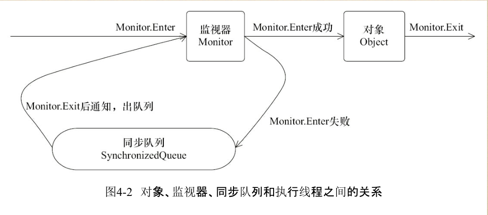
    > 等待、通知机制，是指一个线程A调用了对象O的wait()方法进入等待状态，而另一个线程B调用对象O的notify()或者notifyAll()方法
    > 线程A收到通知后从对象O的wait()方法返回，进而执行后续操作，上述两个线程通过对象O来完成交互，而对象上的wait()和notify/notifyAll()的关系
    > 就如同开关信号一样，用来完成等待方和通知方之间的交互工作，见代码WaitNotify.java
    
    > 上图WaitThread先获取了对象的锁，然后调用对象的wait()方法，从而放弃了锁，并进入到对象的等待队列WaitQueue中，进入等待状态，由于WaitThread
    > 释放了对象的锁，NotifyThread随后获取了对象的锁，并调用对象的notifyAll()方法，将WaitThread从WaitQueue移动到SynchronizedQueue中，
    > 此时WaitThread状态变为Blocked阻塞状态,NotifyThread线程释放锁之后，WaitThread再次获得到锁并从wait()方法返回继续执行
    ```
    在synchronized代码块或方法中，对共享变量的修改会立即被写入主内存，并且其他线程在获取锁之后会从主内存中读取最新的值。
    因此，如果一个线程修改了某个变量的值，其他线程在获取锁之后就一定能看到最新的值
    ```
    - 等待、通知的经典范式
    > 该范式分为两个部分，分别是等待方（消费者）和通知方（生产者）
     - 1：等待方遵顼如下原则
    ```
      1:获取对象的锁
      2：如果条件不满足，那么调用对象的wait()方法，被通知后仍然要检查条件
      3：条件满足则执行对应的逻辑
      对应的伪代码如下：
      synchronized(对象){
        whie(条件不满足){
          对象.wait();
        }
        对应的处理逻辑
      }
    ```
     - 2:通知方遵顼如下原则
    ```
      1:获得对象的锁
      2：改变条件
      3：通知所有等待在对象上的线程
      对应的伪代码如下：
      synchronized(对象){
        改变条件
        对象.notifyAll();
      }
    ```
    - 管道输入、输出流
    > 管道输入输出流和普通的文件输入输出流或者网络输入输出流不同之处在于：它主要用于线程之间的数据传输，而传输的媒介为内存
    > 管道输入输出流包含了如下四种具体实现：PipedOutputStream,PipedInputStream,PipedReader,PipedWriter,前两者面向字节，后两者面向字符
    > 详见Piped
    - Thread.join()的使用
    > 如果一个线程A执行了thread.join()语句，其含义是：当前线程A等待thread线程终止之后才从thread.join()返回，线程Thread除了提供join()方法之外，
    > 还提供了join(long),join(long millis,int nanos)两个具备超时特性的方法，这两个超时方法表示，如果线程thread在给定的超时时间内没有终止，那么将会从该超时方法中返回
    - ThreadLocal的使用
    > ThreadLocal即线程变量，是一个以ThreadLocal对象为键，任意对象为值的存储结构，这个结构被附带在线程上，也就是说一个线程可以根据ThreadLocal对象查询到绑定在这个线程上的一个值
    > 可以通过set(T)方法来设置一个值，在当前线程下再通过get()方法获取到原先设定的值
  
  - 46:线程应用实例
    - 等待超时模式
    > 开发人员经常会遇到这样的方法调用场景：调用一个方法时等待一段时间（一般来说是给定一个时间段），如果该方法能够在给定的时间段内得到结果，那么将结果
    > 立刻返回，反之超时返回默认结果，之前的等待、通知经典范式，即加锁，条件循环和处理逻辑三个步骤，这种范式无法做到超时等待，只需要如下小改动即可：
    ```
    //对当前对象加锁
    public synchronized Object get(long mills) throws InterruptedException{
          //8:03:25
        long future=System.currentTimeMills()+mills;
          //5秒
        long remaining=mills;
        //当超时大于0且result返回值不满足要求时
        while((result==null)&& remaining>0){
           wait(remaining);
           remaining=future-System.currentTimeMills();
        }
        return result;
    }
    ```
    - 一个简单的数据库连接池示例
    > 我们使用等待超时模式来构建一个简单的数据库连接池，模拟从连接池中获取，使用和释放连接的过程，而客户端获取连接的过程被设置为等待、超时模式
    > 在1000毫秒内如果无法获取可用的连接则返回客户端null,设定连接池的大小为10个，然后调节客户端的连接数来模拟无法获取连接的场景
    ```
      1:定义一个连接池，见ConnectionPool.java;通过构造函数初始化连接池大小，使用双向队列来维护，调用方法前获取，调用后放回
      2：动态代理实现一个java.sql.Connection实例，在commit()方法调用时休眠100毫秒，见ConnectionDriver.java
      3:ConnectionPoolTest.java测试
    ```
    - 线程池技术及其示例
    > 对于服务端的程序，经常面对的是客户端传入的短小（执行时间短、工作内容较为单一）
    任务，需要服务端快速处理并返回结果。如果服务端每次接受到一个任务，创建一个线程，然
    后进行执行，这在原型阶段是个不错的选择，但是面对成千上万的任务递交进服务器时，如果
    还是采用一个任务一个线程的方式，那么将会创建数以万记的线程，这不是一个好的选择。因
    为这会使操作系统频繁的进行线程上下文切换，无故增加系统的负载，而线程的创建和消亡
    都是需要耗费系统资源的，也无疑浪费了系统资源
    > 
    > 线程池技术能够很好地解决这个问题，它预先创建了若干数量的线程，并且不能由用户
    直接对线程的创建进行控制，在这个前提下重复使用固定或较为固定数目的线程来完成任务
    的执行。这样做的好处是，一方面，消除了频繁创建和消亡线程的系统资源开销，另一方面，
    面对过量任务的提交能够平缓的劣化。
    代码见ThreadPool.java
    - 一个基于线程池技术的简单web服务器
    > 目前的浏览器都支持多线程访问，比如说在请求一个HTML页面的时候，页面中包含的图
    片资源、样式资源会被浏览器发起并发的获取，这样用户就不会遇到一直等到一个图片完全
    下载完成才能继续查看文字内容的尴尬情况
  
    > 如果Web服务器是单线程的，多线程的浏览器也没有用武之地，因为服务端还是一个请求
    一个请求的顺序处理。因此，大部分Web服务器都是支持并发访问的。常用的Java Web服务器，
    如Tomcat、Jetty，在其处理请求的过程中都使用到了线程池技术。
  
    > 见SimpleHttpServer.java
  - 47:本章小结
    ```
    本章从介绍多线程技术带来的好处开始，讲述了如何启动和终止线程以及线程的状态，纤细讲述了多线程之间的通信的基本方式
    即等待、通知方式，在线程应用示例中，使用了等待超时、数据库连接池、以及简单线程池三个不同的示例巩固本章的知识，最后
    通过一个简单的web应用服务器将上述只是串联起来
    
    ```
  
  - java中的锁
    > 本章将介绍java并发包中与锁相关的api和组件，以及这些api和组件的使用方式和实现细节，关于使用和实现
    > 使用：通过实例演示这些组件的使用方法以及详细介绍与锁相关的api,
    > 实现：分析源码 剖析实现细节 
  - 48: Lock接口
    > 锁是用来控制多个线程访问共享资源的方式，一般来说，一个锁能够防止多个线程同时访问共享资源（但有些锁可以允许多个线程并发的访问共享资源，比如读写锁）
    > 在Lock接口出现之前，java程序是靠着synchronized关键字来实现锁功能的，在jdk5之后，并发包中新增了Lock接口（以及相关实现类）用来实现锁功能
    > 它提供了与synchronized关键字类似的同步功能，只是在使用时需要显示的获取和释放锁，虽然它缺少了（通过synchronized块或方法所提供的）隐式获取和释放锁
    > 的便捷性，但是确拥有了锁获取和释放的可操作性，可中断的获取锁，以及超时获取锁等多种synchronized关键字不具备的同步特性
    > 
    > 使用synchronized关键字将会隐式的获取锁，但是他将锁的获取和释放固化了，也就是先获取再释放，当然这种方式简化了同步的管理，可是扩展性没有显示的获取和释放的好
    > 例如在一个场景手把手经行所得获取和释放，先获取锁a,再获取锁b,获得b之后释放锁a，同时获取锁c,获取锁c的同时释放锁b再获取锁d,这种场景synchronized不太好实现
    > 但是使用Lock就容易很多：LockUseCase
    > 
    > Lock接口提供了synchronized关键字不具备的主要特征
    > 1：尝试非阻塞的获取锁：当前线程尝试获取锁，如果这一时刻没有被其他线程获取到，则成功获取并持有锁
    > 2：能被中断的获取锁：与synchronized不同，获取到锁的线程能够响应中断，当获取到锁的线程被中断时，中断异常将会被抛出，同时锁会被释放
    > 3：超时获取锁：在指定的截至时间之前获取锁，如果无法获取则返回
    ```
      Lock是一个接口，定于了锁的获取和释放的基本操作，API如下：
      void lock():获取锁，调用该方法，当前线程将会获取锁，当获得锁之后，从该方法返回
      void lockInterruptibly() throws InterruptedException:可中断的获取锁，和lock()方法不同之处在于该方法会响应中断，即在锁的获取过程中可以中断当前线程
      boolean tryLock():尝试非阻塞的获取锁，调用该方法之后立刻返回，如果能够获取则返回true,否则返回false
      boolean tryLock(long time,TimeUnit unit) throws InterruptedException:超时的获取锁，当前线程在一下三种情况下会返回：
        1：当前线程在超时时间内获取到了锁
        2：当前线程在超时时间内被中断
        3：超时时间结束，返回false
      void unlock():释放锁
      Condition new Condition():获取等待通知组件，该组件和当前的锁绑定，当前线程只有获取了锁，才能调用该组件的wait()方法，而调用后，当前线程释放锁

    ```
    > 后续的同步器AbstractQueuedSynchronizer AQS 以及常用Lock接口的实现ReentrantLock,Lock接口的实现基本上都是通过聚合了一个同步器的子类来完成线程访问控制的。
  
  - 49：队列同步器
    > 队列同步器AbstractQueuedSynchronizer,使用来构建锁或者其他同步组件的基础框架，它使用了一个int成员变量表示同步状态，通过内置的FIFO(先进先出队列)来完成资源获取
    > 线程的排队工作，并发包的作者Doug Lea希望它能够成为实现大部分同步需求的基础。
    > 
    > 同步器的主要使用方式是继承，子类通过继承同步器并实现它的抽象方法来管理同步状态，在抽象方法实现的过程中免不了要对同步状态进行更改，这时就需要使用同步器
    > 提供的3个方法：getState(),setState(int newState),compareAndSetState(int expect,int update),来进行操作，因为它能够保证状态的改变是安全的，
    > 子类推荐被定义为自定义同步组件的静态内部类，同步器自身没有实现任何同步接口，它仅仅是定义了若干同步状态获取和释放的方法来共自定义同步组件使用，同步器既可以
    > 支持独占式的获取同步状态，也可以支持共享式的获取同步状态，这样就可以方便实现不同类型的同步组件（ReentrantLock,ReentrantReadWriteLock,CountDownLatch等）
    > 
    > 同步器是实现锁（也可以是任意同步组件）的关键，在锁的实现中聚合同步器，利用同步器实现锁的语义，可以这样理解二者之间的关系，锁是面向使用者的，它定义了使用者
    > 与锁交互的接口（比如可以允许两个线程并行访问），隐藏了实现细节，同步器面向的是锁的实现者，它简化的了锁的实现方式，屏蔽了同步状态管理，线程的排队，等待与唤醒等底层操作
    > 锁和同步器很好的隔离了使用者和实现者所关注的领域
  - 50：队列同步器的接口与示例
    > 同步器的式设计是基于模板方法模式的，也就是说，使用者需要继承同步器并编写指定的方法，随后将同步器组合在自定义同步组件的实现中，并调用同步器提供的模板方法，而这些模板方法
    > 将会调用使用者重写的方法
    > 
    > 重写同步器指定的方法时，需要使用同步器提供如下三个方法来访问或修改同步状态：
    > 1：getState():获取当前同步状态
    > 2：setState(int newState):设置当前同步状态
    > 3：compareAndSetState(int expect,int update);使用CAS设置当前状态，该方法能够保证状态设置的原子性
    
    > 同步器可重写的方法与描述如下：
    ```
    1:protected boolean tryAcquire(int arg):独占式获取同步状态，实现该方法需要查询当前状态并判断同步状态是否符合预期，然后再进行CAS设置同步状态
    2:protected boolean tryRelease(int arg):独占式释放同步状态，等待获取同步状态的线程将有机会获取同步状态
    3:protected int tryAcquireShared(int arg):共享式获取同步状态，返回大于等于0的值，表示获取成功，反之获取失败
    4:protected boolean tryReleaseShared(int arg):共享式释放同步状态
    5:protected boolean isHeldExclusivery():当前同步器是否在独占模式下被线程占用，一般该方法表示是否被当前线程所独占
    ```
    > 实现自定义同步组件时，将会调用同步器提供的模板方法，这些（部分）方法描述如下：
    ```
    1:void acquire(int arg):独占式获取同步状态，如果当前西安城获取同步状态成功，则由该方法返回，否则，将会进入同步队列等待，该方法将会调用重写的tryAcquire(int arg)方法
    2:void acquireInterruptibly(int arg):与上面方法相同，但是该方法响应中断，当前线程未能获取到同步状态而进入同步队列中，如果当前线程被中断则该方法抛出InterruptedException并返回
    3:boolean tryAcquireNanos(int arg,long nanos):在上一个方法的基础上增加了超时限制，如果当前线程在超时时间内没有获取到同步状态，那么将会返回false,如果获取到了返回true
    4:void acquireShared(int arg):共享式的获取同步状态，如果当前线程未能获取到同步状态，将会进入到同步队列等待，与独占式获取的主要区别在于同一时刻可以有多个线程获取到同步状态
    5:void acquireSharedInterruptibly(int arg):与上述方法相同，却别再与该方法相应中断
    6:boolean tryAcquireSharedNanos(int arg,long nanaos):在上述方法的基础上增加了超时设置
    7:boolean release(int args)：独占式的释放同步状态，该方法会在释放同步状态之后，将同步队列中第一个节点包含的线程唤醒
    8:boolean releaseShared(int args):共享式的释放同步状态
    9:Collection<Thread>getQueuedThreads():获取等待在同步队列上的线程集合
    ```
    > 同步器提供的模板方法基本上分为3类：独占式获取与释放同步状态，共享式释放与获取同步状态，查询同步队列中的等待线程情况，自定义同步组件将使用同步器提供的模板方法来实现自己的同步语义
    > 只有账务了同步器的同步原理才能更深入的理解并发包中的其他并发组件，已一个独占锁的实例来了解同步器的工作原理
    > 独占锁，顾名思义就是在同一时刻只能由一个线程获取到锁，而其他获取锁的线程只能在同步队列中等待，只有获取锁的线程释放了锁，后续的线程才能够获得到锁，见Mutex.java
  - 51:队列同步器的实现分析 
    > 探究抽象队列同步器是如何完成线程同步的,主要包括:同步队列,独占式同步状态获取与释放,共享式同步状态获取与释放,超时获取同步状态等同步器的核心数据结构与模板算法
      - 1:同步队列
    > 同步器依赖的内部同步队列(一个FIFO双向队列)来完成同步状态的管理,当前线程获取同步状态失败时,同步器会将当前线程以及等待状态等信息构造成一个节点Node并将其加入同步队列
    > 同时会阻塞当前线程,当同步状态释放时,会把首节点中的线程唤醒,使其再次尝试获取同步状态
    > 
    > 同步队列中的节点Node用来保存获取同步状态失败的线程引用,等待状态以及前驱和后继节点,节点的属性类型与名称以及描述如下
      ```
      int waitStatus:等待状态,包括如下状态:
        1:CANCELLED,值为1,由于在同步队列中等待的线程等待超时或者被中断,需要从同步队列中取消等待,节点进入该状态将不会变化
        2:SIGNAL,值为-1后继节点的线程处于等待状态,而当前节点的线程如果释放了同步状态或者被中断,将会通知后继节点,是后继节点的线程得以运行
        3:CONDITION,值为-2,节点在等待队列中,节点线程等待在Condition上,当其他线程对Condition调用了signal()方法后,该节点将会从等待队列中转移到同步队列中,加入到对同步状态的获取中
        4:PROPAGATE,值为-3,表示下一次共享式同步状态获取将会无条件的被传播下去
        5:INITIAL,值为0,初始状态
      Node prev:前驱节点,当节点加入同步队列的时候被设置(尾部添加)
      Node next:后继节点
      Node nextWaiter:等待队列中的后继节点,如果当前节点是共享的,那么这个字段将是一个SHARED常量,也就是说,节点类型(独占和共享)和等待队列中的后继节点共用同一个字段
      Thread thread:获取同步状态的线程
      ```
    > 节点是构成同步队列的基础,同步器拥有首节点head,和尾节点tail,没有成功获取同步状态的线程将会成为节点加入该队列的尾部,同步队列的基本结构如下:
      ```
        同步器 setHead(Node update)         节点1      节点2
         head->指向首节点-->节点1            prev<------prev
         tail->指向尾节点-->节点2            next------>next
            CAS设置尾节点:compareAndSetTail(Node expect,Node update)
      在上述描述中,同步器包含了两个节点类型的引用,一个指向头节点,一个指向尾节点,试想一下,一个线程成功的获取的同步状态(或者锁),其他线程将无法获取到同步状态
      转而被构造成为节点并加入到同步队列中,而这个加入队列的过程必须保证线程安全,因此同步器提供了一个基于CAS的设置尾节点的方法:compareAndSetTail(Node expect,Node update)
      它需要传递当前线程"认为"的尾节点和当前节点,只有设置成功后,当前节点才正式与之前的尾节点建立关联
      ```
      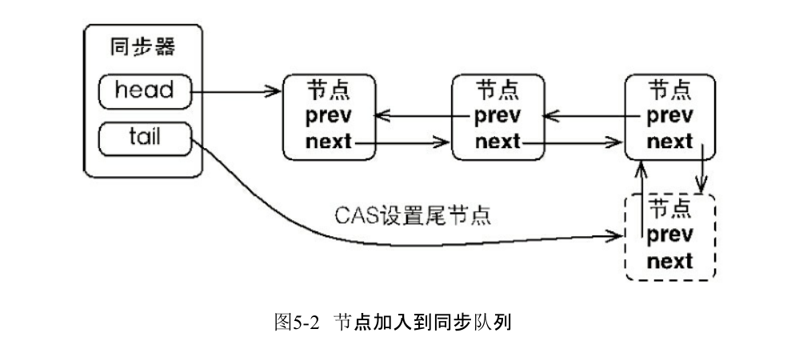
    > 同步队列遵循FIFO,首节点是获取同步装填成功的节点,首节点的线程在释放同步状态时,将会唤醒后继节点,而后继节点将会在获取同步状态成功时将自己设置为首节点,
      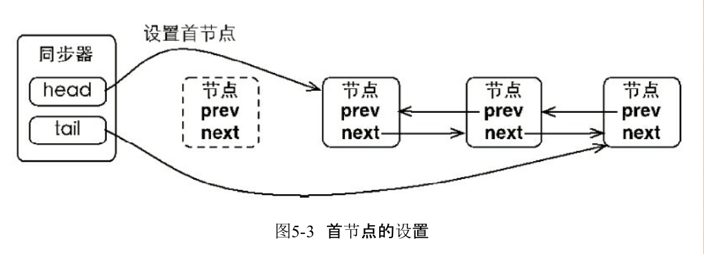
    > 如上图:设置首节点是通过获取同步状态成功的线程完成的,由于只有一个线程能够成功获取到同步状态,因此设置头节点的方法并不需要使用CAS来保证,他只需要将首节点设置成原节点的后继节点
    > 并断开原节点的next引用即可
      - 2:独占式同步状态获取与释放
    > 通过调用同步器的acquire(int arg)方法可以获取同步状态,该方法对中断不敏感,也就是说由于线程获取同步状态失败后进入同步队列中,后续对线程进行中断操作时,线程不会从同步队列中移除
    > 代码如下
      ```
      public final void acquire(int arg){
            if(!tryAcquire(arg)&&acquireQueued(addWaiter(Node.EXCLUSIVE),arg)){
                 selfInterrupt();
            }
      }
      ```
    > 上述代码主要完成了同步状态的获取,节点构造,加入同步队列,在同步队列中自选等待的相关工作,其主要逻辑是：
      ```
      1:首先调用自定义同步器实现的tryAcquire(int arg)方法，该方法保证线程安全的获取同步状态，
      2:如果同步状态获取失败，则构造同步节点（独占式Node.EXCLUSIVE,同一时刻只能有一个线程成功获取同步状态）并通过addWaiter(Node node)方法将该节点加入到同步队列的尾部
      3:最后调用acquireQueued(Node node,int arg)方法，使得该节点以死循环的方式获取同步状态，如果获取不到则阻塞节点中的线程，而被阻塞线程的唤醒主要依靠前驱节点的出队或者阻塞线程被被中断来实现
      ```
    > 先看节点的构造以及加入同步队列，同步器的addWaiter和enq
      ```
      private Node addWaiter(Node mode){
        //构造一个新的节点
        Node node=new Node(Thread.currentThread(),mode);
        //快速尝试在尾部添加
        Node pred=tail;
        if(pred!=null){
          //将新节点的前驱节点连接到尾部节点
          node.prev=pred
          if(compareAndSetTail(pred,node)){//该方法操作一个tail字段，也就是我们的尾部指针pred，尝试将队列的尾部指针更新为node,
            //成功则更新队列的尾部指针指向node
            pred.next=node;
            return node;
          }
          //失败则
          enq(node);
          return node;
        }  
      }
    
      private Node enq(final Node node){
        for(;;){
          Node t=tail;
          if(t==null){//一下初始化
            if(compareAndSetHead(new Node())){
             //compareAndSetHead(node)：比较链表的头节点head和传入的新节点node,如果头节点为null,会将新节点node设置为头节点，并返回true
             tail=head;//这里同时也将尾节点指针指向头节点指针所指向的node，因为就一个节点Node
            }
          }else{
            node.prev=t;//新节点的前驱节点设置为尾节点
            if(compareAndSetTail(t,node)){//比较当前的尾巴节点是否是为t,是的话将其更新为node
              //更新成功后
              t.next=node;
              return t;//这里tail为节点指针已经指向
            }
          
          }
        }
      }
      compareAndSetTail确保节点被线程啊暖的添加到尾部
      enq()方法中同步器通过死循环确保节点的正确添加，在死循环中只有通过CAS将节点设置成尾节点之后，当前线程才能从该方法返回，否则当前线程不断的尝试设置，
        可以看出enq()方法将并发添加节点的请求通过CAS变得“串行化”了
      ```
    > 返回t而不是返回node的原因是，t是node的前一个节点，它本身也是队列中的一个节点。在队列的操作中，通常会返回当前节点或前一个节点，以便于维护队列的完整性。
      例如，如果我们在队列的头部添加一个新的节点，我们通常会返回旧的头节点，以便于在之后的操作中能够正确地维护队列的顺序。
      同样地，在将一个新节点插入到队列的尾部时，返回t有助于在之后的操作中正确地维护队列的顺序。例如，如果需要在队列中删除一个节点，我们可以通过访问t来找到node并执行删除操作。
      总之，返回t而不是返回node是为了在之后的操作中更方便地维护队列的完整性。
    > 
    > 节点进入同步队列之后，就进入了一个自旋得过程，每个节点，或者说每个线程，都在自省的观察，当条件满足，获得到了同步状态，就可以从这个自旋过程中退出，否则以就留在
    > 这个自旋过程中（并且会阻塞该节点的线程），如下：
      ```
      final boolean acquireQueued(final Node node,int arg){
          boolean failed=true;
          try{
            boolean interrupted=fale;
            for(;;){
              final Node p=node.predecessor();
              if(p==head&&tryAcquire(arg)){
                  setHead(node);
                  p.next=null;//help GC
                  failed=false;
                  return interrupted;
              }
              if(shouldParkAfterFailedAcquire(p,node)&&parkAndCheckInterrupt()){
                  interrupted=true;
              }
            }
          }
          finally{
            if(failed){
              cancelAcquire(node);
            }
          }
      }
      在acquireQueued(final Node node,int arg)方法中，当前线程在“死循环”中尝试获取同步状态，而只有前驱节点是头节点才能尝试获取同步状态，原因如下：
      1：头节点是成功获取到同步状态的节点，而头节点的线程释放了同步状态之后，将会唤醒其后继节点，后继节点的线程被唤醒后需要检查自己的前驱节点是否是头节点
      2：维护同步队列的FIFO原则，该方法中，节点自旋获取同步状态的行为如下
      ```
      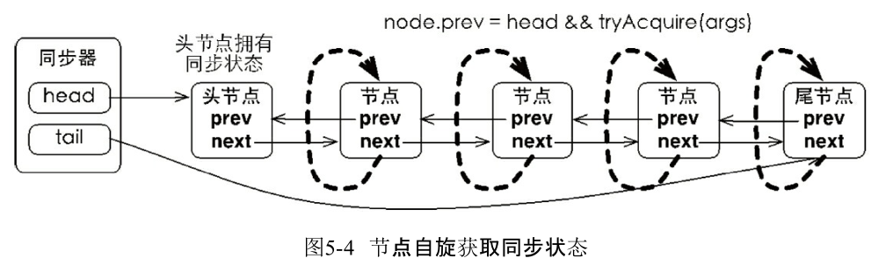
      ```
      上图中：由于非首节点线程前驱节点出队或者被中断而从等待状态返回，随后检查自己的前驱节点是否是头节点，如果是则尝试获取同步状态，可以看到节点和节点之间
      在循环检查的过程中基本不互相通信，而是简单的判断自己的前驱节点是否为头节点，这样就使得节点的释放规则符合FIFO,并且也便于对过早通知的处理（过早通知是指前驱节点不是头节点的线程由于中断而被唤醒）
      ```
    > 独占式同步状态获取流程，也就是acquire(int arg)方法调用流程，如下图：
      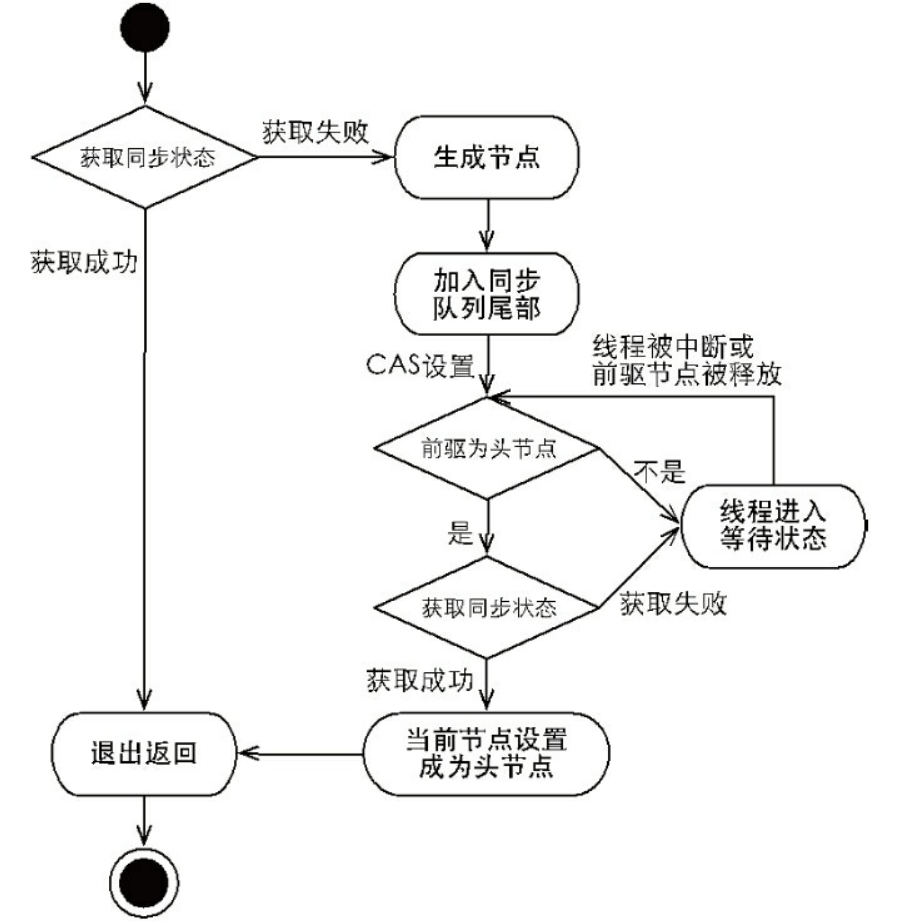
    > 
    > 在上图中，前驱节点为头节点且能够获取同步状态的判断条件和线程进入等待状态是获取同步状态的自旋过程，当同步状态获取成功后，当前线程从acquire(int arg)方法返回
    > 如果对于锁这种并发组件而言，代表着当前线程获取了锁
    > 
    > 当前线程获取同步状态并执行了相应的逻辑之后，就需要释放同步状态，使得后继节点能够继续获得同步状态，通过调用同步器的release(int arg)方法可以释放同步状态
    > 该方法在释放了同步状态之后，会唤醒其后继节点（进而使后继节点重新尝试获取同步状态），方法代码如下：
      ```
      public final boolean release(int arg){
          if(tryRelease(arg)){
            Node h=head;
             if(h!=null&&h.waitStatus!=0){
                unparkSuccessor(h);
             }
            return true;
          }
          return false;
      }
      该方法执行时，会唤醒头节点的后继节点的线程，unparkSuccessor(h)方法使用LockSupport来唤醒处于等待状态的线程
      分析了独占式同步状态的获取和释放过程之后：总结如下：
        在获取同步状态时，同步器维护一个同步队列，获取状态失败的线程都会被加入到队列中并在队列中进行自旋，移出队列
        （或者停止自旋）的调价是前驱节点为头节点且成功获取了同步状态。在释放同步状态时，同步器调用tryRelease(int arg)
         方法释放同步状态，然后唤醒头节点的后继节点
      ```
      - 3:共享式同步状态获取与释放
    > 共享式获取与独占式获取的最主要的区别在于同一时刻能否有多个线程同时获取到同步状态，以文件的读写为例，如果一个程序在对文件进行读操作，
    > 那么这一时刻对于该文件的写操作均被阻塞，而读操作能够同时进行，写操作要求对资源的独占式访问，而读操作可以是共享式访问，两种不同的访问模式
    > 在同一时刻对文件资源的昂问情况如下图:
      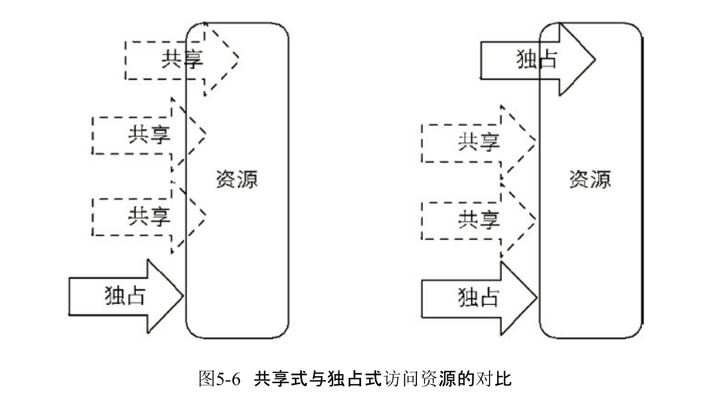
    > 
    > 通过调用同步器的acquireShared(int arg)方法可以共享式的获取同步状态，代码如下：
      ```
      public final void acquireShared(int arg){
          if(tryAcquireShared(arg)){
              doAcquireShared(arg);   
          }
      }
      public void doAcquireShared(int arg){
          final Node node=addWaiter(Node.SHARED);
          boolean failed=true;
          try{
              boolean interrupted=false;        
              for(;;){
                  final Node p=node.predecessor();
                  if(p==head){
                      int r=tryAcquireShared(arg);
                      if(r>=0){
                          setHeadAndPropagate(node,r);
                          p.next=null;
                          if(interrupted){selfInterrupt();}
                          failed=false;
                          return;
                      }
                  }
                  if(shouldParkAfterFailedAcquire(p,node)&&parkAndCheckInterrupt()){
                      interrupted=true;
                  }
              }
          }finally{
              if(failed){
                 cancelAcquire(node);
              }
          }
      }
      在上述acquireShared方法中，同步器调用tryAcquireShared方法尝试获取同步状态，tryAcquireShared方法返回值为int,
      当返回值大于0时表示能够获取到同步状态，因此在共享式获取的自旋过程中，成功获取到同步状态并退出自旋的条件就是tryAcquireShared
      方法的返回值大于0，在doAcquireShared方法的自旋过程中，如果当前节点的前驱节点为头节点时，尝试获取同步状态，如果返回值大于0，
      表示该次获取同步状态成功并从自旋过程中退出。
     
      与独占式一样，共享式获取也需要释放同步状态，通过调用releaseShared(int arg)方法可以释放同步状态，代码如下：
      public final boolean releaseShared(int arg){
        if(tryReleaseShared(arg)){
          doReleaseShared();
          return true;
        }
      }
      该方法在释放同步状态之后，将会唤醒后续处于等待状态的节点，对于能够支持多个线程同时访问的并发组件，比如Semaphore,
      它和独占式主要区别在于tryReleseShared(int arg)方法必须确保同步状态（或者资源数）线程安全释放，一般是通过循环和CAS来保证的
      因为释放同步状态的操作会同时来自多个线程
      ```
      - 4:独占式超时获取同步状态
    > 通过调用同步器的doAcquireNanos(int arg,long nanosTimeout)方法可以超时获取同步状态，即在指定的时间段内获取同步状态，如果获取到同步住哪个太则返回true
    > 否则返回false,该方法提供了传统java同步操作（比如synchronized关键字）所不具备的特性
    > 
    > 在分析该方法之前，先介绍一下响应中断中断的同步状态获取过程，在java5以前，当一个线程获取不到锁而被阻塞在synchronized之外时，对该线程进行中断操作，此刻该线程
    > 的中断标志位会被修改，但是该线程依旧会阻塞在synchronized之上，等待着获取锁，在java5中，同步器提供了acquireInterruptibly(int arg)方法，这个方法在等待获取
    > 同步状态时，如果当前线程被中断，会立刻返回，并抛出InterruptedException
    > 
    > 超时获取同步状态过程可以被视作响应中断获取同步状态过程的增强版，doAcquireNanos()方法在支持响应中断的基础上，增加了超时获取的特性，针对超时获取
    > 主要需要计算出睡眠的时间间隔，为了防止过早的通知，timeOut的计算公式为now-lastTime,其中now为当前唤醒时间，lastTime为上次唤醒时间，如果nanosTimeout大于0，
    > 则表示超时时间未到，需要继续睡眠nanosTimeout纳秒，反之表示已经超时，
    >
    ```
    private boolean doAcquireNanos(int arg,long nanosTimeout) throws InterruptedException{
        long lastTime=System.nanoTime();
        final Node node=addWaiter(Node.EXCLUSIVE);
        boolean failed=true;
        try{
            for(;;){
                final Node p=node.predecessor();
                if(p==head&&tryAcquire(arg)){
                    setHead(node);
                    p.next=null;
                    failed=false;
                    return true;
                }
                if(nanoTimeout<=0){
                    return false;
                }
                if(shouldParkAfterFailedAcquire(p,node)&&nanoTimeout>spinForTimeoutThreshold){
                    LockSupport.parkNanos(this,nanosTimeout);
                }
                long now=System.nanoTime();
                //计算时间，当前时间now减去睡眠时间之前的lastTime,得到已经睡眠的时间delta,然后被原有的超时时间nanosTimeout减去，得到还应该剩余的睡眠时间
                nanosTimeout-=now-lastTime;
                lastTime=now;
                if(Thread.interrupted()){throw new InterruptedException();}
            }
        }finally{
            if(failed){cancelaAcquire(node);}
        }
    }  
    该方法在自旋的过程中，当节点的前驱节点为头节点时，尝试获取同步状态，如果成功获取则从该方法返回，这个过程和独占式同步获取的过程有点类似，
    但是在同步状态获取失败的处理上有所不同，如果当前线程获取同步状态失败，则判断是否超时，（nanosTimeout<0表示已经超时），如果没有超时则重新计算nanosTimeout,
    然后使当前线程等待nanosTimeout纳秒，当以到设置的超时时间，该线程会从LockSupport.parkNanos(Object blocker,long nanos)方法返回
    
    如果nanosTimeout小于等于spinForTimeoutThreshold（1000纳秒）时，将不会使该线程进行超时等待，
    而是进入快速的自旋过程。原因在于，非常短的超时等待无法做到十分精确，如果这时再进行超时等待，相反会让nanosTimeout的超时从整体上表现得反而不精确。
    因此，在超时非常短的场景下，同步器会进入无条件的快速自旋。
    独占式超时获取同步状态流程如下：
    ```
    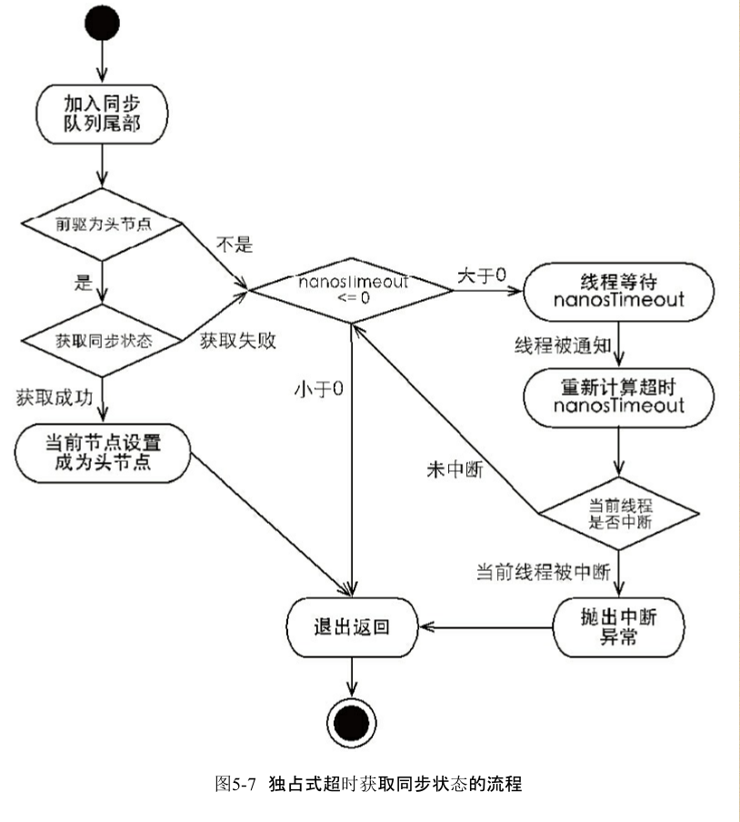
    > 
    > 从上图可以看出，独占式超时获取同步状态doAcquireNanos(int arg,long nanosTimeout)和独占式获取同步状态acquire(int arg),在流程上非常相似
    > 主要区别在与未能获取到同步状态是的逻辑处理，acquire在未获取到同步状态时，将会使线程一直处于等待状态，而doAcquireNanos会使当前线程等待nanosTimeout纳秒
    > 如果当前线程在nanosTimeout纳秒内没有获取到同步状态，将会从等待逻辑中自动返回
    
     - 5：自定义同步组件--TwinsLock
    > 在前面的章节中，对同步器AbstractQueuedSynchronizer进行了实现层面的分析，本节通过编写一个自定义同步组件来加深对同步器的理解.
    > 设计一个同步工具，该工具在同一时刻，只允许之多两个线程访问，超过两个线程的 访问将被阻塞，我们将这个同步工具命名为TwinsLock。
    > 
    > 首先，确定访问模式。TwinsLock能够在同一时刻支持多个线程的访问，这显然是共享式
    访问，因此，需要使用同步器提供的acquireShared(int args)方法等和Shared相关的方法，这就要
    求TwinsLock必须重写tryAcquireShared(int args)方法和tryReleaseShared(int args)方法，这样才能
    保证同步器的共享式同步状态的获取与释放方法得以执行。
    > 
    > 其次，定义资源数。TwinsLock在同一时刻允许至多两个线程的同时访问，表明同步资源
    数为2，这样可以设置初始状态status为2，当一个线程进行获取，status减1，该线程释放，则
    status加1，状态的合法范围为0、1和2，其中0表示当前已经有两个线程获取了同步资源，此时
    再有其他线程对同步状态进行获取，该线程只能被阻塞。在同步状态变更时，需要使用
    compareAndSet(int expect,int update)方法做原子性保障。
    > 
    > 最后，组合自定义同步器。前面的章节提到，自定义同步组件通过组合自定义同步器来完
    成同步功能，一般情况下自定义同步器会被定义为自定义同步组件的内部类。见TwinsLock.java
    > 
  - 52:重入锁
    > 重入锁ReentrantLock，顾名思义，就是支持重进入的锁，它表示该锁能够支持一个线程对资源的重复加锁。除此之外，该锁的还支持获取锁时的公平和非公平性选择。
    > 
    > 回忆在同步器一节中的示例（Mutex），同时考虑如下场景：当一个线程调用Mutex的lock()
    方法获取锁之后，如果再次调用lock()方法，则该线程将会被自己所阻塞，原因是Mutex在实现
    tryAcquire(int acquires)方法时没有考虑占有锁的线程再次获取锁的场景，而在调用
    tryAcquire(int acquires)方法时返回了false，导致该线程被阻塞。简单地说，Mutex是一个不支持
    重进入的锁。而synchronized关键字隐式的支持重进入，比如一个synchronized修饰的递归方
    法，在方法执行时，执行线程在获取了锁之后仍能连续多次地获得该锁，而不像Mutex由于获
    取了锁，而在下一次获取锁时出现阻塞自己的情况
    > 
    > ReentrantLock虽然没能像synchronized关键字一样支持隐式的重进入，但是在调用lock()方
    法时，已经获取到锁的线程，能够再次调用lock()方法获取锁而不被阻塞。
    > 
    > 这里提到一个锁获取的公平性问题，如果在绝对时间上，先对锁进行获取的请求一定先
    被满足，那么这个锁是公平的，反之，是不公平的。公平的获取锁，也就是等待时间最长的线
    程最优先获取锁，也可以说锁获取是顺序的。ReentrantLock提供了一个构造函数，能够控制锁
    是否是公平的。
    > 
    > 事实上，公平的锁机制往往没有非公平的效率高，但是，并不是任何场景都是以TPS作为
    唯一的指标，公平锁能够减少“饥饿”发生的概率，等待越久的请求越是能够得到优先满足
    > 
    > 下面将着重分析ReentrantLock是如何实现重进入和公平性获取锁的特性，并通过测试来
    验证公平性获取锁对性能的影响
     
    - 1:实现重进入 
      > 重进入是指任意线程在获取到锁之后能够再次获取该锁而不会被锁所阻塞，该特性的实现需要解决以下两个问题。
      > 
      > 1：线程再次获取锁：锁需要去识别获取锁的线程是否为当前占据锁的线程，如果是，则再次成功获取
      > 
      > 2：锁的最终释放：线程重复n次获取了锁，随后在第n次释放该锁后，其他线程能够获取到
      该锁。锁的最终释放要求锁对于获取进行计数自增，计数表示当前锁被重复获取的次数，而锁
      被释放时，计数自减，当计数等于0时表示锁已经成功释放
      > 
      > ReentrantLock是通过组合自定义同步器来实现锁的获取与释放，以非公平性（默认的）实
      现为例，获取同步状态的代码如下。
      ```
          final boolean nonfairTryAcquire(int acquires) {
                   final Thread current = Thread.currentThread();
                   int c = getState();
                   if (c == 0) {
                      if (compareAndSetState(0, acquires)) {
                          setExclusiveOwnerThread(current);
                          return true;
                      }
                   } else if (current == getExclusiveOwnerThread()) {
                     int nextc = c + acquires;
                     if (nextc < 0)
                          throw new Error("Maximum lock count exceeded");
                          setState(nextc);
                          return true;
                   }
                   return false;
         }
      该方法增加了再次获取同步状态的处理逻辑：通过判断当前线程是否为获取锁的线程来
      决定获取操作是否成功，如果是获取锁的线程再次请求，则将同步状态值进行增加并返回
      true，表示获取同步状态成功
     ``` 
     > 成功获取锁的线程再次获取锁，只是增加了同步状态值，这也就要求ReentrantLock在释放同步状态时减少同步状态值 
     ```
     ```
      protected final boolean tryRelease(int releases) {
                 int c = getState() - releases;
                 if (Thread.currentThread() != getExclusiveOwnerThread())
                        throw new IllegalMonitorStateException();
                 boolean free = false;
                 if (c == 0) {
                        free = true;
                        setExclusiveOwnerThread(null);
                 }
                 setState(c);
                 return free;
      }
      如果该锁被获取了n次，那么前(n-1)次tryRelease(int releases)方法必须返回false，而只有同
      步状态完全释放了，才能返回true。可以看到，该方法将同步状态是否为0作为最终释放的条
      件，当同步状态为0时，将占有线程设置为null，并返回true，表示释放成功。
     ```
    - 2:公平与非公平获取锁的区别
      > 公平性与否是针对获取锁而言的，如果一个锁是公平的，那么锁的获取顺序就应该符合请求的绝对时间顺序，也就是FIFO
      > nonfairTryAcquire(int acquires)方法，对于非公平锁，只要CAS设置 同步状态成功，则表示当前线程获取了锁，而公平锁则不同见ReentrantLock：tryAcquire
      ```
      protected final boolean tryAcquire(int acquires) {
               final Thread current = Thread.currentThread();
               int c = getState();
               if (c == 0) {
                   if (!hasQueuedPredecessors() && compareAndSetState(0, acquires)) {
                       setExclusiveOwnerThread(current);
                       return true;
                   }
               } else if (current == getExclusiveOwnerThread()) {
                  int nextc = c + acquires;
                  if (nextc < 0)
                          throw new Error("Maximum lock count exceeded");
                  setState(nextc);
                  return true;
               }
               return false;
      }
      该方法与nonfairTryAcquire(int acquires)比较，唯一不同的位置为判断条件多了
      hasQueuedPredecessors()方法，即加入了同步队列中当前节点是否有前驱节点的判断，如果该
      方法返回true，则表示有线程比当前线程更早地请求获取锁，因此需要等待前驱线程获取并释
      放锁之后才能继续获取锁
      ```
  - 53：读写锁
    > 之前提到锁（如Mutex和ReentrantLock）基本都是排他锁，这些锁在同一时刻只允许一个线
    程进行访问，而读写锁在同一时刻可以允许多个读线程访问，但是在写线程访问时，所有的读
    线程和其他写线程均被阻塞。读写锁维护了一对锁，一个读锁和一个写锁，通过分离读锁和写
    锁，使得并发性相比一般的排他锁有了很大提升。
    > 
    > 除了保证写操作对读操作的可见性以及并发性的提升之外，读写锁能够简化读写交互场
    景的编程方式。假设在程序中定义一个共享的用作缓存数据结构，它大部分时间提供读服务
    （例如查询和搜索），而写操作占有的时间很少，但是写操作完成之后的更新需要对后续的读
    服务可见
    > 
    > 在没有读写锁支持的（Java 5之前）时候，如果需要完成上述工作就要使用Java的等待通知
    机制，就是当写操作开始时，所有晚于写操作的读操作均会进入等待状态，只有写操作完成并
    进行通知之后，所有等待的读操作才能继续执行（写操作之间依靠synchronized关键进行同
    步），这样做的目的是使读操作能读取到正确的数据，不会出现脏读。改用读写锁实现上述功
    能，只需要在读操作时获取读锁，写操作时获取写锁即可。当写锁被获取到时，后续（非当前写
    操作线程）的读写操作都会被阻塞，写锁释放之后，所有操作继续执行，编程方式相对于使用
    等待通知机制的实现方式而言，变得简单明了
    > 
    > 一般情况下，读写锁的性能都会比排它锁好，因为大多数场景读是多于写的。在读多于写
    的情况下，读写锁能够提供比排它锁更好的并发性和吞吐量。Java并发包提供读写锁的实现是
    ReentrantReadWriteLock,它提供的特性如下：
    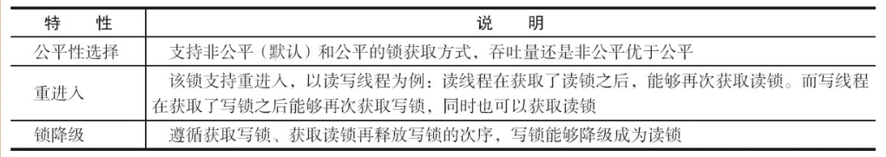
    > 
    - 1：读写锁的接口与示例
    > ReadWriteLock仅定义了获取读锁和写锁的两个方法，即readLock()方法和writeLock()方
    法，而其实现——ReentrantReadWriteLock，除了接口方法之外，还提供了一些便于外界监控其
    内部工作状态的方法，这些方法以及描述如下：
    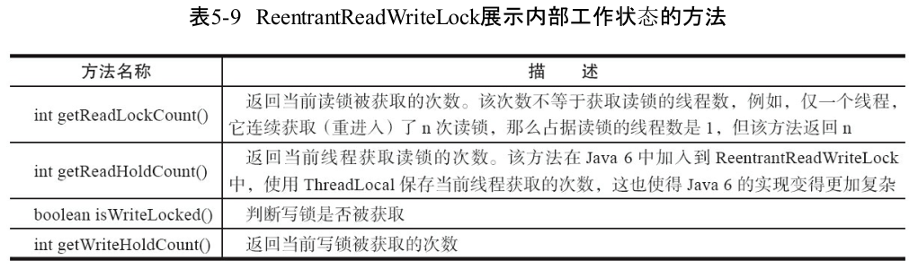
    > 接下来，通过一个缓存示例说明读写锁的使用方式，见代码Cache.java
     
    - 2:读写锁的实现分析 
    > 分析ReentrantReadWriteLock的实现，主要包括：读写状态的设计、写锁的获取与释放、读锁的获取与释放以及锁降级
    ```
    1:读写状态的设计
      读写锁同样依赖自定义同步器来实现同步功能，而读写状态就是其同步器的同步状态。
      回想ReentrantLock中自定义同步器的实现，同步状态表示锁被一个线程重复获取的次数，而读
      写锁的自定义同步器需要在同步状态（一个整型变量）上维护多个读线程和一个写线程的状
      态，使得该状态的设计成为读写锁实现的关键。

      如果在一个整型变量上维护多种状态，就一定需要“按位切割使用”这个变量，读写锁将
      变量切分成了两个部分，高16位表示读，低16位表示写，划分方式如图5-8所示。
    ```
    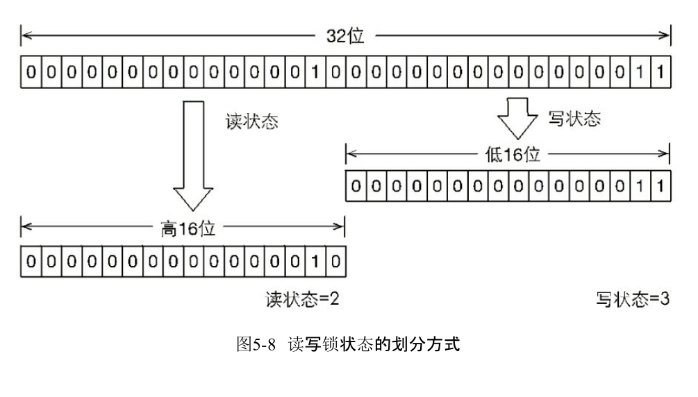
    > 当前同步状态表示一个线程已经获取了写锁，且重进入了两次，同时也连续获取了两次
    读锁。读写锁是如何迅速确定读和写各自的状态呢？答案是通过位运算。假设当前同步状态
    值为S，写状态等于S&0x0000FFFF（将高16位全部抹去），读状态等于S>>>16（无符号补0右移
    16位）。当写状态增加1时，等于S+1，当读状态增加1时，等于S+(1<<16)，也就是
    S+0x00010000
    > 
    > 根据状态的划分能得出一个推论：S不等于0时，当写状态（S&0x0000FFFF）等于0时，则读
    状态（S>>>16）大于0，即读锁已被获取。
    
    ```
    2:写锁的获取与释放
      写锁是一个支持重进入的排它锁。如果当前线程已经获取了写锁，则增加写状态。如果当
      前线程在获取写锁时，读锁已经被获取（读状态不为0）或者该线程不是已经获取写锁的线程，
      则当前线程进入等待状态,获取写锁的代码如下
    protected final boolean tryAcquire(int acquires) {
         Thread current = Thread.currentThread();
         int c = getState();
         int w = exclusiveCount(c);
         if (c != 0) {
           // 存在读锁或者当前获取线程不是已经获取写锁的线程
           if (w == 0 || current != getExclusiveOwnerThread())
           return false;
           if (w + exclusiveCount(acquires) > MAX_COUNT)
           throw new Error("Maximum lock count exceeded");
           setState(c + acquires);
           return true;
         }
         if (writerShouldBlock() || !compareAndSetState(c, c + acquires)) {
           return false;
         }
         setExclusiveOwnerThread(current);
         return true;
    }
    该方法除了重入条件（当前线程为获取了写锁的线程）之外，增加了一个读锁是否存在的
    判断。如果存在读锁，则写锁不能被获取，原因在于：读写锁要确保写锁的操作对读锁可见，如
    果允许读锁在已被获取的情况下对写锁的获取，那么正在运行的其他读线程就无法感知到当
    前写线程的操作。因此，只有等待其他读线程都释放了读锁，写锁才能被当前线程获取，而写
    锁一旦被获取，则其他读写线程的后续访问均被阻塞
    
    写锁的释放与ReentrantLock的释放过程基本类似，每次释放均减少写状态，当写状态为0
    时表示写锁已被释放，从而等待的读写线程能够继续访问读写锁，同时前次写线程的修改对
    后续读写线程可见
    ```
    
    ```
    3:读锁的获取与释放
      读锁是一个支持重进入的共享锁，它能够被多个线程同时获取，在没有其他写线程访问
      （或者写状态为0）时，读锁总会被成功地获取，而所做的也只是（线程安全的）增加读状态。如
      果当前线程已经获取了读锁，则增加读状态。如果当前线程在获取读锁时，写锁已被其他线程
      获取，则进入等待状态。获取读锁的实现从Java 5到Java 6变得复杂许多，主要原因是新增了一
      些功能，例如getReadHoldCount()方法，作用是返回当前线程获取读锁的次数。读状态是所有线
      程获取读锁次数的总和，而每个线程各自获取读锁的次数只能选择保存在ThreadLocal中，由
      线程自身维护，这使获取读锁的实现变得复杂。因此，这里将获取读锁的代码做了删减，保留
      必要的部分，如代码下
      protected final int tryAcquireShared(int unused) {
           for (;;) {
               int c = getState();
               int nextc = c + (1 << 16);
               if (nextc < c)
                  throw new Error("Maximum lock count exceeded");
               if (exclusiveCount(c) != 0 && owner != Thread.currentThread())
                  return -1;
               if (compareAndSetState(c, nextc))
                  return 1;
           }
      }
    在tryAcquireShared(int unused)方法中，如果其他线程已经获取了写锁，则当前线程获取读
    锁失败，进入等待状态。如果当前线程获取了写锁或者写锁未被获取，则当前线程（线程安全，
    依靠CAS保证）增加读状态，成功获取读锁。
    读锁的每次释放（线程安全的，可能有多个读线程同时释放读锁）均减少读状态，减少的
    值是（1<<16）。
    ```
    
    ```
    4:锁降级
      锁降级指的是写锁降级成为读锁。如果当前线程拥有写锁，然后将其释放，最后再获取读
      锁，这种分段完成的过程不能称之为锁降级。锁降级是指把持住（当前拥有的）写锁，再获取到
      读锁，随后释放（先前拥有的）写锁的过程。  

      接下来看一个锁降级的示例。因为数据不常变化，所以多个线程可以并发地进行数据处
      理，当数据变更后，如果当前线程感知到数据变化，则进行数据的准备工作，同时其他处理线
      程被阻塞，直到当前线程完成数据的准备工作，代码如下：
      public void processData() {
            readLock.lock();
            if (!update) {
              // 必须先释放读锁
              readLock.unlock();
              // 锁降级从写锁获取到开始
              writeLock.lock();
              try {
                if (!update) {
                // 准备数据的流程（略）
                    update = true;
                }
                readLock.lock();
              } finally {
                writeLock.unlock();
              }
              // 锁降级完成，写锁降级为读锁
            }
            try {
                // 使用数据的流程（略）
            } finally {
              readLock.unlock();
            }
      }
     上述示例中，当数据发生变更后，update变量（布尔类型且volatile修饰）被设置为false，此
     时所有访问processData()方法的线程都能够感知到变化，但只有一个线程能够获取到写锁，其
     他线程会被阻塞在读锁和写锁的lock()方法上。当前线程获取写锁完成数据准备之后，再获取
     读锁，随后释放写锁，完成锁降级
    
    锁降级中读锁的获取是否必要呢？答案是必要的。主要是为了保证数据的可见性，如果
    当前线程不获取读锁而是直接释放写锁，假设此刻另一个线程（记作线程T）获取了写锁并修
    改了数据，那么当前线程无法感知线程T的数据更新。如果当前线程获取读锁，即遵循锁降级
    的步骤，则线程T将会被阻塞，直到当前线程使用数据并释放读锁之后，线程T才能获取写锁进
    行数据更新
    
    RentrantReadWriteLock不支持锁升级（把持读锁、获取写锁，最后释放读锁的过程）。目的
    也是保证数据可见性，如果读锁已被多个线程获取，其中任意线程成功获取了写锁并更新了
    数据，则其更新对其他获取到读锁的线程是不可见的。
    ```
    
  - 54：LockSupport工具
    > 回顾队列同步器的内容，当需要阻塞或唤醒一个线程的时候，都会使用LockSupport工具类来完成相应
    工作。LockSupport定义了一组的公共静态方法，这些方法提供了最基本的线程阻塞和唤醒功
    能，而LockSupport也成为构建同步组件的基础工具
    > 
    > LockSupport定义了一组以park开头的方法用来阻塞当前线程，以及unpark(Thread thread)
    方法来唤醒一个被阻塞的线程。Park有停车的意思，假设线程为车辆，那么park方法代表着停
    车，而unpark方法则是指车辆启动离开，这些方法以及描述如表5-10所示
    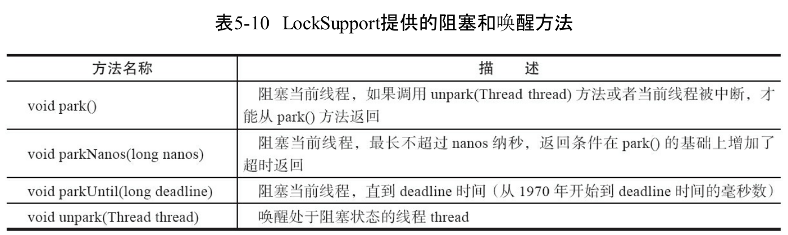
    > 
    > 对比parkNanos(long nanos)方法和parkNanos(Object blocker,long nanos)方
    法来展示阻塞对象blocker的用处,内容都是阻塞当前线程10秒，但从线程
    dump结果可以看出，有阻塞对象的parkNanos方法能够传递给开发人员更多的现场信息。这是
    由于在Java 5之前，当线程阻塞（使用synchronized关键字）在一个对象上时，通过线程dump能够
    查看到该线程的阻塞对象，方便问题定位，而Java 5推出的Lock等并发工具时却遗漏了这一
    点，致使在线程dump时无法提供阻塞对象的信息。因此，在Java 6中，LockSupport新增了上述3
    个含有阻塞对象的park方法，用以替代原有的park方法
    > 
  - 55:Condition接口
    > 任意一个Java对象，都拥有一组监视器方法（定义在java.lang.Object上），主要包括wait()、
    wait(long timeout)、notify()以及notifyAll()方法，这些方法与synchronized同步关键字配合，可以
    实现等待/通知模式。Condition接口也提供了类似Object的监视器方法，与Lock配合可以实现等
    待/通知模式，但是这两者在使用方式以及功能特性上还是有差别的,通过对比Object的监视器方法和Condition接口，可以更详细地了解Condition的特性，对比
    项与结果如表5-12所示
    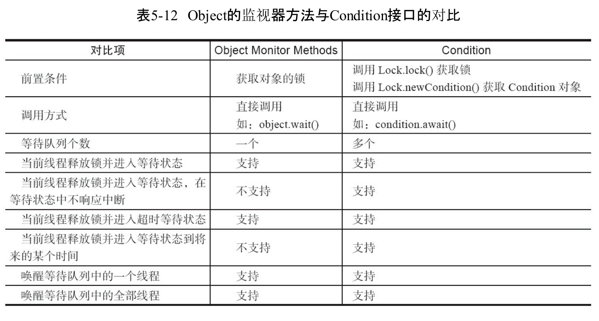
    - 1:Condition接口与示例
    > Condition定义了等待/通知两种类型的方法，当前线程调用这些方法时，需要提前获取到
    Condition对象关联的锁。Condition对象是由Lock对象（调用Lock对象的newCondition()方法）创
    建出来的，换句话说，Condition是依赖Lock对象的,Condition的使用方式比较简单，需要注意在调用方法前获取锁，见代码ConditionUseCase.java
    > 
    > Condition定义的部分方法及描述如下
    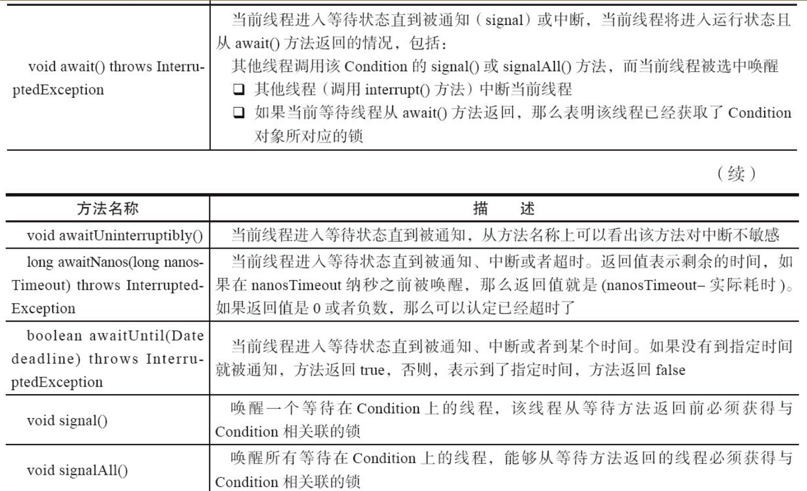
    > 通过一个有界队列的示例来
    深入了解Condition的使用方式。有界队列是一种特殊的队列，当队列为空时，队列的获取操作
    将会阻塞获取线程，直到队列中有新增元素，当队列已满时，队列的插入操作将会阻塞插入线
    程，直到队列出现“空位”，代码如BoundedQueue.java
    - 2:Condition的实现分析 
    > ConditionObject是同步器AbstractQueuedSynchronizer的内部类，因为Condition的操作需要
    获取相关联的锁，所以作为同步器的内部类也较为合理。每个Condition对象都包含着一个队
    列（以下称为等待队列），该队列是Condition对象实现等待/通知功能的关键
    > 
    > 下面将分析Condition的实现，主要包括：等待队列、等待和通知，下面提到的Condition如
    果不加说明均指的是ConditionObject。
    > 
      - 1:等待队列
      > 等待队列是一个FIFO的队列，在队列中的每个节点都包含了一个线程引用，该线程就是
    在Condition对象上等待的线程，如果一个线程调用了Condition.await()方法，那么该线程将会
    释放锁、构造成节点加入等待队列并进入等待状态。事实上，节点的定义复用了同步器中节点
    的定义，也就是说，同步队列和等待队列中节点类型都是同步器的静态内部类
    AbstractQueuedSynchronizer.Node
      >  
      > 一个Condition包含一个等待队列，Condition拥有首节点（firstWaiter）和尾节点
    （lastWaiter）。当前线程调用Condition.await()方法，将会以当前线程构造节点，并将节点从尾部
    加入等待队列，等待队列的基本结构如图5-9所示
    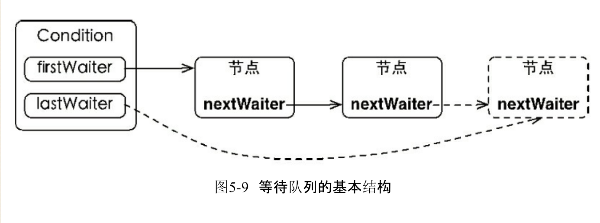 
    > 如图所示，Condition拥有首尾节点的引用，而新增节点只需要将原有的尾节点nextWaiter
    指向它，并且更新尾节点即可。上述节点引用更新的过程并没有使用CAS保证，原因在于调用
    await()方法的线程必定是获取了锁的线程，也就是说该过程是由锁来保证线程安全的 
    > 
    > 在Object的监视器模型上，一个对象拥有一个同步队列和等待队列，而并发包中的
    Lock（更确切地说是同步器）拥有一个同步队列和多个等待队列，其对应关系如图5-10所示
    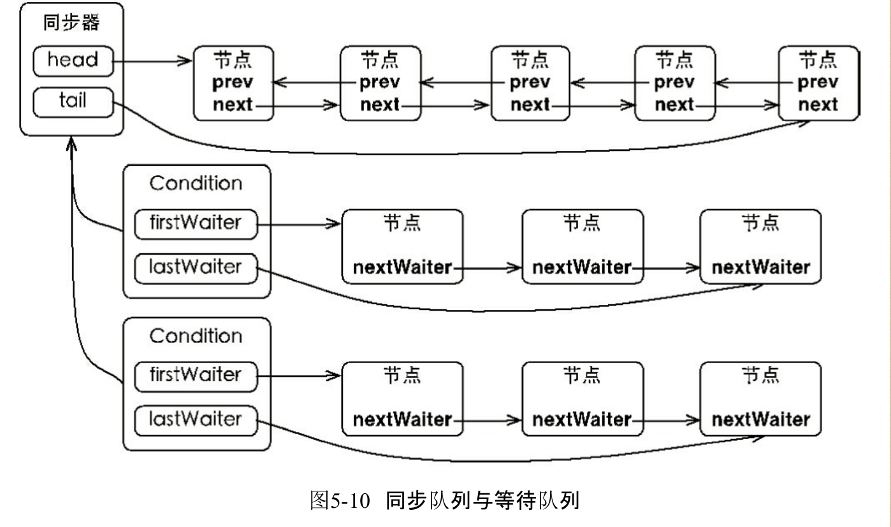 
    > 如图所示，Condition的实现是同步器的内部类，因此每个Condition实例都能够访问同步器
    提供的方法，相当于每个Condition都拥有所属同步器的引用
     - 2:等待
    > 调用Condition的await()方法（或者以await开头的方法），会使当前线程进入等待队列并释
    放锁，同时线程状态变为等待状态。当从await()方法返回时，当前线程一定获取了Condition相
    关联的锁
    > 
    > 如果从队列（同步队列和等待队列）的角度看await()方法，当调用await()方法时，相当于同
    步队列的首节点（获取了锁的节点）移动到Condition的等待队列中,Condition的await()方法，如代码如下：
    ```
    public final void await() throws InterruptedException {
       if (Thread.interrupted())
          throw new InterruptedException();
       // 当前线程加入等待队列
       Node node = addConditionWaiter();
       // 释放同步状态，也就是释放锁
       int savedState = fullyRelease(node);
       int interruptMode = 0;
       while (!isOnSyncQueue(node)) {
          LockSupport.park(this);
          if ((interruptMode = checkInterruptWhileWaiting(node)) != 0)
          break;
       }
       if (acquireQueued(node, savedState) && interruptMode != THROW_IE)
          interruptMode = REINTERRUPT;
       if (node.nextWaiter != null)
          unlinkCancelledWaiters();
       if (interruptMode != 0)
          reportInterruptAfterWait(interruptMode);
    }
    调用该方法的线程成功获取了锁的线程，也就是同步队列中的首节点，该方法会将当前
    线程构造成节点并加入等待队列中，然后释放同步状态，唤醒同步队列中的后继节点，然后当
    前线程会进入等待状态
    
    当等待队列中的节点被唤醒，则唤醒节点的线程开始尝试获取同步状态。如果不是通过
    其他线程调用Condition.signal()方法唤醒，而是对等待线程进行中断，则会抛出
    InterruptedException。
    
    如果从队列的角度去看，当前线程加入Condition的等待队列,该过程如图5-11示
    如图所示，同步队列的首节点并不会直接加入等待队列，而是通过addConditionWaiter()方
    法把当前线程构造成一个新的节点并将其加入等待队列中。
    ``` 
    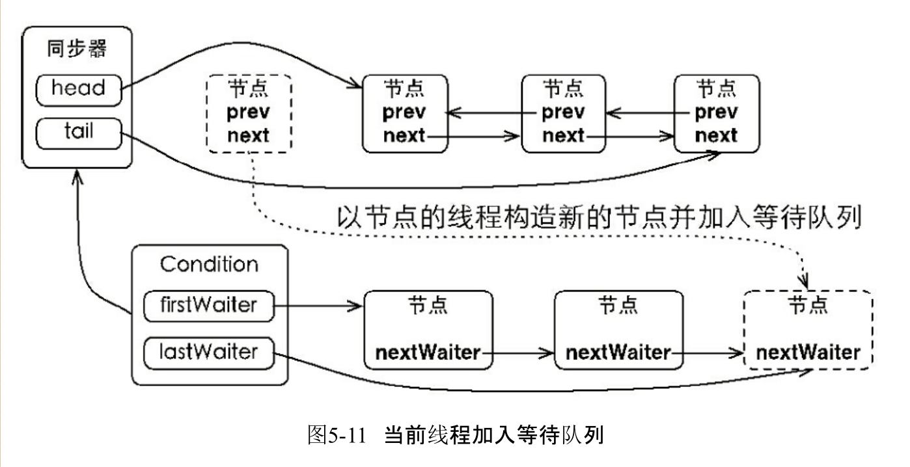
     - 3:通知
    > 调用Condition的signal()方法，将会唤醒在等待队列中等待时间最长的节点（首节点），在
    唤醒节点之前，会将节点移到同步队列中。Condition的signal()方法代码如下：
    ```
    public final void signal() {
      if (!isHeldExclusively())
          throw new IllegalMonitorStateException();
      Node first = firstWaiter;
      if (first != null)
         doSignal(first);
    }
    调用该方法的前置条件是当前线程必须获取了锁，可以看到signal()方法进行了
    isHeldExclusively()检查，也就是当前线程必须是获取了锁的线程。接着获取等待队列的首节
    点，将其移动到同步队列并使用LockSupport唤醒节点中的线程
    节点从等待队列移动到同步队列的过程如下：
    ```
    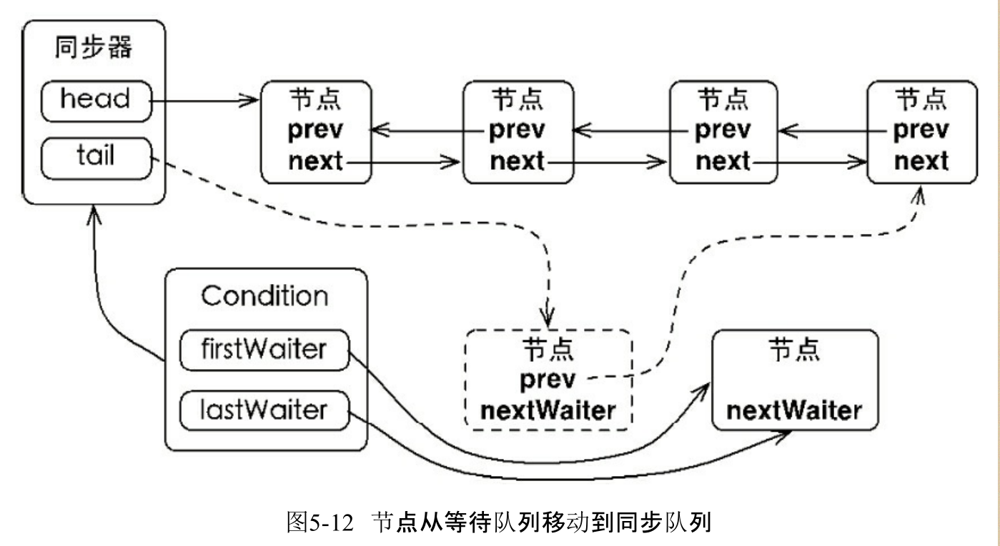
    ```
    通过调用同步器的enq(Node node)方法，等待队列中的头节点线程安全地移动到同步队
    列。当节点移动到同步队列后，当前线程再使用LockSupport唤醒该节点的线程。
    
    被唤醒后的线程，将从await()方法中的while循环中退出（isOnSyncQueue(Node node)方法
    返回true，节点已经在同步队列中），进而调用同步器的acquireQueued()方法加入到获取同步状
    态的竞争中。

    成功获取同步状态（或者说锁）之后，被唤醒的线程将从先前调用的await()方法返回，此
    时该线程已经成功地获取了锁。

    Condition的signalAll()方法，相当于对等待队列中的每个节点均执行一次signal()方法，效
    果就是将等待队列中所有节点全部移动到同步队列中，并唤醒每个节点的线程
    ```
  
  - 56:本章小结
  > 本章介绍了Java并发包中与锁相关的API和组件，通过示例讲述了这些API和组件的使用
  方式以及需要注意的地方，并在此基础上详细地剖析了队列同步器、重入锁、读写锁以及
  Condition等API和组件的实现细节，只有理解这些API和组件的实现细节才能够更加准确地运
  用它们
  > 
  
  - 57:java并发容器框架
  > Java程序员进行并发编程时，相比于其他语言的程序员而言要倍感幸福，因为并发编程大
  师Doug Lea不遗余力地为Java开发者提供了非常多的并发容器和框架。本章让我们一起来见
  识一下大师操刀编写的并发容器和框架，并通过每节的原理分析一起来学习如何设计出精妙
  的并发程序
  
  - 58:ConcurrentHashMap的实现原理与使用 
  > ConcurrentHashMap是线程安全且高效的HashMap。本节让我们一起研究一下该容器是如
  何在保证线程安全的同时又能保证高效的操作
  - 1:为什么要使用ConcurrentHashMap
  > 在并发编程中使用HashMap可能导致程序死循环。而使用线程安全的HashTable效率又非
  常低下，基于以上两个原因，便有了ConcurrentHashMap的登场机会
  ```
  1:线程不安全的HashMap
    在多线程环境下，使用HashMap进行put操作会引起死循环，导致CPU利用率接近100%，所
    以在并发情况下不能使用HashMap
    
    HashMap在并发执行put操作时会引起死循环，是因为多线程会导致HashMap的Entry链表
    形成环形数据结构，一旦形成环形数据结构，Entry的next节点永远不为空，就会产生死循环获
    取Entry
  2:效率低下的HashTable
    HashTable容器使用synchronized来保证线程安全，但在线程竞争激烈的情况下HashTable
    的效率非常低下。因为当一个线程访问HashTable的同步方法，其他线程也访问HashTable的同
    步方法时，会进入阻塞或轮询状态。如线程1使用put进行元素添加，线程2不但不能使用put方
    法添加元素，也不能使用get方法来获取元素，所以竞争越激烈效率越低
  3:ConcurrentHashMap的锁分段技术可有效提升并发访问率
    HashTable容器在竞争激烈的并发环境下表现出效率低下的原因是所有访问HashTable的
    线程都必须竞争同一把锁，假如容器里有多把锁，每一把锁用于锁容器其中一部分数据，那么
    当多线程访问容器里不同数据段的数据时，线程间就不会存在锁竞争，从而可以有效提高并
    发访问效率，这就是ConcurrentHashMap所使用的锁分段技术。首先将数据分成一段一段地存
    储，然后给每一段数据配一把锁，当一个线程占用锁访问其中一个段数据的时候，其他段的数
    据也能被其他线程访问
  ``` 
  - 2:ConcurrentHashMap的结构
  > 通过ConcurrentHashMap的类图来分析ConcurrentHashMap的结构
  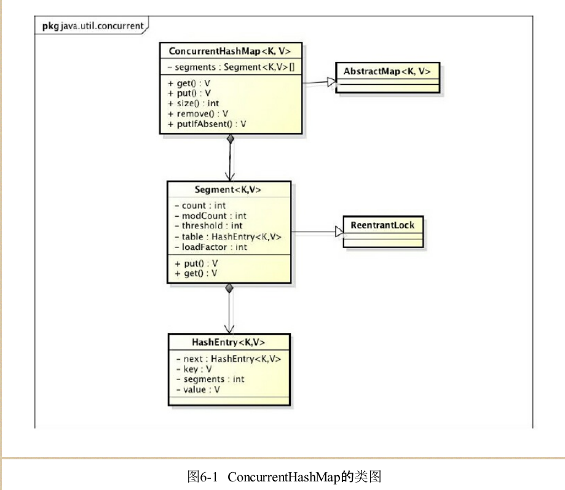
  > ConcurrentHashMap是由Segment数组结构和HashEntry数组结构组成。Segment是一种可重
  入锁（ReentrantLock），在ConcurrentHashMap里扮演锁的角色；HashEntry则用于存储键值对数
  据。一个ConcurrentHashMap里包含一个Segment数组。Segment的结构和HashMap类似，是一种
  数组和链表结构。一个Segment里包含一个HashEntry数组，每个HashEntry是一个链表结构的元
  素，每个Segment守护着一个HashEntry数组里的元素，当对HashEntry数组的数据进行修改时，
  必须首先获得与它对应的Segment锁,如下图：
  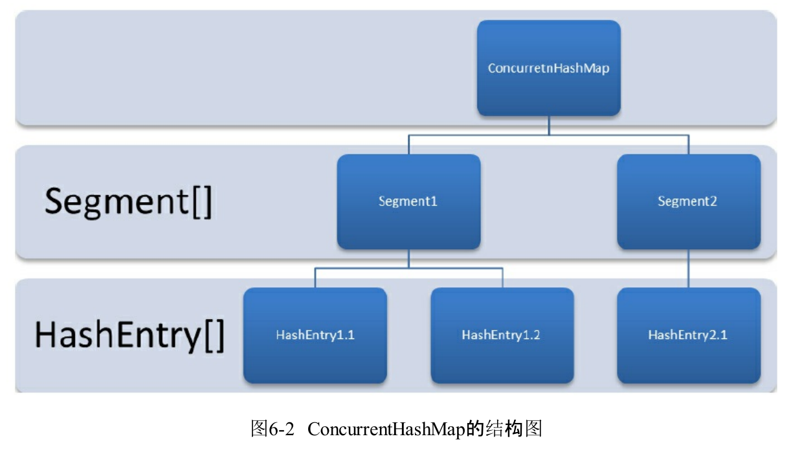
  - 3:ConcurrentHashMap的初始化 
  > ConcurrentHashMap初始化方法是通过initialCapacity、loadFactor和concurrencyLevel等几个
  参数来初始化segment数组、段偏移量segmentShift、段掩码segmentMask和每个segment里的
  HashEntry数组来实现的。
  ```
  1:初始化segments数组
    if (concurrencyLevel > MAX_SEGMENTS)
       concurrencyLevel = MAX_SEGMENTS;
       int sshift = 0;
       int ssize = 1;
       while (ssize < concurrencyLevel) {
          ++sshift;
          ssize <<= 1;
       }
       segmentShift = 32 - sshift;
       segmentMask = ssize - 1;
       this.segments = Segment.newArray(ssize);
    由上面的代码可知，segments数组的长度ssize是通过concurrencyLevel计算得出的。为了能
    通过按位与的散列算法来定位segments数组的索引，必须保证segments数组的长度是2的N次方
    （power-of-two size），所以必须计算出一个大于或等于concurrencyLevel的最小的2的N次方值
    来作为segments数组的长度。假如concurrencyLevel等于14、15或16，ssize都会等于16，即容器里
    锁的个数也是16
    
    注意　concurrencyLevel的最大值是65535，这意味着segments数组的长度最大为65536，
    对应的二进制是16位
  
  2.初始化segmentShift和segmentMask
    这两个全局变量需要在定位segment时的散列算法里使用，sshift等于ssize从1向左移位的
    次数，在默认情况下concurrencyLevel等于16，1需要向左移位移动4次，所以sshift等于4。
    segmentShift用于定位参与散列运算的位数，segmentShift等于32减sshift，所以等于28，这里之所
    以用32是因为ConcurrentHashMap里的hash()方法输出的最大数是32位的，后面的测试中我们
    可以看到这点。segmentMask是散列运算的掩码，等于ssize减1，即15，掩码的二进制各个位的
    值都是1。因为ssize的最大长度是65536，所以segmentShift最大值是16，segmentMask最大值是
    65535，对应的二进制是16位，每个位都是1。
  
  3.初始化每个segment
    输入参数initialCapacity是ConcurrentHashMap的初始化容量，loadfactor是每个segment的负
    载因子，在构造方法里需要通过这两个参数来初始化数组中的每个segment。
    if (initialCapacity > MAXIMUM_CAPACITY)
          initialCapacity = MAXIMUM_CAPACITY;
       int c = initialCapacity / ssize;
       if (c * ssize < initialCapacity)
          ++c;
       int cap = 1;
       while (cap < c)
          cap <<= 1;
       for (int i = 0; i < this.segments.length; ++i)
          this.segments[i] = new Segment<K,V>(cap, loadFactor);

    上面代码中的变量cap就是segment里HashEntry数组的长度，它等于initialCapacity除以ssize
    的倍数c，如果c大于1，就会取大于等于c的2的N次方值，所以cap不是1，就是2的N次方。
    segment的容量threshold＝（int）cap*loadFactor，默认情况下initialCapacity等于16，loadfactor等于
    0.75，通过运算cap等于1，threshold等于零。
  ``` 
  - 4:定位Segment 
  > 既然ConcurrentHashMap使用分段锁Segment来保护不同段的数据，那么在插入和获取元素
  的时候，必须先通过散列算法定位到Segment。可以看到ConcurrentHashMap会首先使用
  Wang/Jenkins hash的变种算法对元素的hashCode进行一次再散列。
  ```
  private static int hash(int h) {
    h += (h << 15) ^ 0xffffcd7d;
    h ^= (h >>> 10);
    h += (h << 3);
    h ^= (h >>> 6);
    h += (h << 2) + (h << 14);
    return h ^ (h >>> 16);
  }
  之所以进行再散列，目的是减少散列冲突，使元素能够均匀地分布在不同的Segment上，
  从而提高容器的存取效率。假如散列的质量差到极点，那么所有的元素都在一个Segment中，
  不仅存取元素缓慢，分段锁也会失去意义
  ``` 
  > ConcurrentHashMap通过以下散列算法定位segment
  ```
  final Segment<K,V> segmentFor(int hash) {
    return segments[(hash >>> segmentShift) & segmentMask];
  }
  默认情况下segmentShift为28，segmentMask为15，再散列后的数最大是32位二进制数据，
  向右无符号移动28位，意思是让高4位参与到散列运算中，（hash>>>segmentShift）
  &segmentMask的运算结果分别是4、15、7和8，可以看到散列值没有发生冲突。
  ```
  - 5:ConcurrentHashMap的操作 
  > 介绍ConcurrentHashMap的3种操作——get操作、put操作和size操作。
  ```
  1.get操作
    Segment的get操作实现非常简单和高效。先经过一次再散列，然后使用这个散列值通过散
    列运算定位到Segment，再通过散列算法定位到元素，代码如下。
    public V get(Object key) {
      int hash = hash(key.hashCode());
      return segmentFor(hash).get(key, hash);
    }
    get操作的高效之处在于整个get过程不需要加锁，除非读到的值是空才会加锁重读。我们
    知道HashTable容器的get方法是需要加锁的，那么ConcurrentHashMap的get操作是如何做到不
    加锁的呢？原因是它的get方法里将要使用的共享变量都定义成volatile类型，如用于统计当前
    Segement大小的count字段和用于存储值的HashEntry的value。定义成volatile的变量，能够在线
    程之间保持可见性，能够被多线程同时读，并且保证不会读到过期的值，但是只能被单线程写
    （有一种情况可以被多线程写，就是写入的值不依赖于原值），在get操作里只需要读不需要写
    共享变量count和value，所以可以不用加锁。之所以不会读到过期的值，是因为根据Java内存模
    型的happen before原则，对volatile字段的写入操作先于读操作，即使两个线程同时修改和获取
    volatile变量，get操作也能拿到最新的值，这是用volatile替换锁的经典应用场景。
  
    transient volatile int count;
    volatile V value;
    
    在定位元素的代码里我们可以发现，定位HashEntry和定位Segment的散列算法虽然一样，
    都与数组的长度减去1再相“与”，但是相“与”的值不一样，定位Segment使用的是元素的
    hashcode通过再散列后得到的值的高位，而定位HashEntry直接使用的是再散列后的值。其目的
    是避免两次散列后的值一样，虽然元素在Segment里散列开了，但是却没有在HashEntry里散列
    开。
    hash >>> segmentShift) & segmentMask　　// 定位Segment所使用的hash算法
    int index = hash & (tab.length - 1);　　// 定位HashEntry所使用的hash算法
  
  2.put操作
    由于put方法里需要对共享变量进行写入操作，所以为了线程安全，在操作共享变量时必
    须加锁。put方法首先定位到Segment，然后在Segment里进行插入操作。插入操作需要经历两个
    步骤，第一步判断是否需要对Segment里的HashEntry数组进行扩容，第二步定位添加元素的位
    置，然后将其放在HashEntry数组里。
    （1）是否需要扩容
    在插入元素前会先判断Segment里的HashEntry数组是否超过容量（threshold），如果超过阈
    值，则对数组进行扩容。值得一提的是，Segment的扩容判断比HashMap更恰当，因为HashMap
    是在插入元素后判断元素是否已经到达容量的，如果到达了就进行扩容，但是很有可能扩容
    之后没有新元素插入，这时HashMap就进行了一次无效的扩容。  
    （2）如何扩容
    在扩容的时候，首先会创建一个容量是原来容量两倍的数组，然后将原数组里的元素进
    行再散列后插入到新的数组里。为了高效，ConcurrentHashMap不会对整个容器进行扩容，而只
    对某个segment进行扩容。
  
  3.size操作
    如果要统计整个ConcurrentHashMap里元素的大小，就必须统计所有Segment里元素的大小
    后求和。Segment里的全局变量count是一个volatile变量，那么在多线程场景下，是不是直接把
    所有Segment的count相加就可以得到整个ConcurrentHashMap大小了呢？不是的，虽然相加时
    可以获取每个Segment的count的最新值，但是可能累加前使用的count发生了变化，那么统计结
    果就不准了。所以，最安全的做法是在统计size的时候把所有Segment的put、remove和clean方法
    全部锁住，但是这种做法显然非常低效。
    
    因为在累加count操作过程中，之前累加过的count发生变化的几率非常小，所以
    ConcurrentHashMap的做法是先尝试2次通过不锁住Segment的方式来统计各个Segment大小，如
    果统计的过程中，容器的count发生了变化，则再采用加锁的方式来统计所有Segment的大小。
  
    那么ConcurrentHashMap是如何判断在统计的时候容器是否发生了变化呢？使用modCount
    变量，在put、remove和clean方法里操作元素前都会将变量modCount进行加1，那么在统计size
    前后比较modCount是否发生变化，从而得知容器的大小是否发生变化。
  ``` 
  - 59:ConcurrentLinkedQueue
  > 在并发编程中，有时候需要使用线程安全的队列。如果要实现一个线程安全的队列有两
  种方式：一种是使用阻塞算法，另一种是使用非阻塞算法。使用阻塞算法的队列可以用一个锁
  （入队和出队用同一把锁）或两个锁（入队和出队用不同的锁）等方式来实现。非阻塞的实现方
  式则可以使用循环CAS的方式来实现。本节让我们一起来研究一下Doug Lea是如何使用非阻
  塞的方式来实现线程安全队列ConcurrentLinkedQueue的，相信从大师身上我们能学到不少并
  发编程的技巧。
  > 
  > ConcurrentLinkedQueue是一个基于链接节点的无界线程安全队列，它采用先进先出的规
  则对节点进行排序，当我们添加一个元素的时候，它会添加到队列的尾部；当我们获取一个元
  素时，它会返回队列头部的元素。它采用了“wait-free”算法（即CAS算法）来实现，该算法在
  Michael&Scott算法上进行了一些修改
  - 1:ConcurrentLinkedQueue的结构
  > 通过ConcurrentLinkedQueue的类图来分析一下它的结构，如图6-3所示。
  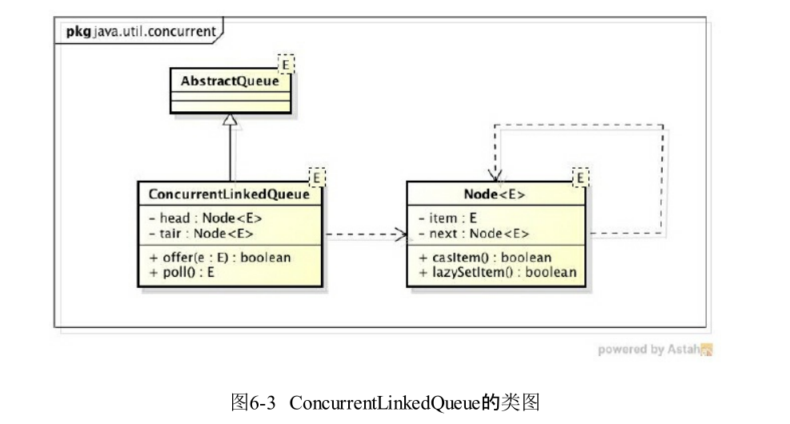
  > ConcurrentLinkedQueue由head节点和tail节点组成，每个节点（Node）由节点元素（item）和
  指向下一个节点（next）的引用组成，节点与节点之间就是通过这个next关联起来，从而组成一
  张链表结构的队列。默认情况下head节点存储的元素为空，tail节点等于head节点。 private transient volatile Node<E> tail = head;
  - 2:入队列 
  > 本节将介绍入队列的相关知识
  ```
  1.入队列的过程
    入队列就是将入队节点添加到队列的尾部。为了方便理解入队时队列的变化，以及head节
    点和tail节点的变化，这里以一个示例来展开介绍。假设我们想在一个队列中依次插入4个节
    点，为了帮助大家理解，每添加一个节点就做了一个队列的快照图，如图6-4所示。  ,过程如下：
    ·添加元素1。队列更新head节点的next节点为元素1节点。又因为tail节点默认情况下等于head节点，所以它们的next节点都指向元素1节点。
    ·添加元素2。队列首先设置元素1节点的next节点为元素2节点，然后更新tail节点指向元素2节点。
    ·添加元素3，设置tail节点的next节点为元素3节点。
    ·添加元素4，设置元素3的next节点为元素4节点，然后将tail节点指向元素4节点。
  
  ``` 
  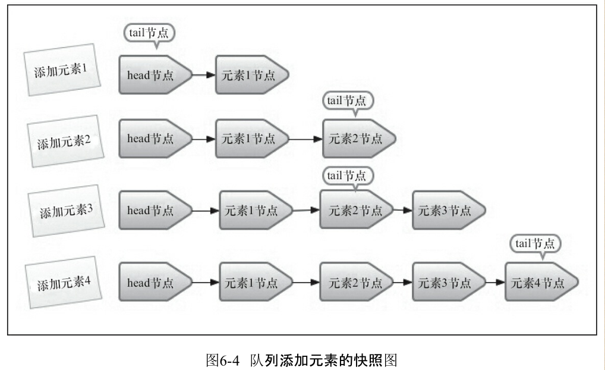
  > 通过调试入队过程并观察head节点和tail节点的变化，发现入队主要做两件事情：第一是
  将入队节点设置成当前队列尾节点的下一个节点；第二是更新tail节点，如果tail节点的next节
  点不为空，则将入队节点设置成tail节点，如果tail节点的next节点为空，则将入队节点设置成
  tail的next节点，所以tail节点不总是尾节点（理解这一点对于我们研究源码会非常有帮助）。
  > 
  > 通过对上面的分析，我们从单线程入队的角度理解了入队过程，但是多个线程同时进行
  入队的情况就变得更加复杂了，因为可能会出现其他线程插队的情况。如果有一个线程正在
  入队，那么它必须先获取尾节点，然后设置尾节点的下一个节点为入队节点，但这时可能有另
  外一个线程插队了，那么队列的尾节点就会发生变化，这时当前线程要暂停入队操作，然后重
  新获取尾节点。让我们再通过源码来详细分析一下它是如何使用CAS算法来入队的。
  ```
  public boolean offer(E e) {
    if (e == null) throw new NullPointerException();
    // 入队前，创建一个入队节点
    Node<E> n = new Node<E>(e);
    retry:
    // 死循环，入队不成功反复入队。
    for (;;) {
        // 创建一个指向tail节点的引用
        Node<E> t = tail;
        // p用来表示队列的尾节点，默认情况下等于tail节点。
        Node<E> p = t;
        for (int hops = 0; ; hops++) {
            // 获得p节点的下一个节点。
            Node<E> next = succ(p);
            // next节点不为空，说明p不是尾节点，需要更新p后在将它指向next节点
            if (next != null) {
                // 循环了两次及其以上，并且当前节点还是不等于尾节点
                if (hops > HOPS && t != tail)
                   continue retry;
                p = next;
            }
            // 如果p是尾节点，则设置p节点的next节点为入队节点。
            else if (p.casNext(null, n)) {
            /*如果tail节点有大于等于1个next节点，则将入队节点设置成tail节点，
            更新失败了也没关系，因为失败了表示有其他线程成功更新了tail节点*/
               if (hops >= HOPS)
                  casTail(t, n); // 更新tail节点，允许失败
               return true;
            }
            // p有next节点,表示p的next节点是尾节点，则重新设置p节点
            else {
               p = succ(p);
            }
        }
    }
  }
  从源代码角度来看，整个入队过程主要做两件事情：第一是定位出尾节点；第二是使用
  CAS算法将入队节点设置成尾节点的next节点，如不成功则重试
  
  2:定位尾节点
    tail节点并不总是尾节点，所以每次入队都必须先通过tail节点来找到尾节点。尾节点可能
    是tail节点，也可能是tail节点的next节点。代码中循环体中的第一个if就是判断tail是否有next节
    点，有则表示next节点可能是尾节点。获取tail节点的next节点需要注意的是p节点等于p的next
    节点的情况，只有一种可能就是p节点和p的next节点都等于空，表示这个队列刚初始化，正准
    备添加节点，所以需要返回head节点。获取p节点的next节点代码如下。
    final Node<E> succ(Node<E> p) {
      Node<E> next = p.getNext();
      return (p == next) head : next;
    }
  
  3.设置入队节点为尾节点
    p.casNext（null，n）方法用于将入队节点设置为当前队列尾节点的next节点，如果p是null，
    表示p是当前队列的尾节点，如果不为null，表示有其他线程更新了尾节点，则需要重新获取当
    前队列的尾节点。
  
  4.HOPS的设计意图
    上面分析过对于先进先出的队列入队所要做的事情是将入队节点设置成尾节点，doug lea
    写的代码和逻辑还是稍微有点复杂。那么，我用以下方式来实现是否可行？
    public boolean offer(E e) {
      if (e == null)
        throw new NullPointerException();
      Node<E> n = new Node<E>(e);
      for (;;) {
        Node<E> t = tail;
        if (t.casNext(null, n) && casTail(t, n)) {
          return true;
        }
      }
    }
    让tail节点永远作为队列的尾节点，这样实现代码量非常少，而且逻辑清晰和易懂。但是，
    这么做有个缺点，每次都需要使用循环CAS更新tail节点。如果能减少CAS更新tail节点的次
    数，就能提高入队的效率，所以doug lea使用hops变量来控制并减少tail节点的更新频率，并不
    是每次节点入队后都将tail节点更新成尾节点，而是当tail节点和尾节点的距离大于等于常量
    HOPS的值（默认等于1）时才更新tail节点，tail和尾节点的距离越长，使用CAS更新tail节点的次
    数就会越少，但是距离越长带来的负面效果就是每次入队时定位尾节点的时间就越长，因为
    循环体需要多循环一次来定位出尾节点，但是这样仍然能提高入队的效率，因为从本质上来
    看它通过增加对volatile变量的读操作来减少对volatile变量的写操作，而对volatile变量的写操
    作开销要远远大于读操作，所以入队效率会有所提升。
    private static final int HOPS = 1;
    注意　入队方法永远返回true，所以不要通过返回值判断入队是否成功。
  ```
  - 3:出队列
  > 出队列的就是从队列里返回一个节点元素，并清空该节点对元素的引用。让我们通过每
  个节点出队的快照来观察一下head节点的变化，如图6-5所示。
  从图中可知，并不是每次出队时都更新head节点，当head节点里有元素时，直接弹出head
  节点里的元素，而不会更新head节点。只有当head节点里没有元素时，出队操作才会更新head
  节点。这种做法也是通过hops变量来减少使用CAS更新head节点的消耗，从而提高出队效率。
  让我们再通过源码来深入分析下出队过程。
  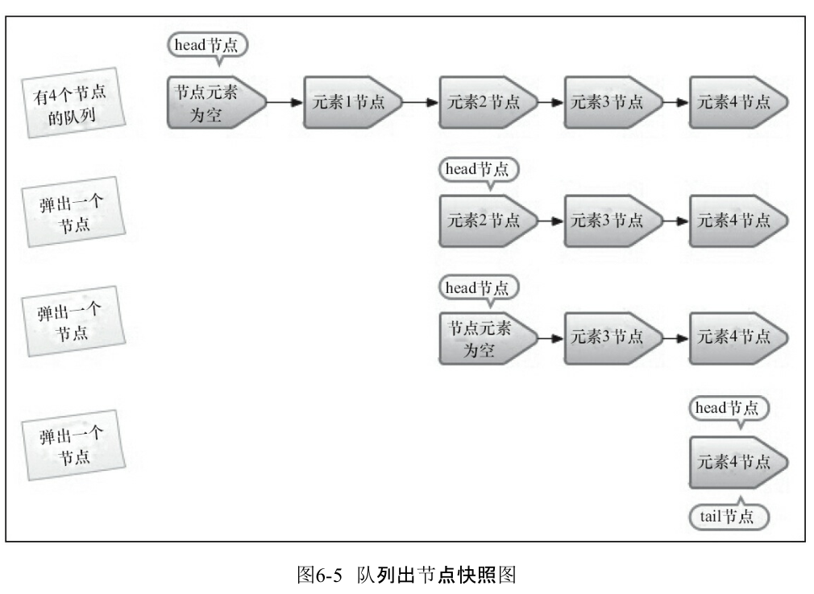 
  ```
  public E poll() {
    Node<E> h = head;
    // p表示头节点，需要出队的节点
    Node<E> p = h;
    for (int hops = 0;; hops++) {
      // 获取p节点的元素
      E item = p.getItem();
      // 如果p节点的元素不为空，使用CAS设置p节点引用的元素为null,
      // 如果成功则返回p节点的元素。
      if (item != null && p.casItem(item, null)) {
        if (hops >= HOPS) {
          // 将p节点下一个节点设置成head节点
          Node<E> q = p.getNext();
          updateHead(h, (q != null) q : p);
        }
        return item;
      }
      // 如果头节点的元素为空或头节点发生了变化，这说明头节点已经被另外
      // 一个线程修改了。那么获取p节点的下一个节点
      Node<E> next = succ(p);
      // 如果p的下一个节点也为空，说明这个队列已经空了
      if (next == null) {
        // 更新头节点。
        updateHead(h, p);
        break;
      }
      // 如果下一个元素不为空，则将头节点的下一个节点设置成头节点
      p = next;
    }
    return null;
  }
  首先获取头节点的元素，然后判断头节点元素是否为空，如果为空，表示另外一个线程已
  经进行了一次出队操作将该节点的元素取走，如果不为空，则使用CAS的方式将头节点的引
  用设置成null，如果CAS成功，则直接返回头节点的元素，如果不成功，表示另外一个线程已经
  进行了一次出队操作更新了head节点，导致元素发生了变化，需要重新获取头节点。
  ```
  - 60:Java中的阻塞队列 
  > 介绍什么是阻塞队列，以及Java中阻塞队列的4种处理方式，并介绍Java 7中提供的
  7种阻塞队列，最后分析阻塞队列的一种实现方式。
  - 1:什么是阻塞队列 
  > 阻塞队列（BlockingQueue）是一个支持两个附加操作的队列。这两个附加的操作支持阻塞
  的插入和移除方法
  ```
  1）支持阻塞的插入方法：意思是当队列满时，队列会阻塞插入元素的线程，直到队列不满。
  2）支持阻塞的移除方法：意思是在队列为空时，获取元素的线程会等待队列变为非空。
  阻塞队列常用于生产者和消费者的场景，生产者是向队列里添加元素的线程，消费者是
  从队列里取元素的线程。阻塞队列就是生产者用来存放元素、消费者用来获取元素的容器。
  在阻塞队列不可用时，这两个附加操作提供了4种处理方式，如表6-1所示
  ```
  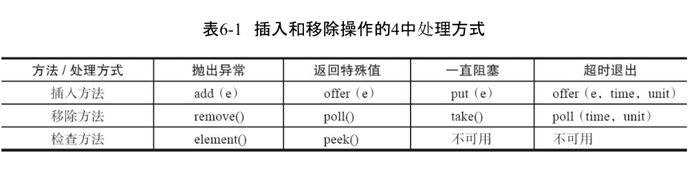
  ```
  ·抛出异常：当队列满时，如果再往队列里插入元素，会抛出IllegalStateException（"Queue
    full"）异常。当队列空时，从队列里获取元素会抛出NoSuchElementException异常。
  ·返回特殊值：当往队列插入元素时，会返回元素是否插入成功，成功返回true。如果是移
    除方法，则是从队列里取出一个元素，如果没有则返回null。
  ·一直阻塞：当阻塞队列满时，如果生产者线程往队列里put元素，队列会一直阻塞生产者
    线程，直到队列可用或者响应中断退出。当队列空时，如果消费者线程从队列里take元素，队
    列会阻塞住消费者线程，直到队列不为空。
  ·超时退出：当阻塞队列满时，如果生产者线程往队列里插入元素，队列会阻塞生产者线程
   一段时间，如果超过了指定的时间，生产者线程就会退出。
  
  这两个附加操作的4种处理方式不方便记忆，所以我找了一下这几个方法的规律。put和
  take分别尾首含有字母t，offer和poll都含有字母o。
  
  注意　如果是无界阻塞队列，队列不可能会出现满的情况，所以使用put或offer方法永
  远不会被阻塞，而且使用offer方法时，该方法永远返回true。
  ``` 
  - 2:Java里的阻塞队列
  ```
  JDK 7提供了7个阻塞队列，如下。
   ·ArrayBlockingQueue：一个由数组结构组成的有界阻塞队列。
   ·LinkedBlockingQueue：一个由链表结构组成的有界阻塞队列。
   ·PriorityBlockingQueue：一个支持优先级排序的无界阻塞队列。
   ·DelayQueue：一个使用优先级队列实现的无界阻塞队列。
   ·SynchronousQueue：一个不存储元素的阻塞队列。
   ·LinkedTransferQueue：一个由链表结构组成的无界阻塞队列。
   ·LinkedBlockingDeque：一个由链表结构组成的双向阻塞队列。
  ```
  - 1.ArrayBlockingQueue
  > ArrayBlockingQueue是一个用数组实现的有界阻塞队列。此队列按照先进先出（FIFO）的原
  则对元素进行排序。
  默认情况下不保证线程公平的访问队列，所谓公平访问队列是指阻塞的线程，可以按照
  阻塞的先后顺序访问队列，即先阻塞线程先访问队列。非公平性是对先等待的线程是非公平
  的，当队列可用时，阻塞的线程都可以争夺访问队列的资格，有可能先阻塞的线程最后才访问
  队列。为了保证公平性，通常会降低吞吐量。我们可以使用以下代码创建一个公平的阻塞队
  列。ArrayBlockingQueue fairQueue = new ArrayBlockingQueue(1000,true);
  > 
  > 访问者的公平性是使用可重入锁实现的，代码如下。
  ```
  public ArrayBlockingQueue(int capacity, boolean fair) {
    if (capacity <= 0)
      throw new IllegalArgumentException();
    this.items = new Object[capacity];
    lock = new ReentrantLock(fair);
    notEmpty = lock.newCondition();
    notFull = lock.newCondition();
  }
  ```
  - 2.LinkedBlockingQueue
  > LinkedBlockingQueue是一个用链表实现的有界阻塞队列。此队列的默认和最大长度为
  Integer.MAX_VALUE。此队列按照先进先出的原则对元素进行排序。
  - 3.PriorityBlockingQueue 
  > PriorityBlockingQueue是一个支持优先级的无界阻塞队列。默认情况下元素采取自然顺序
  升序排列。也可以自定义类实现compareTo()方法来指定元素排序规则，或者初始化
  PriorityBlockingQueue时，指定构造参数Comparator来对元素进行排序。需要注意的是不能保证
  同优先级元素的顺序。
  - 4.DelayQueue 
  > DelayQueue是一个支持延时获取元素的无界阻塞队列。队列使用PriorityQueue来实现。队
  列中的元素必须实现Delayed接口，在创建元素时可以指定多久才能从队列中获取当前元素。
  只有在延迟期满时才能从队列中提取元素。
  > 
  > DelayQueue非常有用，可以将DelayQueue运用在以下应用场景。
  ·缓存系统的设计：可以用DelayQueue保存缓存元素的有效期，使用一个线程循环查询
  DelayQueue，一旦能从DelayQueue中获取元素时，表示缓存有效期到了。
  ·定时任务调度：使用DelayQueue保存当天将会执行的任务和执行时间，一旦从
  DelayQueue中获取到任务就开始执行，比如TimerQueue就是使用DelayQueue实现的。
  ```
  1:如何实现Delayed接口
    DelayQueue队列的元素必须实现Delayed接口。我们可以参考ScheduledThreadPoolExecutor
    里ScheduledFutureTask类的实现，一共有三步。
      第一步：在对象创建的时候，初始化基本数据。使用time记录当前对象延迟到什么时候可
      以使用，使用sequenceNumber来标识元素在队列中的先后顺序。
  ```
  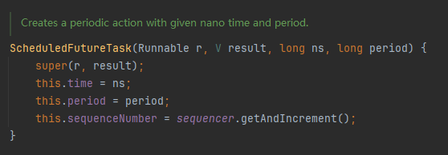
  ```
      第二步：实现getDelay方法，该方法返回当前元素还需要延时多长时间，单位是纳秒，代码
      如下。
      通过构造函数可以看出延迟时间参数ns的单位是纳秒，自己设计的时候最好使用纳秒，因
      为实现getDelay()方法时可以指定任意单位，一旦以秒或分作为单位，而延时时间又精确不到
      纳秒就麻烦了。使用时请注意当time小于当前时间时，getDelay会返回负数。
  ```
  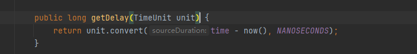
  ``` 
      第三步：实现compareTo方法来指定元素的顺序。例如，让延时时间最长的放在队列的末
      尾
  ```
  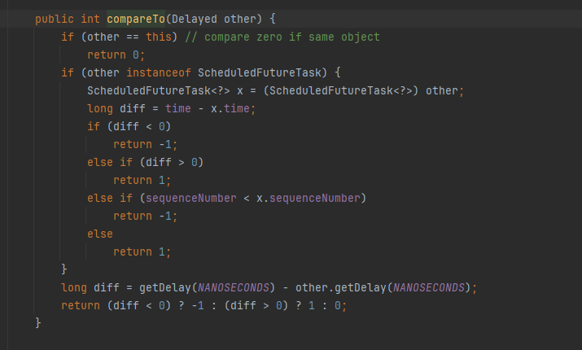
  ``` 
  2：如何实现延时阻塞队列
    延时阻塞队列的实现很简单，当消费者从队列里获取元素时，如果元素没有达到延时时
    间，就阻塞当前线程
  ```
  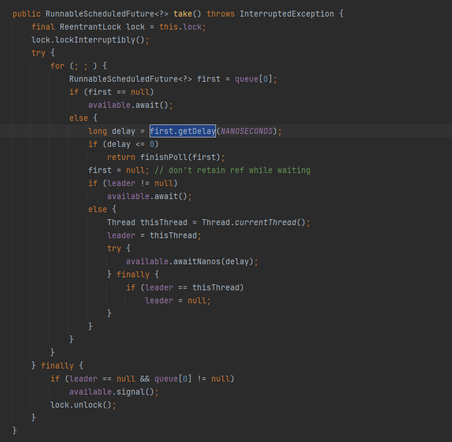
  ``` 
    代码中的变量leader是一个等待获取队列头部元素的线程。如果leader不等于空，表示已
    经有线程在等待获取队列的头元素。所以，使用await()方法让当前线程等待信号。如果leader
    等于空，则把当前线程设置成leader，并使用awaitNanos()方法让当前线程等待接收信号或等
    待delay时间
  ``` 
  - 5.SynchronousQueue
  > SynchronousQueue是一个不存储元素的阻塞队列。每一个put操作必须等待一个take操作，
  否则不能继续添加元素。
  它支持公平访问队列。默认情况下线程采用非公平性策略访问队列。使用以下构造方法
  可以创建公平性访问的SynchronousQueue，如果设置为true，则等待的线程会采用先进先出的
  顺序访问队列。
  ```
  public SynchronousQueue(boolean fair) {
     transferer = fair new TransferQueue() : new TransferStack();
  }
  ``` 
  > SynchronousQueue可以看成是一个传球手，负责把生产者线程处理的数据直接传递给消费
  者线程。队列本身并不存储任何元素，非常适合传递性场景。SynchronousQueue的吞吐量高于
  LinkedBlockingQueue和ArrayBlockingQueue。
  - 6.LinkedTransferQueue 
  > LinkedTransferQueue是一个由链表结构组成的无界阻塞TransferQueue队列。相对于其他阻
  塞队列，LinkedTransferQueue多了tryTransfer和transfer方法。
  ```
  （1）transfer方法
    如果当前有消费者正在等待接收元素（消费者使用take()方法或带时间限制的poll()方法
    时），transfer方法可以把生产者传入的元素立刻transfer（传输）给消费者。如果没有消费者在等
    待接收元素，transfer方法会将元素存放在队列的tail节点，并等到该元素被消费者消费了才返
    回。transfer方法的关键代码如下。
  
    Node pred = tryAppend(s, haveData);
    return awaitMatch(s, pred, e, (how == TIMED), nanos);
  
    第一行代码是试图把存放当前元素的s节点作为tail节点。第二行代码是让CPU自旋等待
    消费者消费元素。因为自旋会消耗CPU，所以自旋一定的次数后使用Thread.yield()方法来暂停
    当前正在执行的线程，并执行其他线程。
  
  （2）tryTransfer方法
    tryTransfer方法是用来试探生产者传入的元素是否能直接传给消费者。如果没有消费者等
    待接收元素，则返回false。和transfer方法的区别是tryTransfer方法无论消费者是否接收，方法
    立即返回，而transfer方法是必须等到消费者消费了才返回。
    
    对于带有时间限制的tryTransfer（E e，long timeout，TimeUnit unit）方法，试图把生产者传入
    的元素直接传给消费者，但是如果没有消费者消费该元素则等待指定的时间再返回，如果超
    时还没消费元素，则返回false，如果在超时时间内消费了元素，则返回true。
  ``` 
  - 7.LinkedBlockingDeque
  > LinkedBlockingDeque是一个由链表结构组成的双向阻塞队列。所谓双向队列指的是可以
  从队列的两端插入和移出元素。双向队列因为多了一个操作队列的入口，在多线程同时入队
  时，也就减少了一半的竞争。相比其他的阻塞队列，LinkedBlockingDeque多了addFirst、
  addLast、offerFirst、offerLast、peekFirst和peekLast等方法，以First单词结尾的方法，表示插入、
  获取（peek）或移除双端队列的第一个元素。以Last单词结尾的方法，表示插入、获取或移除双
  端队列的最后一个元素。另外，插入方法add等同于addLast，移除方法remove等效于
  removeFirst。但是take方法却等同于takeFirst，不知道是不是JDK的bug，使用时还是用带有First
  和Last后缀的方法更清楚。
  > 
  > 在初始化LinkedBlockingDeque时可以设置容量防止其过度膨胀。另外，双向阻塞队列可以
  运用在“工作窃取”模式中。
   
  - 3:阻塞队列的实现原理 
  > 如果队列是空的，消费者会一直等待，当生产者添加元素时，消费者是如何知道当前队列
  有元素的呢？如果让你来设计阻塞队列你会如何设计，如何让生产者和消费者进行高效率的
  通信呢？让我们先来看看JDK是如何实现的。
  > 
  > 使用通知模式实现。所谓通知模式，就是当生产者往满的队列里添加元素时会阻塞住生
  产者，当消费者消费了一个队列中的元素后，会通知生产者当前队列可用。通过查看JDK源码
  发现ArrayBlockingQueue使用了Condition来实现，代码如下。
  
  > 当往队列里插入一个元素时，如果队列不可用，那么阻塞生产者主要通过
  LockSupport.park（this）来实现。
  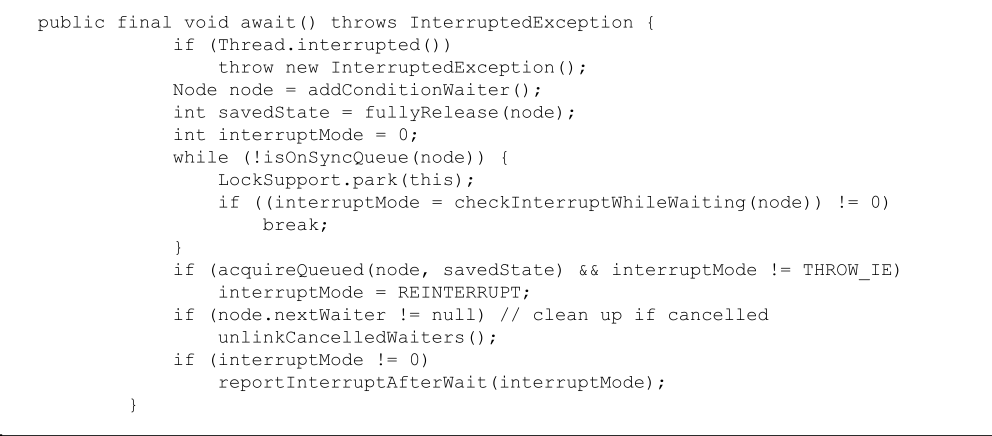
  > 继续进入源码，发现调用setBlocker先保存一下将要阻塞的线程，然后调用unsafe.park阻塞
  当前线程。
  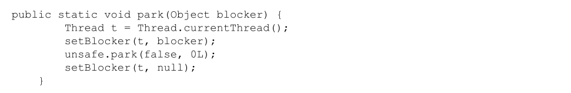
  > unsafe.park是个native方法，代码如下。
   
  > park这个方法会阻塞当前线程，只有以下4种情况中的一种发生时，该方法才会返回。
  ·与park对应的unpark执行或已经执行时。“已经执行”是指unpark先执行，然后再执行park
  的情况。
  ·线程被中断时。
  ·等待完time参数指定的毫秒数时。
  ·异常现象发生时，这个异常现象没有任何原因。
  > 
  > 继续看一下JVM是如何实现park方法：park在不同的操作系统中使用不同的方式实现，在
  Linux下使用的是系统方法pthread_cond_wait实现。实现代码在JVM源码路径
  src/os/linux/vm/os_linux.cpp里的os::PlatformEvent::park方法，代码如下。
  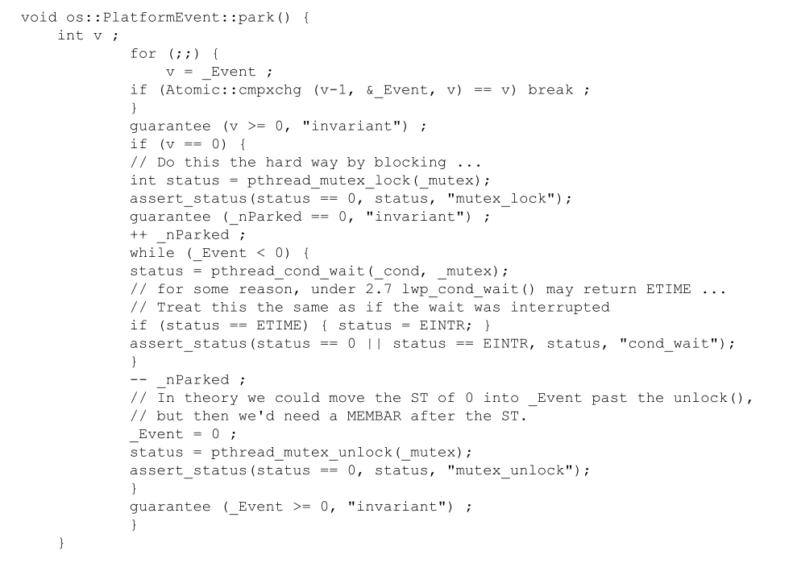
  > pthread_cond_wait是一个多线程的条件变量函数，cond是condition的缩写，字面意思可以
  理解为线程在等待一个条件发生，这个条件是一个全局变量。这个方法接收两个参数：一个共
  享变量_cond，一个互斥量_mutex。而unpark方法在Linux下是使用pthread_cond_signal实现的。
  park方法在Windows下则是使用WaitForSingleObject实现的。想知道pthread_cond_wait是如何实
  现的，可以参考glibc-2.5的nptl/sysdeps/pthread/pthread_cond_wait.c。
  > 
  > 当线程被阻塞队列阻塞时，线程会进入WAITING（parking）状态。我们可以使用jstack dump
  阻塞的生产者线程看到这点，如下。
  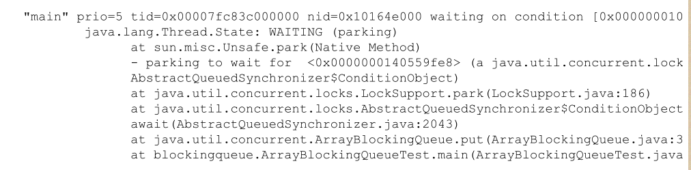
   
  - 61:Fork/Join框架 
  > 介绍Fork/Join框架的基本原理、算法、设计方式、应用与实现等
  ```
  1:什么是Fork/Join框架
    Fork/Join框架是Java 7提供的一个用于并行执行任务的框架，是一个把大任务分割成若干
    个小任务，最终汇总每个小任务结果后得到大任务结果的框架。
    
    我们再通过Fork和Join这两个单词来理解一下Fork/Join框架。Fork就是把一个大任务切分
    为若干子任务并行的执行，Join就是合并这些子任务的执行结果，最后得到这个大任务的结
    果。比如计算1+2+…+10000，可以分割成10个子任务，每个子任务分别对1000个数进行求和，
    最终汇总这10个子任务的结果。Fork/Join的运行流程如图6-6所示
  ``` 
  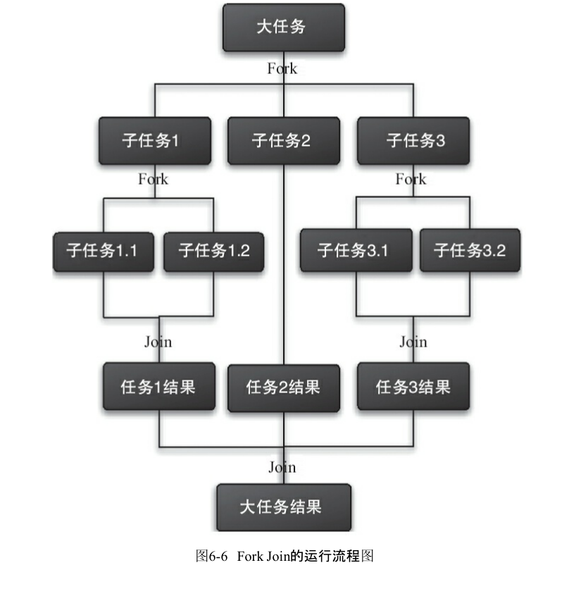
  ```
  2:工作窃取算法
    工作窃取（work-stealing）算法是指某个线程从其他队列里窃取任务来执行。那么，为什么
    需要使用工作窃取算法呢？假如我们需要做一个比较大的任务，可以把这个任务分割为若干
    互不依赖的子任务，为了减少线程间的竞争，把这些子任务分别放到不同的队列里，并为每个
    队列创建一个单独的线程来执行队列里的任务，线程和队列一一对应。比如A线程负责处理A
    队列里的任务。但是，有的线程会先把自己队列里的任务干完，而其他线程对应的队列里还有
    任务等待处理。干完活的线程与其等着，不如去帮其他线程干活，于是它就去其他线程的队列
    里窃取一个任务来执行。而在这时它们会访问同一个队列，所以为了减少窃取任务线程和被
    窃取任务线程之间的竞争，通常会使用双端队列，被窃取任务线程永远从双端队列的头部拿
    任务执行，而窃取任务的线程永远从双端队列的尾部拿任务执行。
  ``` 
  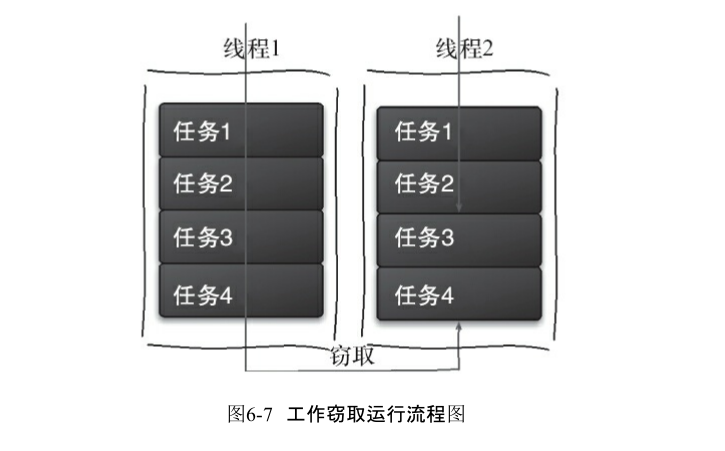
  > 工作窃取算法的优点：充分利用线程进行并行计算，减少了线程间的竞争。
  > 
  > 工作窃取算法的缺点：在某些情况下还是存在竞争，比如双端队列里只有一个任务时。并
  且该算法会消耗了更多的系统资源，比如创建多个线程和多个双端队列。
  ```
  3:Fork/Join框架的设计
    我们已经很清楚Fork/Join框架的需求了，那么可以思考一下，如果让我们来设计一个
    Fork/Join框架，该如何设计？这个思考有助于你理解Fork/Join框架的设计。
  
    步骤1　分割任务。首先我们需要有一个fork类来把大任务分割成子任务，有可能子任务还
    是很大，所以还需要不停地分割，直到分割出的子任务足够小。
  
    步骤2　执行任务并合并结果。分割的子任务分别放在双端队列里，然后几个启动线程分
    别从双端队列里获取任务执行。子任务执行完的结果都统一放在一个队列里，启动一个线程
    从队列里拿数据，然后合并这些数据。
    
    Fork/Join使用两个类来完成以上两件事情。
      
    ①ForkJoinTask：我们要使用ForkJoin框架，必须首先创建一个ForkJoin任务。它提供在任务
     中执行fork()和join()操作的机制。通常情况下，我们不需要直接继承ForkJoinTask类，只需要继
     承它的子类，Fork/Join框架提供了以下两个子类。
     ·RecursiveAction：用于没有返回结果的任务。
     ·RecursiveTask：用于有返回结果的任务。
    ②ForkJoinPool：ForkJoinTask需要通过ForkJoinPool来执行。
     任务分割出的子任务会添加到当前工作线程所维护的双端队列中，进入队列的头部。当
     一个工作线程的队列里暂时没有任务时，它会随机从其他工作线程的队列的尾部获取一个任
     务。
  
  4:使用Fork/Join框架
    让我们通过一个简单的需求来使用Fork/Join框架，需求是：计算1+2+3+4的结果。
  
    使用Fork/Join框架首先要考虑到的是如何分割任务，如果希望每个子任务最多执行两个
    数的相加，那么我们设置分割的阈值是2，由于是4个数字相加，所以Fork/Join框架会把这个任
    务fork成两个子任务，子任务一负责计算1+2，子任务二负责计算3+4，然后再join两个子任务
    的结果。因为是有结果的任务，所以必须继承RecursiveTask，实现代码如下:见：CountTask.java
  
  5:Fork/Join框架的异常处理
    ForkJoinTask在执行的时候可能会抛出异常，但是我们没办法在主线程里直接捕获异常，
    所以ForkJoinTask提供了isCompletedAbnormally()方法来检查任务是否已经抛出异常或已经被
    取消了，并且可以通过ForkJoinTask的getException方法获取异常。使用如下代码。
    
    if(task.isCompletedAbnormally())
    {
      System.out.println(task.getException());
    }
    getException方法返回Throwable对象，如果任务被取消了则返回CancellationException。如
    果任务没有完成或者没有抛出异常则返回null。
  
  6:Fork/Join框架的实现原理
    ForkJoinPool由ForkJoinTask数组和ForkJoinWorkerThread数组组成，ForkJoinTask数组负责
    存放程序提交给ForkJoinPool的任务，而ForkJoinWorkerThread数组负责执行这些任务。
    
  （1）ForkJoinTask的fork方法实现原理
    当我们调用ForkJoinTask的fork方法时，程序会调用ForkJoinWorkerThread的pushTask方法
    异步地执行这个任务，然后立即返回结果。代码如下。
    public final ForkJoinTask<V> fork() {
     ((ForkJoinWorkerThread) Thread.currentThread())
       .pushTask(this);
     return this;
    }
  
    pushTask方法把当前任务存放在ForkJoinTask数组队列里。然后再调用ForkJoinPool的
    signalWork()方法唤醒或创建一个工作线程来执行任务。代码如下
  
    final void pushTask(ForkJoinTask<> t) {
       ForkJoinTask<>[] q; int s, m;
       if ((q = queue) != null) {　　　　// ignore if queue removed
         long u = (((s = queueTop) & (m = q.length - 1)) << ASHIFT) + ABASE;
         UNSAFE.putOrderedObject(q, u, t);
         queueTop = s + 1;　　　　　　// or use putOrderedInt
         if ((s -= queueBase) <= 2)
            pool.signalWork();
         else if (s == m)
         growQueue();
       }
    }
  
  （2）ForkJoinTask的join方法实现原理
    Join方法的主要作用是阻塞当前线程并等待获取结果。让我们一起看看ForkJoinTask的join
    方法的实现，代码如下。
    public final V join() {
        if (doJoin() != NORMAL)
          return reportResult();
        else
          return getRawResult();
    }
    private V reportResult() {
        int s; Throwable ex;
        if ((s = status) == CANCELLED)
          throw new CancellationException();
        if (s == EXCEPTIONAL && (ex = getThrowableException()) != null)
          UNSAFE.throwException(ex);
        return getRawResult();
    }
    首先，它调用了doJoin()方法，通过doJoin()方法得到当前任务的状态来判断返回什么结
    果，任务状态有4种：已完成（NORMAL）、被取消（CANCELLED）、信号（SIGNAL）和出现异常
    （EXCEPTIONAL）。
    ·如果任务状态是已完成，则直接返回任务结果。
    ·如果任务状态是被取消，则直接抛出CancellationException。
    ·如果任务状态是抛出异常，则直接抛出对应的异常。
    让我们再来分析一下doJoin()方法的实现代码。
  ``` 
  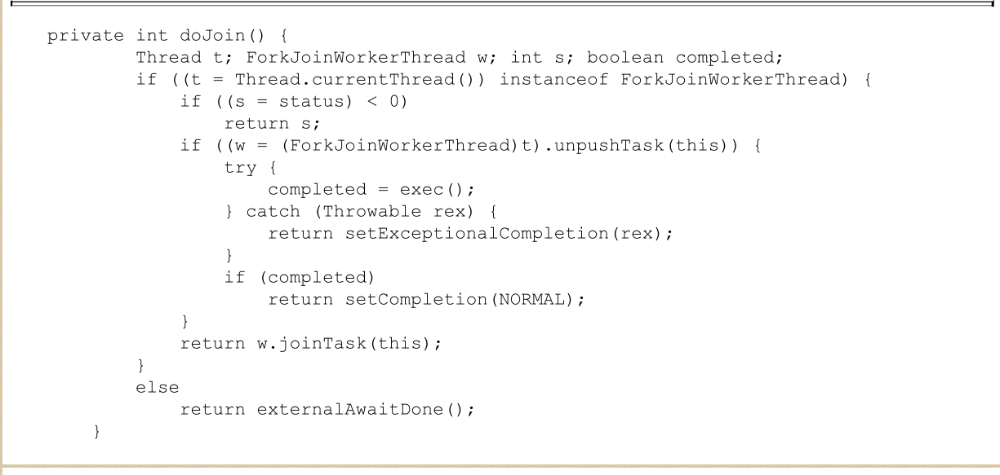
  > 在doJoin()方法里，首先通过查看任务的状态，看任务是否已经执行完成，如果执行完成，
  则直接返回任务状态；如果没有执行完，则从任务数组里取出任务并执行。如果任务顺利执行
  完成，则设置任务状态为NORMAL，如果出现异常，则记录异常，并将任务状态设置为
  EXCEPTIONAL。
  - 62:本章小结 
  > 本章介绍了Java中提供的各种并发容器和框架，并分析了该容器和框架的实现原理，从中
  我们能够领略到大师级的设计思路，希望读者能够充分理解这种设计思想，并在以后开发的
  并发程序时，运用上这些并发编程的技巧。
   
  - 63:java中的13个原子操作类 
  > 当程序更新一个变量时，如果多线程同时更新这个变量，可能得到期望之外的值，比如变
  量i=1，A线程更新i+1，B线程也更新i+1，经过两个线程操作之后可能i不等于3，而是等于2。因
  为A和B线程在更新变量i的时候拿到的i都是1，这就是线程不安全的更新操作，通常我们会使
  用synchronized来解决这个问题，synchronized会保证多线程不会同时更新变量i
  > 
  > 而Java从JDK 1.5开始提供了java.util.concurrent.atomic包（以下简称Atomic包），这个包中
  的原子操作类提供了一种用法简单、性能高效、线程安全地更新一个变量的方式
  > 
  > 因为变量的类型有很多种，所以在Atomic包里一共提供了13个类，属于4种类型的原子更
  新方式，分别是原子更新基本类型、原子更新数组、原子更新引用和原子更新属性（字段）。
  Atomic包里的类基本都是使用Unsafe实现的包装类。
  > 
  - 64:原子更新基本类型类
  > 使用原子的方式更新基本类型，Atomic包提供了以下3个类
  ```
  AtomicBoolean:原子更新布尔类型
  AtomicInteger:原子更新整型
  AtomicLong:原子更新长整形
    以上3个类提供的方法几乎一模一样，以AtomicInteger为例进行讲解，AtomicInteger的常用方法如下
    int addAndGet(int delta):以原子的方式将输入的数值与实例中的值（AtomicInteger中的value）相加，并返回结果
    boolean compareAndSet(int expect,int update):如果输入的数值等于预期值，则以原子的方式将该值设置为更新值
    int getAndIncrement():以原子方式将当前值加1，注意这里返回的是自增前的值
    void lazySet(int newValue):最终会设置成newValue,使用lazySet设置值后，可能导致其他线程在之后的一小段时间内还是可以读到旧的值，
       可以参考如下文章 :
  ```
  http://ifeve.com/how-does-atomiclong-lazyset-work/
  ```
    int getAndSet(int newValue):以原子的方式设置值为newValue,并返回旧值
  ```
  > 查看getAndIncrement()是如何实现原子操作的呢，查看源代码如下:
  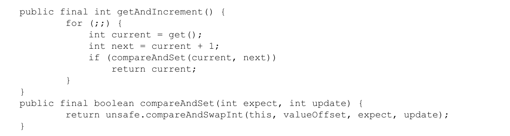
  > 源码中for循环体的第一步先取得AtomicInteger里存储的数值，第二步对AtomicInteger的当
  前数值进行加1操作，关键的第三步调用compareAndSet方法来进行原子更新操作，该方法先检
  查当前数值是否等于current，等于意味着AtomicInteger的值没有被其他线程修改过，则将
  AtomicInteger的当前数值更新成next的值，如果不等compareAndSet方法会返回false，程序会进
  入for循环重新进行compareAndSet操作
  > 
  > Atomic包提供了3种基本类型的原子更新，但是Java的基本类型里还有char、float和double
  等。那么问题来了，如何原子的更新其他的基本类型呢？Atomic包里的类基本都是使用Unsafe
  实现的，让我们一起看一下Unsafe的源码，如代如下
  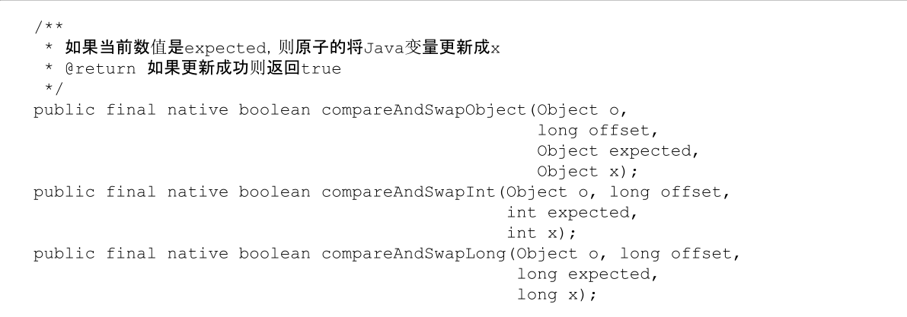
  > 通过代码，我们发现Unsafe只提供了3种CAS方法：compareAndSwapObject、compare-
  AndSwapInt和compareAndSwapLong，再看AtomicBoolean源码，发现它是先把Boolean转换成整
  型，再使用compareAndSwapInt进行CAS，所以原子更新char、float和double变量也可以用类似
  的思路来实现
  - 65:原子更新数组 
  > 通过原子的方式更新数组里的某个元素，Atomic包提供了以下3个类。
  ```
  AtomicIntegerArray:原子更新整型数组里的元素
  AtomicLongArray:原子更新长整型数组里的元素
  AtomicReferenceArray:原子更新引用数据类型数组里的元素
   
  AtomicIntegerArray类主要是提供原子的方式更新数组里的整型，其常用方法如下
    int addAndGet(int i,int delta);以原子方式将输入值与数组中索引i的元素相加
    boolean compareAndSet(int i,int expect,int update);如果当前值等于预期值，则以原子方式将数组位置i的元素设置成update
  以上几个类提供的方法几乎一样，
  ```
  - 66:原子更新引用类型
  > 原子更新基本类型的AtomicInteger，只能更新一个变量，如果要原子更新多个变量，就需
  要使用这个原子更新引用类型提供的类。Atomic包提供了以下3个类。
  ```
  AtomicReference:原子更新引用类型
  AtomicReferenceFieldUpdater:原子更新引用类型里的字段
  AtomicMarkableReference:原子更新带有标记位的引用类型，可以原子更新一个布尔类型的标记位和引用类型
      构造方法是：AtomicMarkableReference(V initialRef,boolean initialMark)
  以上几个类提供的方法几乎一样,以AtomicReference为例子显示代码 

  ```
  - 67:原子更新字段类
  > 如果需原子地更新某个类里的某个字段时，就需要使用原子更新字段类，Atomic包提供
  了以下3个类进行原子字段更新。
  ```
  AtomicIntegerFieldUpdater:原子更新整形的字段的更新器
  AtomicLongFieldUpdater:原子更新长整形的字段的更新器
  AtomicStampedReference:原子更新带有版本号的引用类型,该类型将整数与引用关联起来，可用于原子的更新数据以及数据的版本号
      可以解决使用cas进行原子更新时可能出现的ABA问题
  要想原子地更新字段类需要两步。
      第一步，因为原子更新字段类都是抽象类，每次使用的时候必须使用静态方法newUpdater()创建一个更新器，并且需要设置想要更新的类和属性。
      第二步，更新类的字段（属性）必须使用public volatile修饰符。
  以上3个类提供的方法几乎一样，以AstomicIntegerFieldUpdater为例演示代码
  ```
  - 68:本章小结
  > 本章介绍了JDK中并发包里的13个原子操作类以及原子操作类的实现原理，读者需要熟
  悉这些类和使用场景，在适当的场合下使用它
   
  - 69:java中的并发工具类
  > 在JDK的并发包里提供了几个非常有用的并发工具类。CountDownLatch、CyclicBarrier和
  Semaphore工具类提供了一种并发流程控制的手段，Exchanger工具类则提供了在线程间交换数
  据的一种手段。本章会配合一些应用场景来介绍如何使用这些工具类
  - 70：等待多线程完成的CountDownLatch (倒计数锁存 Latch:门闩; 插销; 弹簧锁; 碰锁)
  > CountDownLatch允许一个或多个线程等待其他线程完成操作
  > 
  > 假如有这样一个需求：我们需要解析一个Excel里多个sheet的数据，此时可以考虑使用多
  线程，每个线程解析一个sheet里的数据，等到所有的sheet都解析完之后，程序需要提示解析完
  成。在这个需求中，要实现主线程等待所有线程完成sheet的解析操作，最简单的做法是使用
  join()方法，见JoinCountDownLatchTest.java
  - 71:同步屏障CyclicBarrier(循环屏障) 
  > CyclicBarrier的字面意思是可循环使用（Cyclic）的屏障（Barrier）。它要做的事情是，让一
  组线程到达一个屏障（也可以叫同步点）时被阻塞，直到最后一个线程到达屏障时，屏障才会
  开门，所有被屏障拦截的线程才会继续运行。
   - 1：CyclicBarrier简介  
  > CyclicBarrier默认的构造方法是CyclicBarrier（int parties），其参数表示屏障拦截的线程数
  量，每个线程调用await方法告诉CyclicBarrier我已经到达了屏障，然后当前线程被阻塞，见CyclicBarrierTest.java
  > 
  > CyclicBarrier还提供一个更高级的构造函数CyclicBarrier（int parties，Runnable barrier-
  Action），用于在线程到达屏障时，优先执行barrierAction，方便处理更复杂的业务场景，如CyclicBarrierTest2.java
   - 2：CyclicBarrier的应用场景 
  > CyclicBarrier可以用于多线程计算数据，最后合并计算结果的场景。例如，用一个Excel保
  存了用户所有银行流水，每个Sheet保存一个账户近一年的每笔银行流水，现在需要统计用户
  的日均银行流水，先用多线程处理每个sheet里的银行流水，都执行完之后，得到每个sheet的日
  均银行流水，最后，再用barrierAction用这些线程的计算结果，计算出整个Excel的日均银行流
  水，代码见：BankWaterService.java
   - 3：CyclicBarrier和CountDownLatch的区别
  > CountDownLatch的计数器只能使用一次，而CyclicBarrier的计数器可以使用reset()方法重
  置。所以CyclicBarrier能处理更为复杂的业务场景。例如，如果计算发生错误，可以重置计数
  器，并让线程重新执行一次。
  > 
  > CyclicBarrier还提供其他有用的方法，比如getNumberWaiting方法可以获得Cyclic-Barrier
  阻塞的线程数量。isBroken()方法用来了解阻塞的线程是否被中断，见CyclicBarrierTest3.java
  - 72:控制线程并发数的Semaphore 
  > Semaphore（信号量）是用来控制同时访问特定资源的线程数量，它通过协调各个线程，以
  保证合理的使用公共资源
  > 
  > 很难理解Semaphore所表达的含义，它比作是控制流
  量的红绿灯。比如××马路要限制流量，只允许同时有一百辆车在这条路上行使，其他的都必须
  在路口等待，所以前一百辆车会看到绿灯，可以开进这条马路，后面的车会看到红灯，不能驶
  入××马路，但是如果前一百辆中有5辆车已经离开了××马路，那么后面就允许有5辆车驶入马
  路，这个例子里说的车就是线程，驶入马路就表示线程在执行，离开马路就表示线程执行完
  成，看见红灯就表示线程被阻塞，不能执行.
   - 1.应用场景 
  > Semaphore可以用于做流量控制，特别是公用资源有限的应用场景，比如数据库连接。假
  如有一个需求，要读取几万个文件的数据，因为都是IO密集型任务，我们可以启动几十个线程
  并发地读取，但是如果读到内存后，还需要存储到数据库中，而数据库的连接数只有10个，这
  时我们必须控制只有10个线程同时获取数据库连接保存数据，否则会报错无法获取数据库连
  接。这个时候，就可以使用Semaphore来做流量控制，代码见SemaphoreTest.java
   - 2:其他方法
  ```
  Semaphore还提供一些其他方法，具体如下。
   ·int availablePermits()：返回此信号量中当前可用的许可证数。
   ·int getQueueLength()：返回正在等待获取许可证的线程数。
   ·boolean hasQueuedThreads()：是否有线程正在等待获取许可证。
   ·void reducePermits（int reduction）：减少reduction个许可证，是个protected方法。
   ·Collection getQueuedThreads()：返回所有等待获取许可证的线程集合，是个protected方法。
  ``` 
  - 73:线程间交换数据的Exchanger
  > Exchanger（交换者）是一个用于线程间协作的工具类。Exchanger用于进行线程间的数据交
  换。它提供一个同步点，在这个同步点，两个线程可以交换彼此的数据。这两个线程通过
  exchange方法交换数据，如果第一个线程先执行exchange()方法，它会一直等待第二个线程也
  执行exchange方法，当两个线程都到达同步点时，这两个线程就可以交换数据，将本线程生产
  出来的数据传递给对方。
  > 
  > Exchanger可以用于遗传算法，遗传算法里需要选出两个人作为交配对象，这时候会交换
  两人的数据，并使用交叉规则得出2个交配结果。Exchanger也可以用于校对工作，比如我们需
  要将纸制银行流水通过人工的方式录入成电子银行流水，为了避免错误，采用AB岗两人进行
  录入，录入到Excel之后，系统需要加载这两个Excel，并对两个Excel数据进行校对，看看是否
  录入一致,代码见ExchangerTest.java
  - 74:本章小结 
  > 本章配合一些应用场景介绍JDK中提供的几个并发工具类，大家记住这个工具类的用途，
  一旦有对应的业务场景，不妨试试这些工具类
   
  - 75：java中的线程池 
  > Java中的线程池是运用场景最多的并发框架，几乎所有需要异步或并发执行任务的程序
  都可以使用线程池。在开发过程中，合理地使用线程池能够带来3个好处。
  第一：降低资源消耗。通过重复利用已创建的线程降低线程创建和销毁造成的消耗。
  第二：提高响应速度。当任务到达时，任务可以不需要等到线程创建就能立即执行。
  第三：提高线程的可管理性。线程是稀缺资源，如果无限制地创建，不仅会消耗系统资源，
  还会降低系统的稳定性，使用线程池可以进行统一分配、调优和监控。但是，要做到合理利用
  线程池，必须对其实现原理了如指掌。
  - 76：线程池的实现原理 
  > 当向线程池提交一个任务之后，线程池是如何处理这个任务的呢,处理流程图如图:
  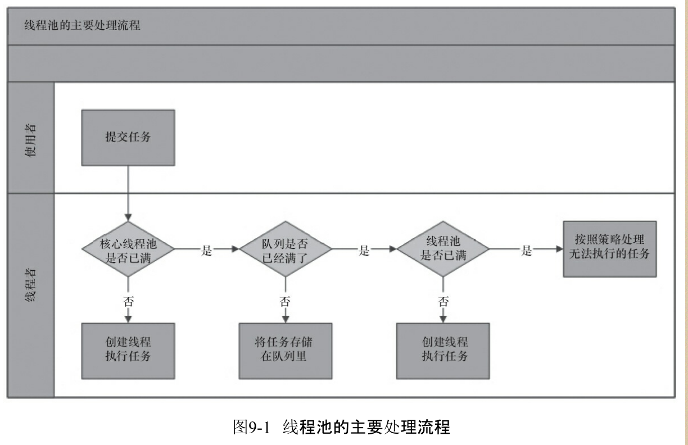
  ```
  1）线程池判断核心线程池里的线程是否都在执行任务。如果不是，则创建一个新的工作
  线程来执行任务。如果核心线程池里的线程都在执行任务，则进入下个流程。
  2）线程池判断工作队列是否已经满。如果工作队列没有满，则将新提交的任务存储在这
  个工作队列里。如果工作队列满了，则进入下个流程。
  3）线程池判断线程池的线程是否都处于工作状态。如果没有，则创建一个新的工作线程
  来执行任务。如果已经满了，则交给饱和策略来处理这个任务
  ``` 
  > ThreadPoolExecutor执行execute()方法的示意图如下图：
  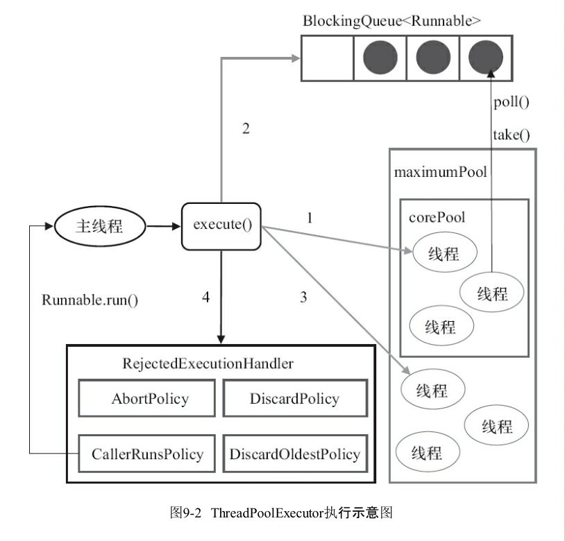
  ```
  ThreadPoolExecutor执行execute()方法分下面四种情况
  1）如果当前运行的线程少于corePoolSize，则创建新线程来执行任务（注意，执行这一步骤
  需要获取全局锁）。
  2）如果运行的线程等于或多于corePoolSize，则将任务加入BlockingQueue。
  3）如果无法将任务加入BlockingQueue（队列已满），则创建新的线程来处理任务（注意，执
  行这一步骤需要获取全局锁）。
  4）如果创建新线程将使当前运行的线程超出maximumPoolSize，任务将被拒绝，并调用
  RejectedExecutionHandler.rejectedExecution()方法。
  ThreadPoolExecutor采取上述步骤的总体设计思路，是为了在执行execute()方法时，尽可能
  地避免获取全局锁（那将会是一个严重的可伸缩瓶颈）。在ThreadPoolExecutor完成预热之后
  当前运行的线程数大于等于corePoolSize），几乎所有的execute()方法调用都是执行步骤2，而
  步骤2不需要获取全局锁。
  ```
  > 上面的流程分析让我们很直观地了解了线程池的工作原理，让我们再通过源代码来看看是如何实现的，线程池执行任务的方法如下
  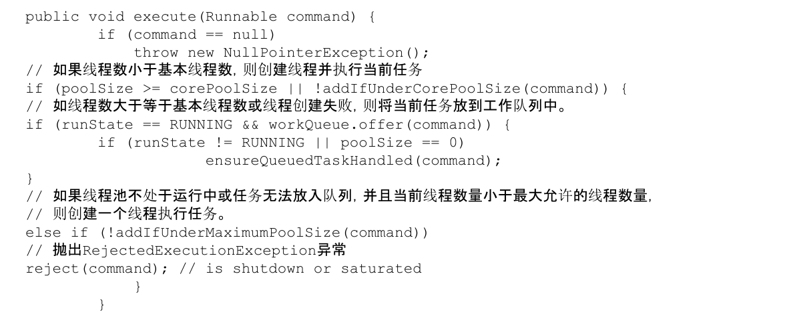
  > 工作线程：线程池创建线程时，会将线程封装成工作线程Worker，Worker在执行完任务
  后，还会循环获取工作队列里的任务来执行。我们可以从Worker类的run()方法里看到这点
  ```
  public void run() {
    try {
      Runnable task = firstTask;
      firstTask = null;
      while (task != null || (task = getTask()) != null) {
        runTask(task);
        task = null;
      }
    } finally {
      workerDone(this);
    }
  }

  ```
  > ThreadPoolExecutor中线程执行任务的示意图如图9-3所示
  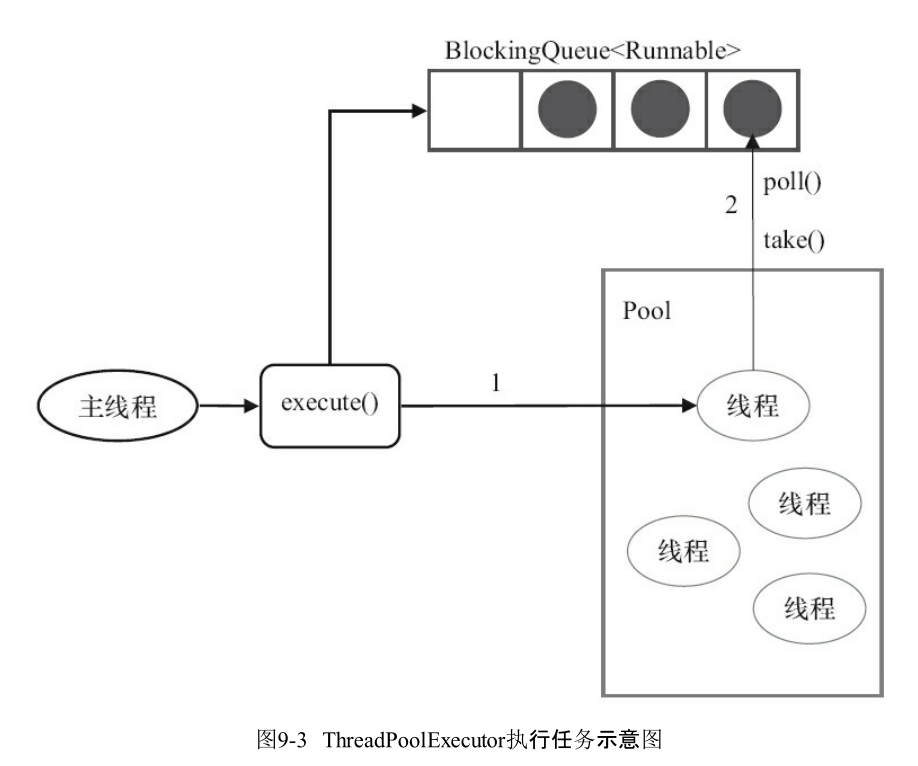
  > 线程池中的线程执行任务分两种情况，如下。
  > 1）在execute()方法中创建一个线程时，会让这个线程执行当前任务。
  > 2）这个线程执行完上图中1的任务后，会反复从BlockingQueue获取任务来执行。
  - 77:线程池的使用
  - 78:线程池的创建
  > 我们可以通过ThreadPoolExecutor来创建一个线程池。
  > new ThreadPoolExecutor(corePoolSize, maximumPoolSize, keepAliveTime, milliseconds,runnableTaskQueue, handler);
  > 创建一个线程池时需要输入几个参数，如下。
  ```
  1）corePoolSize（线程池的基本大小）：当提交一个任务到线程池时，线程池会创建一个线
  程来执行任务，即使其他空闲的基本线程能够执行新任务也会创建线程，等到需要执行的任
  务数大于线程池基本大小时就不再创建。如果调用了线程池的prestartAllCoreThreads()方法，
  线程池会提前创建并启动所有基本线程。
  2）runnableTaskQueue（任务队列）：用于保存等待执行的任务的阻塞队列。可以选择以下几
  个阻塞队列。
    ·ArrayBlockingQueue：是一个基于数组结构的有界阻塞队列，此队列按FIFO（先进先出）原
    则对元素进行排序。
    ·LinkedBlockingQueue：一个基于链表结构的阻塞队列，此队列按FIFO排序元素，吞吐量通
    常要高于ArrayBlockingQueue。静态工厂方法Executors.newFixedThreadPool()使用了这个队列。
    ·SynchronousQueue：一个不存储元素的阻塞队列。每个插入操作必须等到另一个线程调用
    移除操作，否则插入操作一直处于阻塞状态，吞吐量通常要高于Linked-BlockingQueue，静态工
    厂方法Executors.newCachedThreadPool使用了这个队列。
    ·PriorityBlockingQueue：一个具有优先级的无限阻塞队列。
  3）maximumPoolSize（线程池最大数量）：线程池允许创建的最大线程数。如果队列满了，并
  且已创建的线程数小于最大线程数，则线程池会再创建新的线程执行任务。值得注意的是，如
  果使用了无界的任务队列这个参数就没什么效果。
  4）ThreadFactory：用于设置创建线程的工厂，可以通过线程工厂给每个创建出来的线程设
  置更有意义的名字。使用开源框架guava提供的ThreadFactoryBuilder可以快速给线程池里的线
  程设置有意义的名字，代码如下。
    new ThreadFactoryBuilder().setNameFormat("XX-task-%d").build();
  5）RejectedExecutionHandler（饱和策略）：当队列和线程池都满了，说明线程池处于饱和状
  态，那么必须采取一种策略处理提交的新任务。这个策略默认情况下是AbortPolicy，表示无法
  处理新任务时抛出异常。在JDK 1.5中Java线程池框架提供了以下4种策略。
    ·AbortPolicy：直接抛出异常。
    ·CallerRunsPolicy：只用调用者所在线程来运行任务。
    ·DiscardOldestPolicy：丢弃队列里最近的一个任务，并执行当前任务。
    ·DiscardPolicy：不处理，丢弃掉。
    当然，也可以根据应用场景需要来实现RejectedExecutionHandler接口自定义策略。如记录
    日志或持久化存储不能处理的任务。
    ·keepAliveTime（线程活动保持时间）：线程池的工作线程空闲后，保持存活的时间。所以，
    如果任务很多，并且每个任务执行的时间比较短，可以调大时间，提高线程的利用率。
    ·TimeUnit（线程活动保持时间的单位）：可选的单位有天（DAYS）、小时（HOURS）、分钟
    （MINUTES）、毫秒（MILLISECONDS）、微秒（MICROSECONDS，千分之一毫秒）和纳秒
    （NANOSECONDS，千分之一微秒）。
  ```
  - 79:像线程池提交任务
  > 可以使用两个方法向线程池提交任务，分别为execute()和submit()方法。
  > execute()方法用于提交不需要返回值的任务，所以无法判断任务是否被线程池执行成功。
  通过以下代码可知execute()方法输入的任务是一个Runnable类的实例
  ```
  threadsPool.execute(new Runnable() {
    @Override
    public void run() {
      // TODO Auto-generated method stub
    }
  });
  ```
  > submit()方法用于提交需要返回值的任务。线程池会返回一个future类型的对象，通过这个
  future对象可以判断任务是否执行成功，并且可以通过future的get()方法来获取返回值，get()方
  法会阻塞当前线程直到任务完成，而使用get（long timeout，TimeUnit unit）方法则会阻塞当前线
  程一段时间后立即返回，这时候有可能任务没有执行完。
  ```
  Future<Object> future = executor.submit(harReturnValuetask);
  try {
    Object s = future.get();
  } catch (InterruptedException e) {
    // 处理中断异常
  } catch (ExecutionException e) {
    // 处理无法执行任务异常
  } finally {
    // 关闭线程池
    executor.shutdown();
  }
  ```
  - 80: 关闭线程池
  > 可以通过调用线程池的shutdown或shutdownNow方法来关闭线程池。它们的原理是遍历线
  程池中的工作线程，然后逐个调用线程的interrupt方法来中断线程，所以无法响应中断的任务
  可能永远无法终止。但是它们存在一定的区别，shutdownNow首先将线程池的状态设置成
  STOP，然后尝试停止所有的正在执行或暂停任务的线程，并返回等待执行任务的列表，而
  shutdown只是将线程池的状态设置成SHUTDOWN状态，然后中断所有没有正在执行任务的线
  程。
  > 只要调用了这两个关闭方法中的任意一个，isShutdown方法就会返回true。当所有的任务
  都已关闭后，才表示线程池关闭成功，这时调用isTerminaed方法会返回true。至于应该调用哪
  一种方法来关闭线程池，应该由提交到线程池的任务特性决定，通常调用shutdown方法来关闭
  线程池，如果任务不一定要执行完，则可以调用shutdownNow方法。
  - 81:合理地配置线程池 
  > 要想合理地配置线程池，就必须首先分析任务特性，可以从以下几个角度来分析。
  ```
  ·任务的性质：CPU密集型任务、IO密集型任务和混合型任务。
  ·任务的优先级：高、中和低。
  ·任务的执行时间：长、中和短。
  ·任务的依赖性：是否依赖其他系统资源，如数据库连接。
  ```
  > 性质不同的任务可以用不同规模的线程池分开处理。CPU密集型任务应配置尽可能小的
  线程，如配置N cpu +1个线程的线程池。由于IO密集型任务线程并不是一直在执行任务，则应配
  置尽可能多的线程，如2*N cpu 。混合型的任务，如果可以拆分，将其拆分成一个CPU密集型任务
  和一个IO密集型任务，只要这两个任务执行的时间相差不是太大，那么分解后执行的吞吐量
  将高于串行执行的吞吐量。如果这两个任务执行时间相差太大，则没必要进行分解。可以通过
  Runtime.getRuntime().availableProcessors()方法获得当前设备的CPU个数。
  > 
  > 优先级不同的任务可以使用优先级队列PriorityBlockingQueue来处理。它可以让优先级高
  的任务先执行。
  > 
  > 注意　如果一直有优先级高的任务提交到队列里，那么优先级低的任务可能永远不能 执行。
  > 
  > 执行时间不同的任务可以交给不同规模的线程池来处理，或者可以使用优先级队列，让
  执行时间短的任务先执行。
  > 
  > 依赖数据库连接池的任务，因为线程提交SQL后需要等待数据库返回结果，等待的时间越
  长，则CPU空闲时间就越长，那么线程数应该设置得越大，这样才能更好地利用CPU。
  > 
  > 建议使用有界队列。有界队列能增加系统的稳定性和预警能力，可以根据需要设大一点
  儿，比如几千。有一次，我们系统里后台任务线程池的队列和线程池全满了，不断抛出抛弃任
  务的异常，通过排查发现是数据库出现了问题，导致执行SQL变得非常缓慢，因为后台任务线
  程池里的任务全是需要向数据库查询和插入数据的，所以导致线程池里的工作线程全部阻
  塞，任务积压在线程池里。如果当时我们设置成无界队列，那么线程池的队列就会越来越多，
  有可能会撑满内存，导致整个系统不可用，而不只是后台任务出现问题。当然，我们的系统所
  有的任务是用单独的服务器部署的，我们使用不同规模的线程池完成不同类型的任务，但是
  出现这样问题时也会影响到其他任务。
  - 82：线程池的监控 
  > 如果在系统中大量使用线程池，则有必要对线程池进行监控，方便在出现问题时，可以根
  据线程池的使用状况快速定位问题。可以通过线程池提供的参数进行监控，在监控线程池的
  时候可以使用以下属性。
  ```
  ·taskCount：线程池需要执行的任务数量。
  ·completedTaskCount：线程池在运行过程中已完成的任务数量，小于或等于taskCount。
  ·largestPoolSize：线程池里曾经创建过的最大线程数量。通过这个数据可以知道线程池是否曾经满过。如该数值等于线程池的最大大小，则表示线程池曾经满过。
  ·getPoolSize：线程池的线程数量。如果线程池不销毁的话，线程池里的线程不会自动销毁，所以这个大小只增不减
  ·getActiveCount：获取活动的线程数。
  ``` 
  > 通过扩展线程池进行监控。可以通过继承线程池来自定义线程池，重写线程池的
  beforeExecute、afterExecute和terminated方法，也可以在任务执行前、执行后和线程池关闭前执
  行一些代码来进行监控。例如，监控任务的平均执行时间、最大执行时间和最小执行时间等。
  这几个方法在线程池里是空方法。
  - 83:本章小结 
  > 在工作中我经常发现，很多人因为不了解线程池的实现原理，把线程池配置错误，从而导
  致了各种问题。本章介绍了为什么要使用线程池、如何使用线程池和线程池的使用原理，相信
  阅读完本章之后，读者能更准确、更有效地使用线程池
   
  - 84:Executor框架 
  > 在Java中，使用线程来异步执行任务。Java线程的创建与销毁需要一定的开销，如果我们
  为每一个任务创建一个新线程来执行，这些线程的创建与销毁将消耗大量的计算资源。同时，
  为每一个任务创建一个新线程来执行，这种策略可能会使处于高负荷状态的应用最终崩溃。
  > 
  > Java的线程既是工作单元，也是执行机制。从JDK 5开始，把工作单元与执行机制分离开
  来。工作单元包括Runnable和Callable，而执行机制由Executor框架提供。
  - 85:Executor框架简介
  - 86:Executor框架的两级调度模型 
  > 在HotSpot VM的线程模型中，Java线程（java.lang.Thread）被一对一映射为本地操作系统线
  程。Java线程启动时会创建一个本地操作系统线程；当该Java线程终止时，这个操作系统线程
  也会被回收。操作系统会调度所有线程并将它们分配给可用的CPU。
  > 
  > 在上层，Java多线程程序通常把应用分解为若干个任务，然后使用用户级的调度器
  （Executor框架）将这些任务映射为固定数量的线程；在底层，操作系统内核将这些线程映射到
  硬件处理器上。这种两级调度模型的示意图如图10-1所示。
  > 
  > 从图中可以看出，应用程序通过Executor框架控制上层的调度；而下层的调度由操作系统
  内核控制，下层的调度不受应用程序的控制
  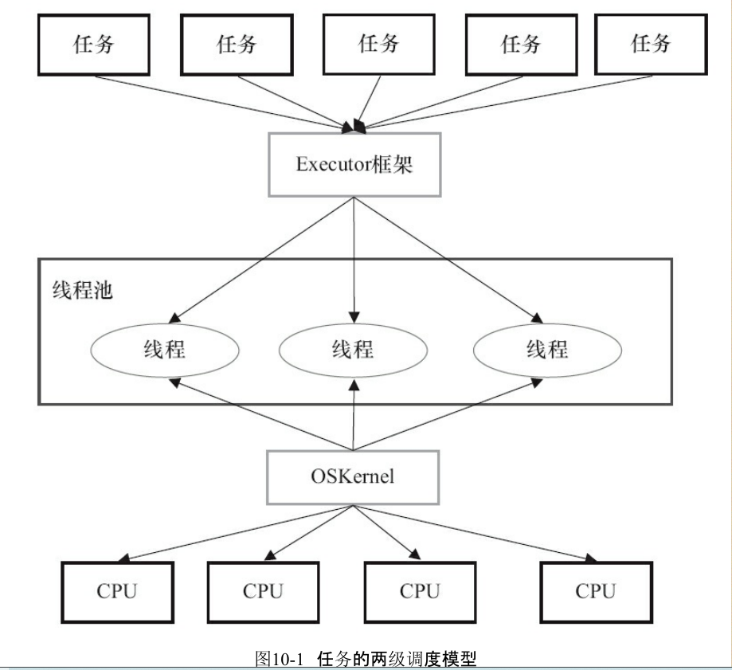
  - 87:Executor框架的结构与成员 
  > 分两部分来介绍Executor：Executor的结构和Executor框架包含的成员组件
  ```
  1.Executor框架的结构
    Executor框架主要由3大部分组成如下。
    ·任务。包括被执行任务需要实现的接口：Runnable接口或Callable接口。
    ·任务的执行。包括任务执行机制的核心接口Executor，以及继承自Executor的
     ExecutorService接口。Executor框架有两个关键类实现了ExecutorService接口
    （ThreadPoolExecutor和ScheduledThreadPoolExecutor）。
    ·异步计算的结果。包括接口Future和实现Future接口的FutureTask类。
    Executor框架包含的主要的类与接口如图10-2所示。
      ·Executor是一个接口，它是Executor框架的基础，它将任务的提交与任务的执行分离开来。
      ·ThreadPoolExecutor是线程池的核心实现类，用来执行被提交的任务。
      ·ScheduledThreadPoolExecutor是一个实现类，可以在给定的延迟后运行命令，或者定期执
        行命令。ScheduledThreadPoolExecutor比Timer更灵活，功能更强大。
      ·Future接口和实现Future接口的FutureTask类，代表异步计算的结果。
      ·Runnable接口和Callable接口的实现类，都可以被ThreadPoolExecutor或Scheduled-
        ThreadPoolExecutor执行。
  ``` 
  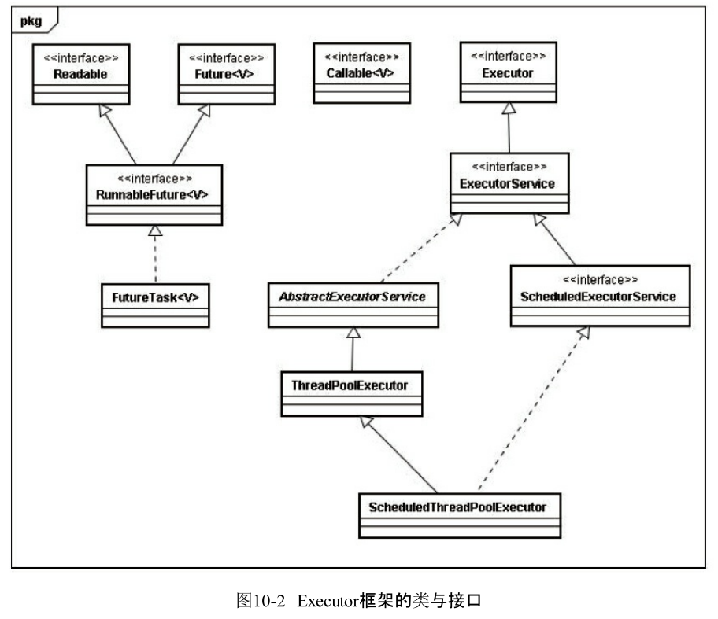
  > Executor框架的使用示意图如图10-3所示。
  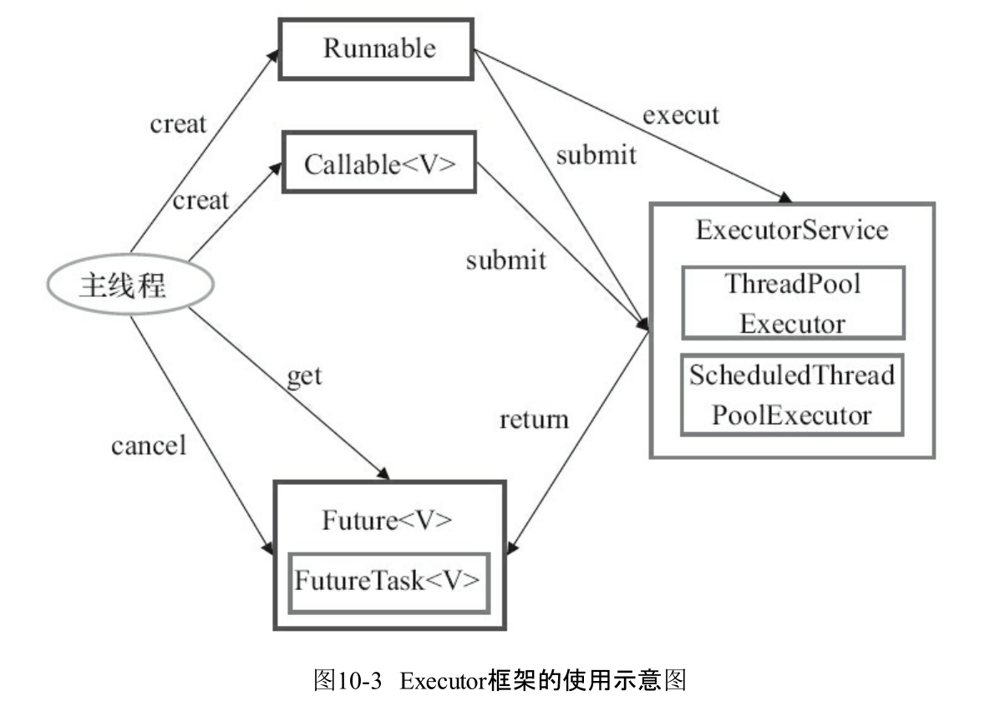 
  > 主线程首先要创建实现Runnable或者Callable接口的任务对象。工具类Executors可以把一
  个Runnable对象封装为一个Callable对象（Executors.callable（Runnable task）或
  Executors.callable（Runnable task，Object result））。
  > 
  > 然后可以把Runnable对象直接交给ExecutorService执行（ExecutorService.execute（Runnable
  command））；或者也可以把Runnable对象或Callable对象提交给ExecutorService执行（Executor-
  Service.submit（Runnable task）或ExecutorService.submit（Callable<T>task））。
  > 
  > 如果执行ExecutorService.submit（…），ExecutorService将返回一个实现Future接口的对象
  （到目前为止的JDK中，返回的是FutureTask对象）。由于FutureTask实现了Runnable，程序员也可
  以创建FutureTask，然后直接交给ExecutorService执行。
  > 
  > 最后，主线程可以执行FutureTask.get()方法来等待任务执行完成。主线程也可以执行
  FutureTask.cancel（boolean mayInterruptIfRunning）来取消此任务的执行。
  - 88:Executor框架的成员 
  > 介绍Executor框架的主要成员：ThreadPoolExecutor、ScheduledThreadPoolExecutor、
  Future接口、Runnable接口、Callable接口和Executors。
  ```
  （1）ThreadPoolExecutor
  ThreadPoolExecutor通常使用工厂类Executors来创建。Executors可以创建3种类型的
  ThreadPoolExecutor：SingleThreadExecutor、FixedThreadPool和CachedThreadPool。
  下面分别介绍这3种ThreadPoolExecutor。
    1）FixedThreadPool:适用于为了满足资源管理的需求，而需要限制当前线程数量的应用场
    景，它适用于负载比较重的服务器。
    2）SingleThreadExecutor:SingleThreadExecutor适用于需要保证顺序地执行各个任务；并且在任意时间点，不会有多
    个线程是活动的应用场景
    3）CachedThreadPool:是大小无界的线程池，适用于执行很多的短期异步任务的小程序，或者
    是负载较轻的服务器
  （2）ScheduledThreadPoolExecutor
  ScheduledThreadPoolExecutor通常使用工厂类Executors来创建。Executors可以创建2种类
  型的ScheduledThreadPoolExecutor，如下。
    ·ScheduledThreadPoolExecutor。包含若干个线程的ScheduledThreadPoolExecutor。
      ScheduledThreadPoolExecutor适用于需要多个后台线程执行周期任务，同时为了满足资源
      管理的需求而需要限制后台线程的数量的应用场景
    ·SingleThreadScheduledExecutor。只包含一个线程的ScheduledThreadPoolExecutor。
      SingleThreadScheduledExecutor适用于需要单个后台线程执行周期任务，同时需要保证顺
      序地执行各个任务的应用场景。
  （3）Future接口
  Future接口和实现Future接口的FutureTask类用来表示异步计算的结果。当我们把Runnable
  接口或Callable接口的实现类提交（submit）给ThreadPoolExecutor或
  ScheduledThreadPoolExecutor时，ThreadPoolExecutor或ScheduledThreadPoolExecutor会向我们
  返回一个FutureTask对象
  
  有一点需要读者注意，到目前最新的JDK 8为止，Java通过上述API返回的是一个
  FutureTask对象。但从API可以看到，Java仅仅保证返回的是一个实现了Future接口的对象。在将
  来的JDK实现中，返回的可能不一定是FutureTask。
  （4）Runnable接口和Callable接口
  Runnable接口和Callable接口的实现类，都可以被ThreadPoolExecutor或Scheduled-
  ThreadPoolExecutor执行。它们之间的区别是Runnable不会返回结果，而Callable可以返回结
  果。
  除了可以自己创建实现Callable接口的对象外，还可以使用工厂类Executors来把一个
  Runnable包装成一个Callable。
  public static Callable<Object> callable(Runnable task) // 假设返回对象Callable1
  
  前面讲过，当我们把一个Callable对象（比如上面的Callable1或Callable2）提交给
  ThreadPoolExecutor或ScheduledThreadPoolExecutor执行时，submit（…）会向我们返回一个
  FutureTask对象。我们可以执行FutureTask.get()方法来等待任务执行完成。当任务成功完成后
  FutureTask.get()将返回该任务的结果。例如，如果提交的是对象Callable1，FutureTask.get()方法
  将返回null；如果提交的是对象Callable2，FutureTask.get()方法将返回result对象。
  ``` 
  - 89:ThreadPoolExecutor详解
  > Executor框架最核心的类是ThreadPoolExecutor，它是线程池的实现类，主要由下列4个组
  件构成
  > ·corePool：核心线程池的大小。
  > ·maximumPool：最大线程池的大小。
  > ·BlockingQueue：用来暂时保存任务的工作队列。
  > ·RejectedExecutionHandler：当ThreadPoolExecutor已经关闭或ThreadPoolExecutor已经饱和
  时（达到了最大线程池大小且工作队列已满），execute()方法将要调用的Handler。
  > 
  > ·通过Executor框架的工具类Executors，可以创建3种类型的ThreadPoolExecutor。
  > ·FixedThreadPool。
  > ·SingleThreadExecutor。
  > ·CachedThreadPool。
  > 
  > FixedThreadPool被称为可重用固定线程数的线程池,FixedThreadPool的corePoolSize和maximumPoolSize都被设置为创建FixedThreadPool时指
  定的参数nThreads。当线程池中的线程数大于corePoolSize时，keepAliveTime为多余的空闲线程等待新任务的
  最长时间，超过这个时间后多余的线程将被终止。这里把keepAliveTime设置为0L，意味着多余
  的空闲线程会被立即终止。FixedThreadPool的execute()方法的运行示意图如图10-4所示。
  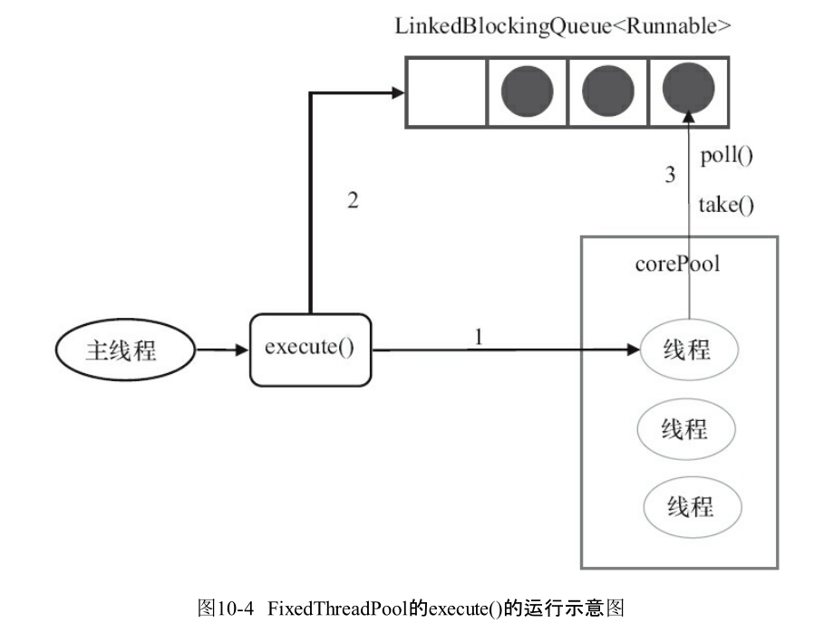
  > 对上述的图示例如下：
  > 1）如果当前运行的线程数少于corePoolSize，则创建新线程来执行任务。
  > 2）在线程池完成预热之后（当前运行的线程数等于corePoolSize），将任务加入LinkedBlockingQueue。
  > 3）线程执行完1中的任务后，会在循环中反复从LinkedBlockingQueue获取任务来执行。
  > FixedThreadPool使用无界队列LinkedBlockingQueue作为线程池的工作队列（队列的容量为
  Integer.MAX_VALUE）。使用无界队列作为工作队列会对线程池带来如下影响。
  1）当线程池中的线程数达到corePoolSize后，新任务将在无界队列中等待，因此线程池中
  的线程数不会超过corePoolSize。
  2）由于1，使用无界队列时maximumPoolSize将是一个无效参数。
  3）由于1和2，使用无界队列时keepAliveTime将是一个无效参数。
  4）由于使用无界队列，运行中的FixedThreadPool（未执行方法shutdown()或
  shutdownNow()）不会拒绝任务（不会调用RejectedExecutionHandler.rejectedExecution方法）。
  > 
  > SingleThreadExecutor详解
  > SingleThreadExecutor是使用单个worker线程的Executor。
  > 
  > SingleThreadExecutor的corePoolSize和maximumPoolSize被设置为1。其他参数与
  FixedThreadPool相同。SingleThreadExecutor使用无界队列LinkedBlockingQueue作为线程池的工
  作队列（队列的容量为Integer.MAX_VALUE）。SingleThreadExecutor使用无界队列作为工作队列
  对线程池带来的影响与FixedThreadPool相同，这里就不赘述了。
  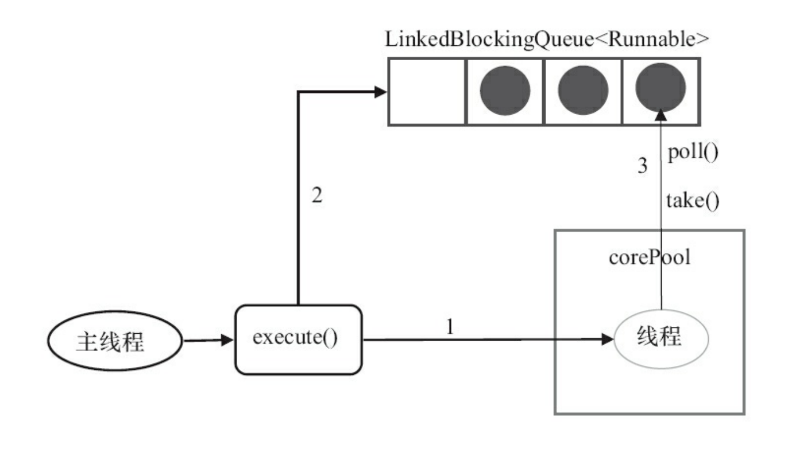
  > 1）如果当前运行的线程数少于corePoolSize（即线程池中无运行的线程），则创建一个新线
  程来执行任务。
  2）在线程池完成预热之后（当前线程池中有一个运行的线程），将任务加入Linked-
  BlockingQueue。
  3）线程执行完1中的任务后，会在一个无限循环中反复从LinkedBlockingQueue获取任务来
  执行。
  > 
  - CachedThreadPool详解
  > CachedThreadPool是一个会根据需要创建新线程的线程池
  > CachedThreadPool的corePoolSize被设置为0，即corePool为空；maximumPoolSize被设置为
  Integer.MAX_VALUE，即maximumPool是无界的。这里把keepAliveTime设置为60L，意味着
  CachedThreadPool中的空闲线程等待新任务的最长时间为60秒，空闲线程超过60秒后将会被
  终止。
  > 
  > FixedThreadPool和SingleThreadExecutor使用无界队列LinkedBlockingQueue作为线程池的
  工作队列。CachedThreadPool使用没有容量的SynchronousQueue作为线程池的工作队列，但
  CachedThreadPool的maximumPool是无界的。这意味着，如果主线程提交任务的速度高于
  maximumPool中线程处理任务的速度时，CachedThreadPool会不断创建新线程。极端情况下，
  CachedThreadPool会因为创建过多线程而耗尽CPU和内存资源。
  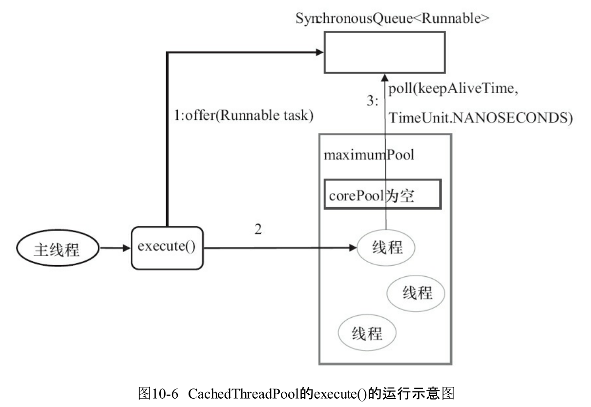
  ```
  1）首先执行SynchronousQueue.offer（Runnable task）。如果当前maximumPool中有空闲线程
  正在执行SynchronousQueue.poll（keepAliveTime，TimeUnit.NANOSECONDS），那么主线程执行
  offer操作与空闲线程执行的poll操作配对成功，主线程把任务交给空闲线程执行，execute()方
  法执行完成；否则执行下面的步骤2）。
  
  2）当初始maximumPool为空，或者maximumPool中当前没有空闲线程时，将没有线程执行
  SynchronousQueue.poll（keepAliveTime，TimeUnit.NANOSECONDS）。这种情况下，步骤1）将失
  败。此时CachedThreadPool会创建一个新线程执行任务，execute()方法执行完成。

  3）在步骤2）中新创建的线程将任务执行完后，会执行
  SynchronousQueue.poll（keepAliveTime，TimeUnit.NANOSECONDS）。这个poll操作会让空闲线
  程最多在SynchronousQueue中等待60秒钟。如果60秒钟内主线程提交了一个新任务（主线程执
  行步骤1）），那么这个空闲线程将执行主线程提交的新任务；否则，这个空闲线程将终止。由于
  空闲60秒的空闲线程会被终止，因此长时间保持空闲的CachedThreadPool不会使用任何资源。

  前面提到过，SynchronousQueue是一个没有容量的阻塞队列。每个插入操作必须等待另一
  个线程的对应移除操作，反之亦然。CachedThreadPool使用SynchronousQueue，把主线程提交的
  任务传递给空闲线程执行。CachedThreadPool中任务传递的示意图如图10-7所示。
  
  ```
  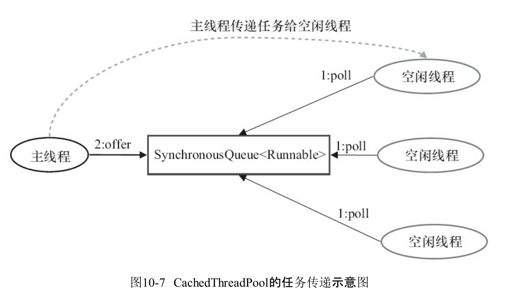
  - ScheduledThreadPoolExecutor详解
  > ScheduledThreadPoolExecutor继承自ThreadPoolExecutor。它主要用来在给定的延迟之后运
  行任务，或者定期执行任务。ScheduledThreadPoolExecutor的功能与Timer类似，但
  ScheduledThreadPoolExecutor功能更强大、更灵活。Timer对应的是单个后台线程，而
  ScheduledThreadPoolExecutor可以在构造函数中指定多个对应的后台线程数。
  - ScheduledThreadPoolExecutor的运行机制 
  > ScheduledThreadPoolExecutor的执行示意图
  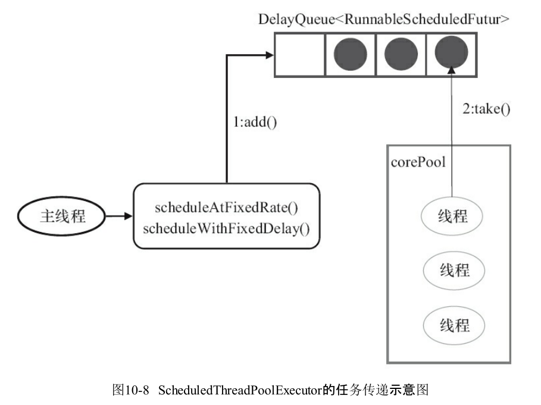 
  > DelayQueue是一个无界队列，所以ThreadPoolExecutor的maximumPoolSize在Scheduled-
  ThreadPoolExecutor中没有什么意义（设置maximumPoolSize的大小没有什么效果）。
  ScheduledThreadPoolExecutor的执行主要分为两大部分。
  1）当调用ScheduledThreadPoolExecutor的scheduleAtFixedRate()方法或者scheduleWith-
  FixedDelay()方法时，会向ScheduledThreadPoolExecutor的DelayQueue添加一个实现了
  RunnableScheduledFutur接口的ScheduledFutureTask。
  > 
  > 2）线程池中的线程从DelayQueue中获取ScheduledFutureTask，然后执行任务。
  > ScheduledThreadPoolExecutor为了实现周期性的执行任务，对ThreadPoolExecutor做了如下
  的修改。
  ·使用DelayQueue作为任务队列。
  ·获取任务的方式不同（后文会说明）。
  ·执行周期任务后，增加了额外的处理（后文会说明）。
  - ScheduledThreadPoolExecutor的实现 
  > ScheduledThreadPoolExecutor会把待调度的任务（ScheduledFutureTask）
  放到一个DelayQueue中
  > ScheduledFutureTask主要包含3个成员变量，如下
  > ·long型成员变量time，表示这个任务将要被执行的具体时间。
  ·long型成员变量sequenceNumber，表示这个任务被添加到ScheduledThreadPoolExecutor中
  的序号。
  ·long型成员变量period，表示任务执行的间隔周期。
  > DelayQueue封装了一个PriorityQueue，这个PriorityQueue会对队列中的Scheduled-
  FutureTask进行排序。排序时，time小的排在前面（时间早的任务将被先执行）。如果两个
  ScheduledFutureTask的time相同，就比较sequenceNumber，sequenceNumber小的排在前面（也就
  是说，如果两个任务的执行时间相同，那么先提交的任务将被先执行）。
  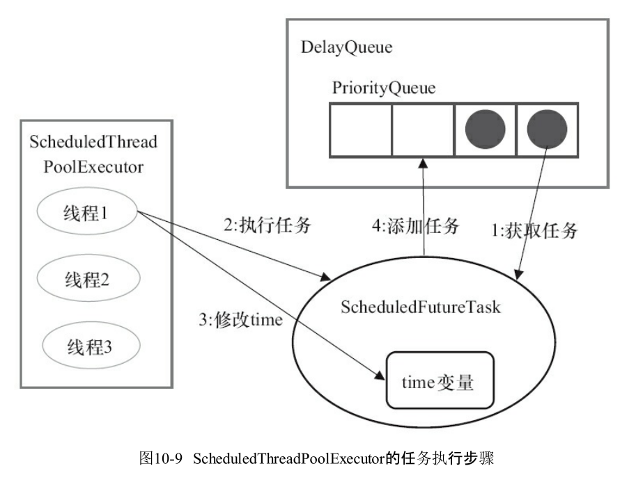
  > 1）线程1从DelayQueue中获取已到期的ScheduledFutureTask（DelayQueue.take()）。到期任务
  是指ScheduledFutureTask的time大于等于当前时间。
  > 2）线程1执行这个ScheduledFutureTask。
  > 3）线程1修改ScheduledFutureTask的time变量为下次将要被执行的时间。
  > 4）线程1把这个修改time之后的ScheduledFutureTask放回DelayQueue中（Delay-
  Queue.add()）。
  > 接下来，让我们看看上面的步骤1）获取任务的过程。下面是DelayQueue.take()方法的源代
  码实现。
  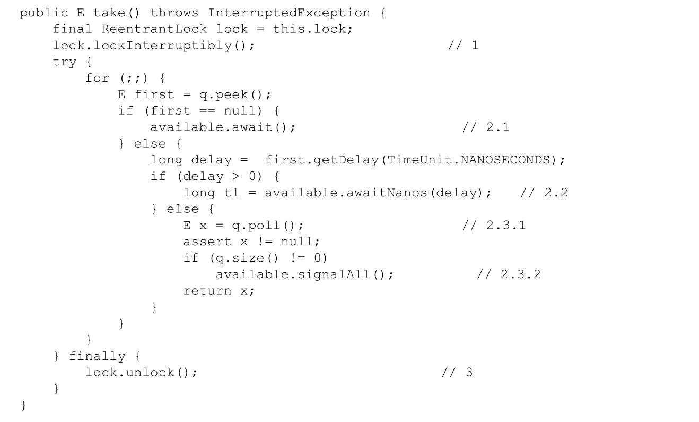
  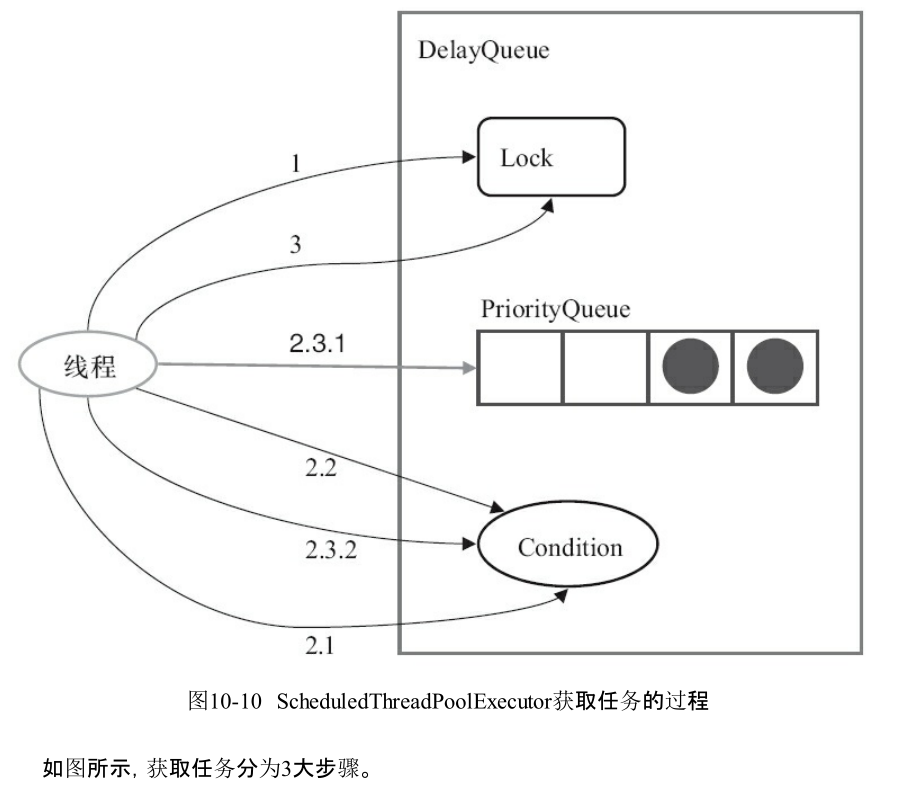
  > 如图所示，获取任务分为3大步骤。
  1）获取Lock。
  2）获取周期任务。
  ·如果PriorityQueue为空，当前线程到Condition中等待；否则执行下面的2.2。
  ·如果PriorityQueue的头元素的time时间比当前时间大，到Condition中等待到time时间；否
  则执行下面的2.3。
  ·获取PriorityQueue的头元素（2.3.1）；如果PriorityQueue不为空，则唤醒在Condition中等待
  的所有线程（2.3.2）。
  3）释放Lock。
  ScheduledThreadPoolExecutor在一个循环中执行步骤2，直到线程从PriorityQueue获取到一
  个元素之后（执行2.3.1之后），才会退出无限循环（结束步骤2）。
  > 
  > 最后，让我们看看ScheduledThreadPoolExecutor中的线程执行任务的步骤4，把
  ScheduledFutureTask放入DelayQueue中的过程。下面是DelayQueue.add()的源代码实现。
  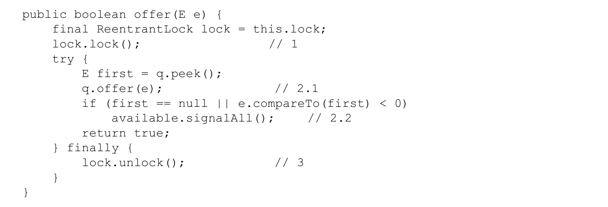
  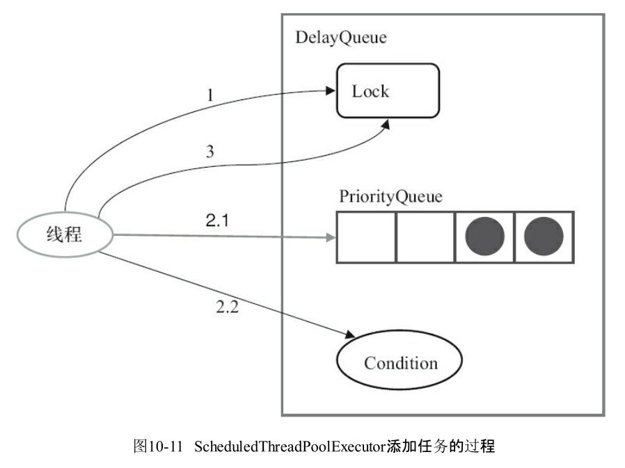 
  > 如图所示，添加任务分为3大步骤。
  1）获取Lock。
  2）添加任务。
  ·向PriorityQueue添加任务。
  ·如果在上面2.1中添加的任务是PriorityQueue的头元素，唤醒在Condition中等待的所有线
  程。
  3）释放Lock。
  - 90:FutureTask详解 
  > Future接口和实现Future接口的FutureTask类，代表异步计算的结果。
  - FutureTask简介 
  > FutureTask除了实现Future接口外，还实现了Runnable接口。因此，FutureTask可以交给
  Executor执行，也可以由调用线程直接执行（FutureTask.run()）。根据FutureTask.run()方法被执行
  的时机，FutureTask可以处于下面3种状态。
  ```
  1）未启动。FutureTask.run()方法还没有被执行之前，FutureTask处于未启动状态。当创建一
    个FutureTask，且没有执行FutureTask.run()方法之前，这个FutureTask处于未启动状态。
  2）已启动。FutureTask.run()方法被执行的过程中，FutureTask处于已启动状态
  3）已完成。FutureTask.run()方法执行完后正常结束，或被取消（FutureTask.cancel（…）），或
    执行FutureTask.run()方法时抛出异常而异常结束，FutureTask处于已完成状态。
  ``` 
  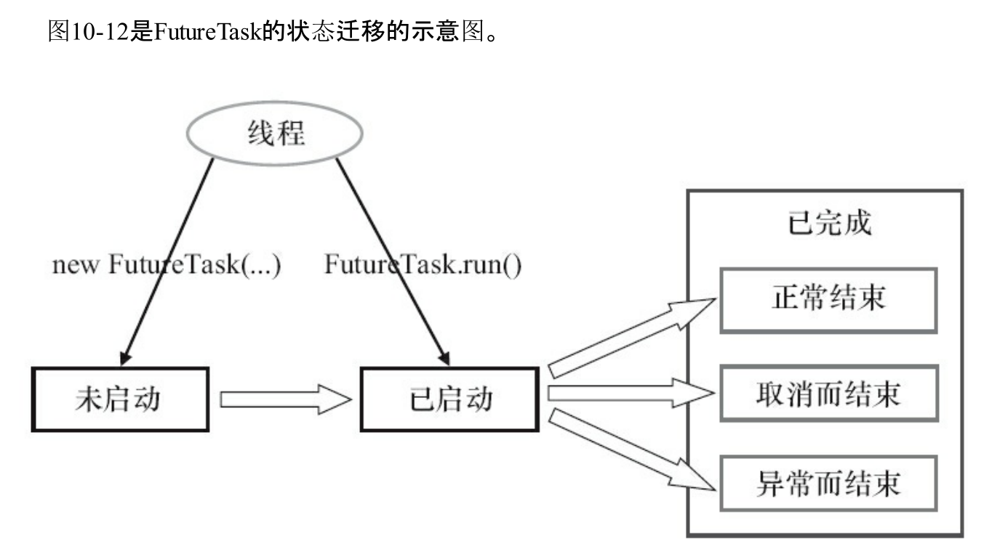
  > 当FutureTask处于未启动或已启动状态时，执行FutureTask.get()方法将导致调用线程阻塞；
  当FutureTask处于已完成状态时，执行FutureTask.get()方法将导致调用线程立即返回结果或抛
  出异常。
  > 
  > 当FutureTask处于未启动状态时，执行FutureTask.cancel()方法将导致此任务永远不会被执
  行；当FutureTask处于已启动状态时，执行FutureTask.cancel（true）方法将以中断执行此任务线程
  的方式来试图停止任务；当FutureTask处于已启动状态时，执行FutureTask.cancel（false）方法将
  不会对正在执行此任务的线程产生影响（让正在执行的任务运行完成）；当FutureTask处于已完
  成状态时，执行FutureTask.cancel（…）方法将返回false。
  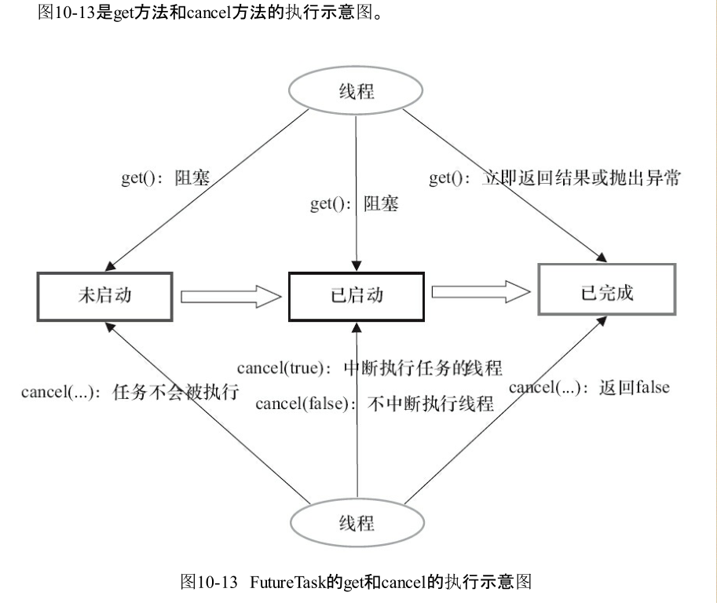 
  - FutureTask的使用 
  > 可以把FutureTask交给Executor执行；也可以通过ExecutorService.submit（…）方法返回一个
  FutureTask，然后执行FutureTask.get()方法或FutureTask.cancel（…）方法。除此以外，还可以单独
  使用FutureTask。
  > 
  > 当一个线程需要等待另一个线程把某个任务执行完后它才能继续执行，此时可以使用
  FutureTask。假设有多个线程执行若干任务，每个任务最多只能被执行一次。当多个线程试图
  同时执行同一个任务时，只允许一个线程执行任务，其他线程需要等待这个任务执行完后才
  能继续执行。代码见：ConcurrentTask
  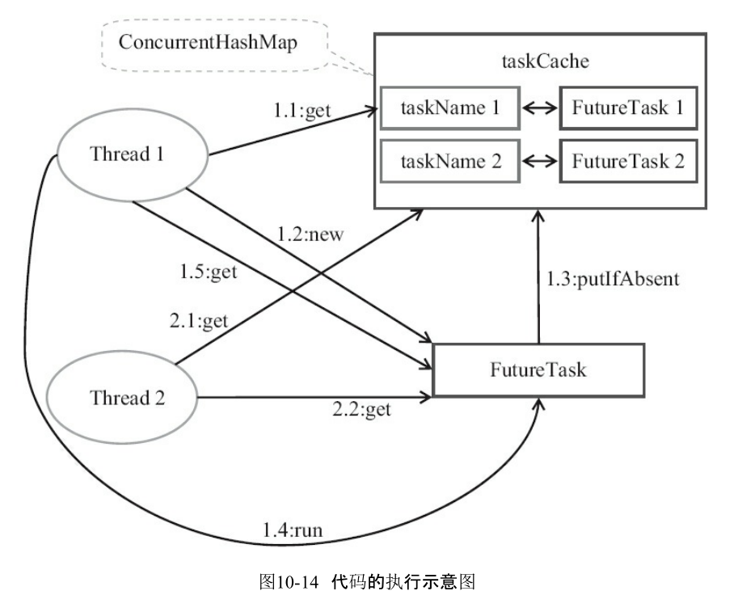
  - FutureTask的实现 
  > FutureTask的实现基于AbstractQueuedSynchronizer（以下简称为AQS）。java.util.concurrent中
  的很多可阻塞类（比如ReentrantLock）都是基于AQS来实现的。AQS是一个同步框架，它提供通
  用机制来原子性管理同步状态、阻塞和唤醒线程，以及维护被阻塞线程的队列。JDK 6中AQS
  被广泛使用，基于AQS实现的同步器包括：ReentrantLock、Semaphore、ReentrantReadWriteLock、
  CountDownLatch和FutureTask。
  > 
  > 每一个基于AQS实现的同步器都会包含两种类型的操作，如下。
  > 
  > ·至少一个acquire操作。这个操作阻塞调用线程，除非/直到AQS的状态允许这个线程继续
  执行。FutureTask的acquire操作为get()/get（long timeout，TimeUnit unit）方法调用。
  > 
  > ·至少一个release操作。这个操作改变AQS的状态，改变后的状态可允许一个或多个阻塞
  线程被解除阻塞。FutureTask的release操作包括run()方法和cancel（…）方法。
  > 
  > 基于“复合优先于继承”的原则，FutureTask声明了一个内部私有的继承于AQS的子类
  Sync，对FutureTask所有公有方法的调用都会委托给这个内部子类。
  > 
  > AQS被作为“模板方法模式”的基础类提供给FutureTask的内部子类Sync，这个内部子类只
  需要实现状态检查和状态更新的方法即可，这些方法将控制FutureTask的获取和释放操作。具
  体来说，Sync实现了AQS的tryAcquireShared（int）方法和tryReleaseShared（int）方法，Sync通过这
  两个方法来检查和更新同步状态。
  > 
  > FutureTask的设计示意图如图10-15所示。
  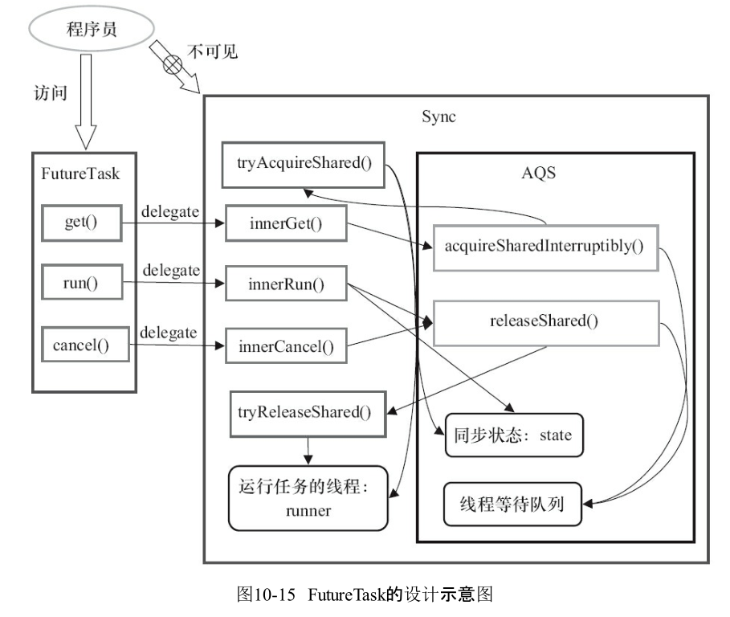 
  > 如图所示，Sync是FutureTask的内部私有类，它继承自AQS。创建FutureTask时会创建内部
  私有的成员对象Sync，FutureTask所有的的公有方法都直接委托给了内部私有的Sync。
  > 
  > FutureTask.get()方法会调用AQS.acquireSharedInterruptibly（int arg）方法，这个方法的执行
  过程如下。
  > 
  > 1）调用AQS.acquireSharedInterruptibly（int arg）方法，这个方法首先会回调在子类Sync中实
  现的tryAcquireShared()方法来判断acquire操作是否可以成功。acquire操作可以成功的条件为：
  state为执行完成状态RAN或已取消状态CANCELLED，且runner不为null。
  > 
  > 2）如果成功则get()方法立即返回。如果失败则到线程等待队列中去等待其他线程执行
  release操作。 
  > 
  > 3）当其他线程执行release操作（比如FutureTask.run()或FutureTask.cancel（…））唤醒当前线
  程后，当前线程再次执行tryAcquireShared()将返回正值1，当前线程将离开线程等待队列并唤
  醒它的后继线程（这里会产生级联唤醒的效果，后面会介绍）。
  > 
  > 4）最后返回计算的结果或抛出异常。
  > 
  > FutureTask.run()的执行过程如下。：
  > 
  > 1）执行在构造函数中指定的任务（Callable.call()）。
  > 
  > 2）以原子方式来更新同步状态（调用AQS.compareAndSetState（int expect，int update），设置
  state为执行完成状态RAN）。如果这个原子操作成功，就设置代表计算结果的变量result的值为
  Callable.call()的返回值，然后调用AQS.releaseShared（int arg）。
  > 
  > 3）AQS.releaseShared（int arg）首先会回调在子类Sync中实现的tryReleaseShared（arg）来执
  行release操作（设置运行任务的线程runner为null，然会返回true）；AQS.releaseShared（int arg），
  然后唤醒线程等待队列中的第一个线程。
  > 
  > 4）调用FutureTask.done()。
  > 
  > 当执行FutureTask.get()方法时，如果FutureTask不是处于执行完成状态RAN或已取消状态
  CANCELLED，当前执行线程将到AQS的线程等待队列中等待（见下图的线程A、B、C和D）。当
  某个线程执行FutureTask.run()方法或FutureTask.cancel（...）方法时，会唤醒线程等待队列的第一
  个线程（见图10-16所示的线程E唤醒线程A）。
  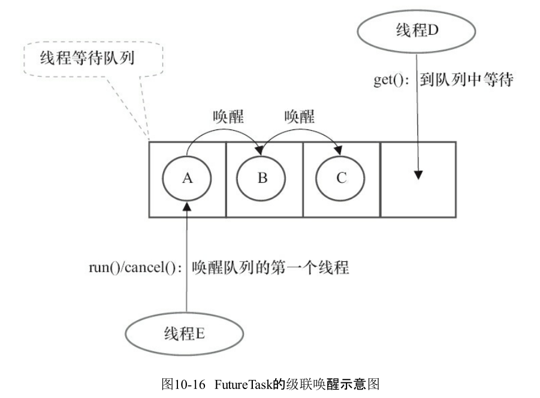 
  > 假设开始时FutureTask处于未启动状态或已启动状态，等待队列中已经有3个线程（A、B和
  C）在等待。此时，线程D执行get()方法将导致线程D也到等待队列中去等待。
  > 
  > 当线程E执行run()方法时，会唤醒队列中的第一个线程A。线程A被唤醒后，首先把自己从
  队列中删除，然后唤醒它的后继线程B，最后线程A从get()方法返回。线程B、C和D重复A线程
  的处理流程。最终，在队列中等待的所有线程都被级联唤醒并从get()方法返回。
  > 
  - 本章小结 
  > 本章介绍了Executor框架的整体结构和成员组件。希望读者阅读本章之后，能够对
  Executor框架有一个比较深入的理解，同时也希望本章内容有助于读者更熟练地使用Executor
  框架。
  > 
  - 91：Java并发编程实践 
  - 92：生产者和消费者模式 
  > 在并发编程中使用生产者和消费者模式能够解决绝大多数并发问题。该模式通过平衡生
  产线程和消费线程的工作能力来提高程序整体处理数据的速度。
  > 
  > 在线程世界里，生产者就是生产数据的线程，消费者就是消费数据的线程。在多线程开发
  中，如果生产者处理速度很快，而消费者处理速度很慢，那么生产者就必须等待消费者处理
  完，才能继续生产数据。同样的道理，如果消费者的处理能力大于生产者，那么消费者就必须
  等待生产者。为了解决这种生产消费能力不均衡的问题，便有了生产者和消费者模式。
  > 
  > 生产者和消费者模式是通过一个容器来解决生产者和消费者的强耦合问题。生产者和消
  费者彼此之间不直接通信，而是通过阻塞队列来进行通信，所以生产者生产完数据之后不用
  等待消费者处理，直接扔给阻塞队列，消费者不找生产者要数据，而是直接从阻塞队列里取，
  阻塞队列就相当于一个缓冲区，平衡了生产者和消费者的处理能力。
  > 
  > 这个阻塞队列就是用来给生产者和消费者解耦的。纵观大多数设计模式，都会找一个第
  三者出来进行解耦，如工厂模式的第三者是工厂类，模板模式的第三者是模板类。在学习一些
  设计模式的过程中，先找到这个模式的第三者，能帮助我们快速熟悉一个设计模式。
  - 93：多生产者和多消费者场景 
  > 在多核时代，多线程并发处理速度比单线程处理速度更快，所以可以使用多个线程来生
  产数据，同样可以使用多个消费线程来消费数据。而更复杂的情况是，消费者消费的数据，有
  可能需要继续处理，于是消费者处理完数据之后，它又要作为生产者把数据放在新的队列里，
  交给其他消费者继续处理，如图11-1所示。
  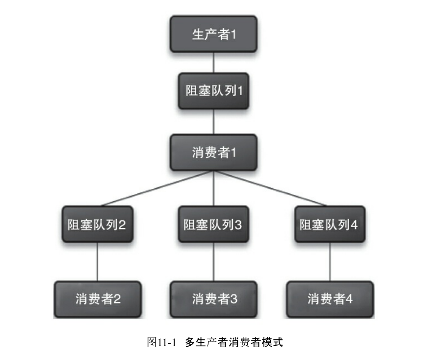 
  > 我们在一个长连接服务器中使用了这种模式，生产者1负责将所有客户端发送的消息存放
  在阻塞队列1里，消费者1从队列里读消息，然后通过消息ID进行散列得到N个队列中的一个，
  然后根据编号将消息存放在到不同的队列里，每个阻塞队列会分配一个线程来消费阻塞队列
  里的数据。如果消费者2无法消费消息，就将消息再抛回到阻塞队列1中，交给其他消费者处
  理。代码见11package
  > 
  - 94:线程池与生产消费者模式 
  > Java中的线程池类其实就是一种生产者和消费者模式的实现方式，但是我觉得其实现方
  式更加高明。生产者把任务丢给线程池，线程池创建线程并处理任务，如果将要运行的任务数
  大于线程池的基本线程数就把任务扔到阻塞队列里，这种做法比只使用一个阻塞队列来实现
  生产者和消费者模式显然要高明很多，因为消费者能够处理直接就处理掉了，这样速度更快，
  而生产者先存，消费者再取这种方式显然慢一些。
  > 
  > 我们的系统也可以使用线程池来实现多生产者和消费者模式。例如，创建N个不同规模的
  Java线程池来处理不同性质的任务，比如线程池1将数据读到内存之后，交给线程池2里的线程
  继续处理压缩数据。线程池1主要处理IO密集型任务，线程池2主要处理CPU密集型任务。
  > 
  - 95:异步任务池 
  > Java中的线程池设计得非常巧妙，可以高效并发执行多个任务，但是在某些场景下需要对
  线程池进行扩展才能更好地服务于系统。例如，如果一个任务仍进线程池之后，运行线程池的
  程序重启了，那么线程池里的任务就会丢失。另外，线程池只能处理本机的任务，在集群环境
  下不能有效地调度所有机器的任务。所以，需要结合线程池开发一个异步任务处理池。图11-2
  为异步任务池设计图。
  > 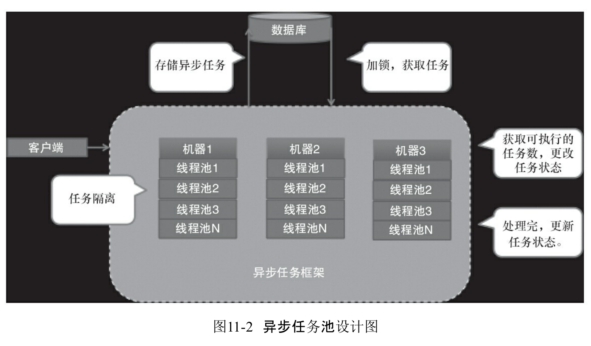
  > 任务池的主要处理流程是，每台机器会启动一个任务池，每个任务池里有多个线程池，当
  某台机器将一个任务交给任务池后，任务池会先将这个任务保存到数据中，然后某台机器上
  的任务池会从数据库中获取待执行的任务，再执行这个任务。
  > 每个任务有几种状态，分别是创建（NEW）、执行中（EXECUTING）、RETRY（重试）、挂起
  （SUSPEND）、中止（TEMINER）和执行完成（FINISH）。
  > 
  > ·创建：提交给任务池之后的状态。
  > 
  > ·执行中：任务池从数据库中拿到任务执行时的状态。
  > 
  > ·重试：当执行任务时出现错误，程序显式地告诉任务池这个任务需要重试，并设置下一次
  执行时间。
  > 
  > ·挂起：当一个任务的执行依赖于其他任务完成时，可以将这个任务挂起，当收到消息后，
  再开始执行。
  > 
  > ·中止：任务执行失败，让任务池停止执行这个任务，并设置错误消息告诉调用端。
  > 
  > ·执行完成：任务执行结束。
  > 
  > 任务池的任务隔离。异步任务有很多种类型，比如抓取网页任务、同步数据任务等，不同
  类型的任务优先级不一样，但是系统资源是有限的，如果低优先级的任务非常多，高优先级的
  任务就可能得不到执行，所以必须对任务进行隔离执行。使用不同的线程池处理不同的任务，
  或者不同的线程池处理不同优先级的任务，如果任务类型非常少，建议用任务类型来隔离，如
  果任务类型非常多，比如几十个，建议采用优先级的方式来隔离。
  > 
  > 任务池的重试策略。根据不同的任务类型设置不同的重试策略，有的任务对实时性要求
  高，那么每次的重试间隔就会非常短，如果对实时性要求不高，可以采用默认的重试策略，重
  试间隔随着次数的增加，时间不断增长，比如间隔几秒、几分钟到几小时。每个任务类型可以
  设置执行该任务类型线程池的最小和最大线程数、最大重试次数。
  > 
  > 使用任务池的注意事项。任务必须无状态：任务不能在执行任务的机器中保存数据，比如
  某个任务是处理上传的文件，任务的属性里有文件的上传路径，如果文件上传到机器1，机器2
  获取到了任务则会处理失败，所以上传的文件必须存在其他的集群里，比如OSS或SFTP。
  > 
  > 异步任务的属性。包括任务名称、下次执行时间、已执行次数、任务类型、任务优先级和
  执行时的报错信息（用于快速定位问题）。
  > 
